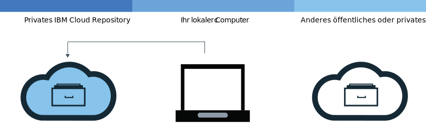
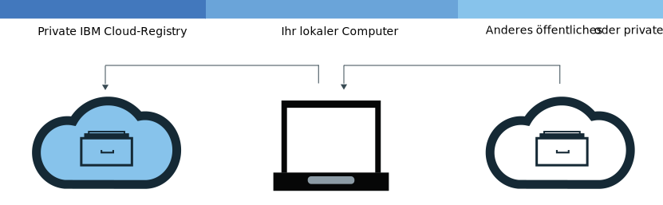

---

copyright:
  years: 2017, 2018
lastupdated: "2018-11-14"

---

{:new_window: target="_blank"}
{:shortdesc: .shortdesc}
{:screen: .screen}
{:pre: .pre}
{:table: .aria-labeledby="caption"}
{:codeblock: .codeblock}
{:tip: .tip}
{:download: .download}

# Images zu eigenem Namensbereich hinzufügen
{: #registry_images_}

Wenn Sie Images zu Ihrem eigenen Namensbereich in {{site.data.keyword.registrylong}} hinzufügen, können Sie Docker-Images sicher speichern und mit anderen Benutzern gemeinsam nutzen.
{:shortdesc}

Jedes Image, das Sie zu Ihrem Namensbereich hinzufügen wollen, muss zuvor auf Ihrem lokalen Computer vorhanden sein. Sie können entweder ein Image aus einem anderen Repository auf Ihren lokalen Computer herunterladen (Pull-Operation) oder mit dem Docker-Befehl `build` Ihr eigenes Image aus einer Dockerfile erstellen. Um ein Image zu Ihrem Namensbereich hinzuzufügen, müssen Sie das lokale Image in Ihren Namensbereich von {{site.data.keyword.registrylong_notm}} hochladen (Push-Operation).

Beziehen Sie keine personenbezogenen Daten in Ihre Container-Images, Namensbereichsnamen, Beschreibungsfelder (z. B. in Registry-Tokens) oder in Image-Konfigurationsdaten (z. B. Imagenamen oder Imagebezeichnungen) ein.
{:tip}

## Images aus einer anderen Registry mit Pull-Operation extrahieren
{: #registry_images_pulling}

Sie können ein Image aus einer beliebigen privaten oder öffentlichen Registryquelle mit einer Pull-Operation extrahieren (herunterladen) und es anschließend für die spätere Verwendung in {{site.data.keyword.registrylong_notm}} kennzeichnen.
{:shortdesc}


**Vorbereitung**

- [Installieren Sie die CLI](registry_setup_cli_namespace.html#registry_cli_install), damit Sie in Ihrem Namensbereich mit Images arbeiten können.
- [Richten Sie einen eigenen Namensbereich in {{site.data.keyword.registrylong_notm}}](registry_setup_cli_namespace.html#registry_namespace_add) ein.
- [Stellen Sie sicher, dass Sie Docker-Befehle ohne Rootberechtigungen ausführen können](https://docs.docker.com/engine/installation/linux/linux-postinstall). Falls Ihr Docker-Client konfigurationsgemäß Rootberechtigungen erfordert, müssen Sie die Befehle `ibmcloud login`, `ibmcloud cr login`, `docker pull` und `docker push` mit `sudo` ausführen.

  Wenn Sie Ihre Berechtigungen ändern, um Docker-Befehle ohne Rootberechtigungen auszuführen, müssen Sie den Befehl `ibmcloud login` erneut ausführen.

Laden Sie das Image herunter. Informationen dazu finden Sie im Abschnitt [Image mit Pull-Operation extrahieren](index.html#registry_images_pulling) in der Dokumentation zur Einführung.

Wenn die Nachricht `Berechtigung nicht vorhanden: Authentifizierung erforderlich` oder `Zugriff verweigert: Angeforderter Zugriff auf die Ressource wurde verweigert` ausgegeben wird, führen Sie den Befehl `ibmcloud cr login` aus.
{:tip}

Nachdem Sie ein Image mit einer Pull-Operation extrahiert und für Ihren Namensbereich gekennzeichnet haben, können Sie das Image aus Ihrem lokalen Computer in Ihren Namensbereich hochladen (Push-Operation).

## Docker-Images mit Push-Operation in eigenen Namensbereich übertragen
{: #registry_images_pushing}

Sie können ein Image mit einer Push-Operation in Ihren eigenen Namensbereich in {{site.data.keyword.registrylong_notm}} übertragen (hochladen), um das Image sicher zu speichern und mit anderen Benutzern gemeinsam zu nutzen.
{:shortdesc}



**Vorbereitung**

- [Installieren Sie die CLI](registry_setup_cli_namespace.html#registry_cli_install), damit Sie in Ihrem Namensbereich mit Images arbeiten können.
- [Richten Sie einen eigenen Namensbereich in der privaten Registry von {{site.data.keyword.registrylong_notm}} ein](registry_setup_cli_namespace.html#registry_namespace_add).
- [Führen Sie eine Pull-Operation für ein Image durch](#registry_images_pulling) oder [erstellen Sie ein Image](#registry_images_creating) auf Ihrem lokalen Computer und kennzeichnen Sie das Image mit den Informationen zu Ihrem Namensbereich.
- [Stellen Sie sicher, dass Sie Docker-Befehle ohne Rootberechtigungen ausführen können](https://docs.docker.com/engine/installation/linux/linux-postinstall). Falls Ihr Docker-Client konfigurationsgemäß Rootberechtigungen erfordert, müssen Sie die Befehle `ibmcloud login`, `ibmcloud cr login`, `docker pull` und `docker push` mit `sudo` ausführen.

  Wenn Sie Ihre Berechtigungen ändern, um Docker-Befehle ohne Rootberechtigungen auszuführen, müssen Sie den Befehl `ibmcloud login` erneut ausführen.

Führen Sie die folgenden Schritte aus, um ein Image hochzuladen (Push-Operation):

1. Melden Sie sich an der Befehlszeilenschnittstelle an.

   ```
   ibmcloud cr login
   ```
   {: pre}

   Sie müssen sich anmelden, wenn Sie ein Image aus Ihrer privaten {{site.data.keyword.registrylong_notm}} mit Pull-Operation extrahieren.
  {:tip}

2. Führen Sie den Befehl `ibmcloud cr namespace-list` aus, um alle Namensbereiche anzuzeigen, die in Ihrem Konto verfügbar sind.
3. [Laden Sie das Image in Ihren Namensbereich hoch. ](index.html#registry_images_pushing)

   Wenn die Nachricht `Berechtigung nicht vorhanden: Authentifizierung erforderlich` oder `Zugriff verweigert: Angeforderter Zugriff auf die Ressource wurde verweigert` ausgegeben wird, führen Sie den Befehl `ibmcloud cr login` aus.
   {:tip}

Nachdem Sie das Image mit einer Push-Operation in Ihre private Registry übertragen haben, können Sie eine der folgenden Tasks ausführen:

- [Verwalten Sie die Sicherheit mit Vulnerability Advisor](../va/va_index.html), um Informationen zu möglichen Sicherheitsproblemen und Sicherheitslücken zu erhalten.
- Sie können einen [Cluster erstellen und dieses Image zum Bereitstellen eines Containers](/docs/containers/container_index.html#container_index) für den Cluster in {{site.data.keyword.containerlong_notm}} verwenden.

## Images zwischen Registrys kopieren
{: #registry_images_copying}

Sie können ein Image mit einer Pull-Operation aus einer Registry in einer Region extrahieren und es in eine Registry in einer anderen Region mit einer Push-Operation übertragen, sodass Sie das Image mit Benutzern in beiden Regionen gemeinsam nutzen können.
{:shortdesc}



**Vorbereitung**

- [Installieren Sie die CLI](registry_setup_cli_namespace.html#registry_cli_install), damit Sie in Ihrem Namensbereich mit Images arbeiten können.
- [Richten Sie einen eigenen Namensbereich in der privaten Registry von {{site.data.keyword.registrylong_notm}} ein](registry_setup_cli_namespace.html#registry_namespace_add).
- [Stellen Sie sicher, dass Sie Docker-Befehle ohne Rootberechtigungen ausführen können](https://docs.docker.com/engine/installation/linux/linux-postinstall). Falls Ihr Docker-Client konfigurationsgemäß Rootberechtigungen erfordert, müssen Sie die Befehle `ibmcloud login`, `ibmcloud cr login`, `docker pull` und `docker push` mit `sudo` ausführen.

  Wenn Sie Ihre Berechtigungen ändern, um Docker-Befehle ohne Rootberechtigungen auszuführen, müssen Sie den Befehl `ibmcloud login` erneut ausführen.

Führen Sie die folgenden Schritte aus, um ein Image zwischen zwei Registrys zu kopieren:

1. [Extrahieren Sie ein Image mit einer Pull-Operation aus einer Registry](#registry_images_pulling).
2. [Übertragen Sie das Image mit einer Push-Operation in eine andere Registry](#registry_images_pushing). Stellen Sie sicher, dass Sie den korrekten Domänennamen für die neue Zielregion verwenden.

Nachdem Sie das Image kopiert haben, können Sie eine der folgenden Tasks ausführen:

- [Verwalten Sie die Imagesicherheit mit Vulnerability Advisor](../va/va_index.html), um Informationen zu möglichen Sicherheitsproblemen und Sicherheitslücken zu erhalten.
- Sie können einen [Cluster erstellen und dieses Image zum Bereitstellen eines Containers](/docs/containers/container_index.html#container_index) für den Cluster in {{site.data.keyword.containerlong_notm}} verwenden.

## Docker-Images für die Verwendung mit dem eigenen Namensbereich erstellen
{: #registry_images_creating}

Sie können ein Docker-Image direkt in {{site.data.keyword.Bluemix_notm}} erstellen oder ein eigenes Docker-Image auf Ihrem lokalen Computer erstellen und es in Ihren Namensbereich in {{site.data.keyword.registrylong_notm}} hochladen (Push-Operation).
{:shortdesc}

**Vorbereitung**

- [Installieren Sie die CLI](registry_setup_cli_namespace.html#registry_cli_install), damit Sie in Ihrem Namensbereich mit Images arbeiten können.
- [Richten Sie einen eigenen Namensbereich in der privaten Registry von {{site.data.keyword.registrylong_notm}} ein](registry_setup_cli_namespace.html#registry_namespace_add).
- [Stellen Sie sicher, dass Sie Docker-Befehle ohne Rootberechtigungen ausführen können](https://docs.docker.com/engine/installation/linux/linux-postinstall). Falls Ihr Docker-Client konfigurationsgemäß Rootberechtigungen erfordert, müssen Sie die Befehle `ibmcloud login`, `ibmcloud cr login`, `docker pull` und `docker push` mit `sudo` ausführen.

  Wenn Sie Ihre Berechtigungen ändern, um Docker-Befehle ohne Rootberechtigungen auszuführen, müssen Sie den Befehl `ibmcloud login` erneut ausführen.

Jeder Container, den Sie erstellen, basiert auf einem Docker-Image. Ein Image wird aus einer Dockerfile erstellt, die Anweisungen zum Erstellen des Images enthält. Eine Dockerfile kann in ihren Anweisungen Buildartefakte referenzieren, die separat gespeichert sind (z. B. eine App, die Konfiguration der App und die Abhängigkeiten der App).

Wenn Sie die Vorteile der {{site.data.keyword.Bluemix_notm}}-Berechnungsressourcen und der Internetverbindung nutzen möchten, oder wenn auf Ihrer Workstation Docker nicht installiert ist, erstellen Sie das Image direkt in {{site.data.keyword.Bluemix_notm}}. Wenn Sie in Ihrem Build auf Ressourcen auf Servern zugreifen müssen, die durch Ihre Firewall geschützt sind, erstellen Sie das Image lokal.

Führen Sie die folgenden Schritte aus, um ein eigenes Docker-Image zu erstellen:

1. Erstellen Sie ein lokales Verzeichnis, in dem Sie den Buildkontext speichern möchten. Der Buildkontext enthält Ihre Dockerfile und zugehörige Buildartefakte (z. B. den App-Code). Navigieren Sie in einem Befehlszeilenfenster zu diesem Verzeichnis.
2. Erstellen Sie eine Dockerfile.
    1. Erstellen Sie eine Dockerfile in Ihrem lokalen Verzeichnis.

        ```
        touch Dockerfile
        ```
        {: pre}

    2. Öffnen Sie die Dockerfile in einem Texteditor. Sie müssen mindestens das Basisimage hinzufügen, aus dem Sie Ihr Image erstellen wollen. Ersetzen Sie _&lt;quellenimage&gt;_ und _&lt;tag&gt;_ durch das Image-Repository und den Tag, die Sie verwenden wollen. Falls Sie ein Image aus einer anderen privaten Registry verwenden, definieren Sie den vollständigen Pfad zum Image in dieser privaten Registry.

       ```
       FROM <quellenimage>:<tag>
       ```
       {: pre}

       **Beispiel**
     Zum Erstellen einer Dockerfile, die auf dem öffentlichen Image von {{site.data.keyword.IBM_notm}} {{site.data.keyword.appserver_short}} Liberty (ibmliberty) basiert, den folgenden Code verwenden:

       ```
       FROM registry.<region>.bluemix.net/ibmliberty:latest
    LABEL description="This is my test Dockerfile"
    EXPOSE 9080
       ```
       {: pre}

       Dieses Beispiel fügt eine Bezeichnung zu den Imagemetadaten hinzu und macht Port 9080 zugänglich. Informationen zu weiteren Dockerfile-Anweisungen, die Sie verwenden können, finden Sie auf der Seite [Dockerfile - Referenz](https://docs.docker.com/engine/reference/builder/).

3. Wählen Sie einen Namen für das Image. Der Imagename muss dem folgenden Format entsprechen:

   ```
   registry.<region>.bluemix.net/<eigener_namensbereich>/<repository_name>:<tag>
   ```
   {: pre}

   Dabei ist _&lt;eigener_namensbereich&gt;_ die Angabe zu Ihrem Namensbereich, _&lt;repository_name&gt;_ der Name Ihres Repositorys und _&lt;tag&gt;_ die Version, die Sie für Ihr Image verwenden möchten. Führen Sie den Befehl `ibmcloud cr namespace-list` aus, um nach Ihrem Namensbereich zu suchen.

4. Notieren Sie den Pfad zu dem Verzeichnis, das Ihre Dockerfile enthält. Wenn Sie die in den folgenden Schritten beschriebenen Befehle ausführen, während das Arbeitsverzeichnis auf das Verzeichnis eingestellt ist, in dem Ihr Buildkontext gespeichert ist, können Sie _&lt;verzeichnis&gt;_ durch einen Punkt (.) ersetzen.
5. Entscheiden Sie, ob Sie das Image direkt in {{site.data.keyword.Bluemix_notm}} erstellen oder das Image zunächst lokal erstellen und testen möchten, bevor Sie es mit einer Push-Operation in {{site.data.keyword.Bluemix_notm}} übertragen.
   - Führen Sie die folgenden Schritte aus, um das Image direkt in {{site.data.keyword.Bluemix_notm}} zu erstellen:

     ```
     ibmcloud cr build -t <imagename> <verzeichnis>
     ```
     {: pre}

     Dabei ist _&lt;imagename&gt;_ der Name Ihres Images und _&lt;verzeichnis&gt;_ der Pfad zum Verzeichnis. Wenn Sie den Befehl ausführen, während das Arbeitsverzeichnis auf das Verzeichnis eingestellt ist, in dem Ihr Buildkontext gespeichert ist, können Sie _&lt;verzeichnis&gt;_ durch einen Punkt (.) ersetzen.
  
     Weitere Informationen zum Befehl `ibmcloud cr build` finden Sie im Abschnitt [{{site.data.keyword.registrylong_notm}}-CLI](/docs/services/Registry/registry_cli.html#bx_cr_build).

   - Führen Sie die folgenden Schritte aus, um Ihr Image zunächst lokal zu erstellen und zu testen, bevor Sie es mit einer Push-Operation in {{site.data.keyword.Bluemix_notm}} übertragen:
      1. Erstellen Sie das Image aus Ihrer Dockerfile auf dem lokalen Computer und kennzeichnen Sie es mit dem Imagenamen.

         ```
         docker build -t <imagename> <verzeichnis>
         ```
         {: pre}

         Dabei ist _&lt;imagename&gt;_ der Name Ihres Images und _&lt;verzeichnis&gt;_ der Pfad zum Verzeichnis.

      2. Optional: Testen Sie Ihr Image auf dem lokalen Computer, bevor Sie es mit einer Push-Operation in Ihren Namensbereich übertragen.

         ```
         docker run <imagename>
         ```
         {: pre}

         Ersetzen Sie _&lt;imagename&gt;_ durch den Namen Ihres Images.

      3. Nachdem Sie das Image erstellt und für Ihren Namensbereich gekennzeichnet haben, [können Sie das Image mit einer Push-Operation in die private Registry des Namensbereichs übertragen](#registry_images_pushing).

Informationen zur Verwendung von Vulnerability Advisor zum Überprüfen der Sicherheit Ihres Images finden Sie im Abschnitt [Imagesicherheit mit Vulnerability Advisor verwalten](../va/va_index.html).

## Images aus Ihrem privaten {{site.data.keyword.Bluemix_notm}}-Repository löschen
{: #registry_images_remove}

Sie können unerwünschte Images aus Ihrem privaten Repository über die grafische Benutzerschnittstelle (GUI) oder die Befehlszeilenschnittstelle (CLI) löschen.
{:shortdesc}

Wenn Sie ein privates Repository und die zugehörigen Images löschen möchten, lesen Sie den Abschnitt [Privates Repository und alle zugehörigen Images löschen](#registry_repo_remove).

Öffentliche {{site.data.keyword.IBM_notm}}-Images können nicht aus Ihrem privaten {{site.data.keyword.Bluemix_notm}}-Repository gelöscht werden und zählen nicht zu Ihrem Kontingent.

Das Löschen eines Images kann nicht rückgängig gemacht werden. Das Löschen eines Images, das von einer vorhandenen Bereitstellung verwendet wird, kann zu einem Scale-up, einem neuen Zeitplan oder beidem führen, um fehlzuschlagen.
{:tip}

### Images aus dem privaten {{site.data.keyword.Bluemix_notm}}-Repository mithilfe der CLI löschen
{: #registry_images_remove_cli}

Sie können unerwünschte Images aus Ihrem privaten Repository über die CLI löschen.
{:shortdesc}

Das Löschen eines Images kann nicht rückgängig gemacht werden. Das Löschen eines Images, das von einer vorhandenen Bereitstellung verwendet wird, kann zu einem Scale-up, einem neuen Zeitplan oder beidem führen, um fehlzuschlagen.
{:tip}

Führen Sie die folgenden Schritte aus, um ein Image über die CLI zu löschen:

1. Melden Sie sich bei {{site.data.keyword.Bluemix_notm}} an, indem Sie den Befehl `ibmcloud login` ausführen.
2. Führen Sie den folgenden Befehl aus, um ein Image zu löschen:

   ```
   ibmcloud cr image-rm IMAGE
   ```
   {: pre}

   Dabei steht _IMAGE_ für den Namen des Images, das Sie entfernen möchten, im Format `repository:tag`.

   Wenn ein Tag nicht im Imagenamen angegeben ist, wird standardmäßig das Image mit dem Tag `latest` gelöscht. Sie können mehrere Images löschen, indem Sie die einzelnen privaten {{site.data.keyword.Bluemix_notm}}-Registry-Pfade im Befehl auflisten und die Pfade jeweils durch ein Leerzeichen voneinander trennen.

   Um die Namen Ihrer Images zu ermitteln, führen Sie `ibmcloud cr image-list` aus. Kombinieren Sie den Inhalt des Repositorys und der Tagspalten, um den Imagenamen im Format `repository:tag` zu bilden.
   {:tip}

3. Überprüfen Sie, ob das Image gelöscht wurde, indem Sie den folgenden Befehl ausführen, und stellen Sie sicher, dass das Image nicht in der Liste angezeigt wird.

   ```
   ibmcloud cr image-list
   ```
   {: pre}

### Images aus dem privaten {{site.data.keyword.Bluemix_notm}}-Repository mithilfe der grafischen Benutzerschnittstelle löschen
{: #registry_images_remove_gui}

Sie können unerwünschte Images aus Ihrem privaten Image-Repository mithilfe der grafischen Benutzerschnittstelle (GUI) löschen.
{:shortdesc}

Das Löschen eines Images kann nicht rückgängig gemacht werden. Das Löschen eines Images, das von einer vorhandenen Bereitstellung verwendet wird, kann zu einem Scale-up, einem neuen Zeitplan oder beidem führen, um fehlzuschlagen.
{:tip}

Führen Sie die folgenden Schritte aus, um ein Image über die grafische Benutzerschnittstelle zu löschen:

1. Melden Sie sich bei der {{site.data.keyword.Bluemix_notm}}-Konsole ([https://console.bluemix.net](https://console.bluemix.net)) mit Ihrer IBMid an.
2. Wenn Sie über mehrere {{site.data.keyword.Bluemix_notm}}-Konten verfügen, wählen Sie das Konto und die Region im Kontomenü aus, die Sie verwenden möchten.
3. Klicken Sie auf **Katalog**.
4. Wählen Sie die Kategorie **Container** aus und klicken Sie auf die Kachel **Container Registry**.
5. Klicken Sie auf **Images**. Es wird eine Liste Ihrer Images angezeigt.
6. Markieren Sie in der Zeile, die das Image enthält, das Sie löschen möchten, das Kontrollkästchen.

   Stellen Sie sicher, dass Sie das richtige Image ausgewählt haben, da diese Aktion nicht rückgängig gemacht werden kann.
   {: tip}

7. Klicken Sie auf **Image löschen**.

## Privates Repository und alle zugehörigen Images löschen
{: #registry_repo_remove}

Sie können private Repositorys, die nicht mehr benötigt werden, und alle zugehörigen Images über die grafische Benutzerschnittstelle (GUI) löschen.
{:shortdesc}

Wenn Sie ein Repository löschen, werden alle Images in diesem Repository gelöscht. Diese Aktion kann nicht rückgängig gemacht werden.
{:tip}

**Vorbereitung**

Sie müssen alle Images sichern, die Sie behalten möchten.

Um ein privates Repository über die grafische Benutzerschnittstelle zu löschen, führen Sie die folgenden Schritte aus:

1. Melden Sie sich bei der {{site.data.keyword.Bluemix_notm}}-Konsole ([https://console.bluemix.net](https://console.bluemix.net)) mit Ihrer IBMid an.
2. Wenn Sie über mehrere {{site.data.keyword.Bluemix_notm}}-Konten verfügen, wählen Sie das Konto und die Region im Kontomenü aus, die Sie verwenden möchten.
3. Klicken Sie auf **Katalog**.
4. Wählen Sie die Kategorie **Container** aus und klicken Sie auf die Kachel **Container Registry**.
5. Klicken Sie auf **Repositorys**. Es wird eine Liste Ihrer privaten Repositorys angezeigt.
6. Markieren Sie in der Zeile, die das private Repository enthält, das Sie löschen möchten, das Kontrollkästchen.

    Stellen Sie sicher, dass Sie das richtige Repository ausgewählt haben, da diese Aktion nicht rückgängig gemacht werden kann.
    {: tip}

7. Klicken Sie auf **Repository löschen**.
