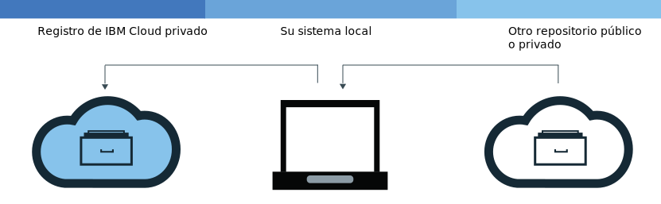

---

copyright:
  years: 2017, 2019
lastupdated: "2019-06-13"

keywords: IBM Cloud Container Registry, Docker build command, delete images, add images, pull images, push images, copy images, delete private repositories,

subcollection: registry

---

{:new_window: target="_blank"}
{:shortdesc: .shortdesc}
{:screen: .screen}
{:pre: .pre}
{:table: .aria-labeledby="caption"}
{:codeblock: .codeblock}
{:tip: .tip}
{:note: .note}
{:important: .important}
{:deprecated: .deprecated}
{:download: .download}

# Adición de imágenes a su espacio de nombres
{: #registry_images_}

Puede almacenar y compartir de forma segura imágenes de Docker con otros usuarios añadiendo imágenes a su espacio de nombres en {{site.data.keyword.registrylong}}.
{:shortdesc}

Cada imagen que desea añadir a su espacio de nombres debe existir en su sistema local en primer lugar. Puede descargar (extraer) una imagen desde otro repositorio al sistema local, o crear su propia imagen de un Dockerfile utilizando el mandato de Docker `build`. Para añadir una imagen a su espacio de nombres, debe subir (enviar por push) la imagen local a su espacio de nombres en {{site.data.keyword.registrylong_notm}}.

No coloque información personal en las imágenes de contenedor, nombres de espacio de nombres, campos de descripción (por ejemplo, en señales de registro), o en cualesquiera datos de configuración de imágenes (por ejemplo, nombres de imágenes o etiquetas de imagen).
{: important}

## Extracción de imágenes de otro registro
{: #registry_images_pulling_reg}

Puede extraer (descargar) una imagen desde cualquier origen de registro privado o público, y, a continuación, etiquétela para utilizarla más adelante en {{site.data.keyword.registrylong_notm}}.
{:shortdesc}


**Antes de empezar**

- [Instale la CLI](/docs/services/Registry?topic=registry-registry_setup_cli_namespace#cli_namespace_registry_cli_install) para trabajar con imágenes en el espacio de nombres.
- [Configure su propio espacio de nombres en {{site.data.keyword.registrylong_notm}}](/docs/services/Registry?topic=registry-registry_setup_cli_namespace#registry_namespace_setup).
- [Asegúrese de que puede ejecutar mandatos Docker sin permisos root ](https://docs.docker.com/install/linux/linux-postinstall/). Si el cliente Docker está configurado para requerir permisos root, debe ejecutar los mandatos `ibmcloud login`, `ibmcloud cr login`, `docker pull`, y `docker push` con `sudo`.

  Si cambia sus permisos para ejecutar mandatos Docker sin privilegios root, debe ejecutar de nuevo el mandato `ibmcloud login`.

Para descargar la imagen, consulte [Extraiga una imagen](/docs/services/Registry?topic=registry-getting-started#gs_registry_images_pulling) en la documentación de iniciación.

Si obtiene el mensaje `No autorizado: se necesita autorización` o el mensaje `denegado: se ha denegado el acceso al recurso`, ejecute el mandato `ibmcloud cr login`.
{:tip}

Después de extraer una imagen y de etiquetarla para su espacio de nombres, puede subir (enviar por push) la imagen del sistema local al espacio de nombres.

## Envío por push de imágenes de Docker a su espacio de nombres
{: #registry_images_pushing_namespace}

Puede enviar por push (cargar) una imagen a su espacio de nombres en {{site.data.keyword.registrylong_notm}} para almacenar y compartir su imagen con otros usuarios.
{:shortdesc}


**Antes de empezar**

- [Instale la CLI](/docs/services/Registry?topic=registry-registry_setup_cli_namespace#cli_namespace_registry_cli_install) para trabajar con imágenes en el espacio de nombres.
- [Configure su propio espacio de nombres en {{site.data.keyword.registrylong_notm}}](/docs/services/Registry?topic=registry-registry_setup_cli_namespace#registry_namespace_setup).
- [Extraiga](#registry_images_pulling_reg) o [cree](#registry_images_creating) una imagen en el sistema local y etiquetar la imagen con la información de espacio de nombres.
- [Asegúrese de que puede ejecutar mandatos Docker sin permisos root ](https://docs.docker.com/install/linux/linux-postinstall/). Si el cliente Docker está configurado para requerir permisos root, debe ejecutar los mandatos `ibmcloud login`, `ibmcloud cr login`, `docker pull`, y `docker push` con `sudo`.

  Si cambia sus permisos para ejecutar mandatos Docker sin privilegios root, debe ejecutar de nuevo el mandato `ibmcloud login`.

Para subir (enviar por push) una imagen, siga los siguientes pasos:

1. Inicie la sesión en la CLI.

   ```
   ibmcloud cr login
   ```
   {: pre}

   Debe iniciar la sesión si extrae una imagen desde su {{site.data.keyword.registrylong_notm}} privado.
  {:tip}

2. Para ver todos los espacios de nombres que están disponibles en su cuenta, ejecute el mandato `ibmcloud cr namespace-list`.
3. [Cargue la imagen a su espacio de nombres.](/docs/services/Registry?topic=registry-getting-started#gs_registry_images_pushing)

   Si obtiene el mensaje `No autorizado: se necesita autorización` o el mensaje `denegado: se ha denegado el acceso al recurso`, ejecute el mandato `ibmcloud cr login`.
   {:tip}

Después de enviar por push la imagen a {{site.data.keyword.registrylong_notm}}, puede realizar una de las siguientes tareas:

- [Gestionar la seguridad con Vulnerability Advisor](/docs/services/va?topic=va-va_index) para encontrar información sobre potenciales problemas de seguridad y vulnerabilidades.
- [Cree un clúster
y utilice esta imagen para desplegar un contenedor](/docs/containers?topic=containers-getting-started#getting-started) al clúster en {{site.data.keyword.containerlong_notm}}.

## Copia de imágenes entre registros
{: #registry_images_copying}

Puede extraer una imagen de un registro en una región y enviarla por push a un registro de otra región, de forma que puede compartir la imagen con usuarios de ambas regiones.
{:shortdesc}



**Antes de empezar**

- [Instale la CLI](/docs/services/Registry?topic=registry-registry_setup_cli_namespace#cli_namespace_registry_cli_install) para trabajar con imágenes en el espacio de nombres.
- [Configure su propio espacio de nombres en {{site.data.keyword.registrylong_notm}}](/docs/services/Registry?topic=registry-registry_setup_cli_namespace#registry_namespace_setup).
- [Asegúrese de que puede ejecutar mandatos Docker sin permisos root ](https://docs.docker.com/install/linux/linux-postinstall/). Si el cliente Docker está configurado para requerir permisos root, debe ejecutar los mandatos `ibmcloud login`, `ibmcloud cr login`, `docker pull`, y `docker push` con `sudo`.

  Si cambia sus permisos para ejecutar mandatos Docker sin privilegios root, debe ejecutar de nuevo el mandato `ibmcloud login`.

Para copiar una imagen entre dos registros, siga los siguientes pasos:

1. [Extraiga una imagen desde un registro](#registry_images_pulling_reg).
2. [Envíe por push la imagen a otro registro](#registry_images_pushing_namespace). Asegúrese de utilizar el nombre de dominio correcto para la nueva región de destino.

Después de copiar la imagen, puede realizar una de las siguientes tareas:

- [Gestionar la seguridad con Vulnerability Advisor](/docs/services/va?topic=va-va_index) para encontrar información sobre potenciales problemas de seguridad y vulnerabilidades.
- [Cree un clúster
y utilice esta imagen para desplegar un contenedor](/docs/containers?topic=containers-getting-started#getting-started) al clúster en {{site.data.keyword.containerlong_notm}}.

## Creación de imágenes nuevas que hacen referencia a una imagen de origen
{: #registry_images_source}

En la región en la que tiene la sesión iniciada, cree una imagen nueva en {{site.data.keyword.registrylong_notm}} que haga referencia a una imagen existente en la misma región. Esta acción se admite para imágenes de origen creadas solo mediante Docker Engine versión 1.12 o posterior.

Las imágenes nuevas que se crean mediante este mecanismo no retienen firmas. Si necesita que la imagen nueva esté firmada, no utilice este mecanismo.
{: tip}

**Antes de empezar**

- [Instale la CLI](/docs/services/Registry?topic=registry-registry_setup_cli_namespace#cli_namespace_registry_cli_install) para trabajar con imágenes en el espacio de nombres.
- Asegúrese de que tiene acceso a un espacio de nombres privado en {{site.data.keyword.registrylong_notm}} que contiene una imagen de origen a la que desea hacer referencia desde otra imagen.

Para obtener más información acerca del mandato, consulte [`ibmcloud cr image-tag`](/docs/services/Registry?topic=container-registry-cli-plugin-containerregcli#bx_cr_image_tag).

Para crear una imagen nueva desde una imagen de origen, siga estos pasos:

1. Inicie la sesión en la CLI.

   ```
   ibmcloud cr login
   ```
   {: pre}

2. Ejecute el mandato siguiente para añadir la nueva referencia, donde `SOURCE_IMAGE` es el nombre de la imagen de origen y `TARGET_IMAGE` es el nombre de la imagen de destino. Las imágenes de origen y de destino deben estar en la misma región. `SOURCE_IMAGE` y `TARGET_IMAGE` deben tener el formato `<REPOSITORY>:<TAG>`, por ejemplo: `us.icr.io/namespace/image:latest`

   ```
   ibmcloud cr image-tag [SOURCE_IMAGE] [TARGET_IMAGE]
   ```
   {: pre}

3. Compruebe que la imagen nueva se ha creado ejecutando el siguiente mandato y compruebe que la imagen aparece en la lista con el mismo resumen de imagen que la imagen de origen.

   ```
   ibmcloud cr image-list
   ```
   {: pre}

## Compilar imágenes de Docker para utilizarlas con su espacio de nombres
{: #registry_images_creating}

Puede crear una imagen de Docker directamente en {{site.data.keyword.cloud_notm}} o crear su propia imagen de Docker en su sistema local y subirla (enviar por push) a su espacio de nombres en {{site.data.keyword.registrylong_notm}}.
{:shortdesc}

**Antes de empezar**

- [Instale la CLI](/docs/services/Registry?topic=registry-registry_setup_cli_namespace#cli_namespace_registry_cli_install) para trabajar con imágenes en el espacio de nombres.
- [Configure su propio espacio de nombres en {{site.data.keyword.registrylong_notm}}](/docs/services/Registry?topic=registry-registry_setup_cli_namespace#registry_namespace_setup).
- [Asegúrese de que puede ejecutar mandatos Docker sin permisos root ](https://docs.docker.com/install/linux/linux-postinstall/). Si el cliente Docker está configurado para requerir permisos root, debe ejecutar los mandatos `ibmcloud login`, `ibmcloud cr login`, `docker pull`, y `docker push` con `sudo`.

  Si cambia sus permisos para ejecutar mandatos Docker sin privilegios root, debe ejecutar de nuevo el mandato `ibmcloud login`.

Una imagen de Docker es la base para todos los contenedores que cree. Una imagen se crea a partir de un Dockerfile, que es un archivo que contiene las instrucciones para crear la imagen. Un Dockerfile podría hacer referencia a los artefactos de compilación en sus instrucciones que se almacenan por separado, como por ejemplo una app, la configuración de la app y sus dependencias.

Si desea sacar partido de los recursos informáticos de {{site.data.keyword.cloud_notm}} y no tiene instalado en su estación de trabajo la conexión a Internet o Docker, cree su imagen directamente en {{site.data.keyword.cloud_notm}}. Si durante la creación necesita acceder a los recursos que están en servidores detrás de su cortafuegos, cree la imagen localmente.

Para crear su propia imagen de Docker, siga estos pasos:

1. Cree un directorio local donde desea almacenar el contexto de construcción. El contexto de construcción contiene el Dockerfile y artefactos de compilación relacionados, como por ejemplo el código de la app. Navegue hasta este directorio en una ventana de línea de mandatos.
2. Cree un Dockerfile.
    1. Cree un Dockerfile en el directorio local.

        ```
        touch Dockerfile
        ```
        {: pre}

    2. Utilice un editor de texto para abrir el Dockerfile. Como mínimo, debe añadir la imagen base para crear su imagen. Sustituya `<source_image>` y `<tag>` por el repositorio y por la etiqueta que desee utilizar. Si está utilizando una imagen desde otro registro privado, defina la vía de acceso completa a la imagen en {{site.data.keyword.registrylong_notm}}.

       ```
       FROM <source_image>:<tag>
       ```
       {: pre}

       **Ejemplo**
    Para crear un Dockerfile que se basa en la imagen pública de {{site.data.keyword.IBM_notm}} {{site.data.keyword.appserver_short}} Liberty (ibmliberty), utilice el siguiente código:

       ```
       FROM <region>.icr.io/ibmliberty:latest
       LABEL description="Es mi prueba Dockerfile"
       EXPOSE 9080
       ```
       {: pre}

       Este ejemplo añade una etiqueta a los metadatos de imagen y expone el puerto 9080. Para obtener más instrucciones acerca de Dockerfile que puede utilizar, consulte la [Referencia de Dockerfile ](https://docs.docker.com/engine/reference/builder/).

3. Decida un nombre para su imagen. El nombre de la imagen debe tener el formato siguiente:

   ```
   <region>.icr.io/<my_namespace>/<repo_name>:<tag>
   ```
   {: pre}

   donde `<my_namespace>` es la información de su espacio de nombres, `<repo_name>` es el nombre del repositorio y `<tag>` es la versión que desea utilizar para la imagen. Para encontrar el espacio de nombres, ejecute el mandato `ibmcloud cr namespace-list`.

4. Anote la vía de acceso al directorio que contiene el Dockerfile. Si ejecuta los mandatos con los pasos siguientes mientras el directorio de trabajo está establecido donde está almacenado su contexto de construcción, puede sustituir `<directory>` por un punto (.).
5. Puede crear la imagen directamente en {{site.data.keyword.cloud_notm}} o puede crearla y probarla localmente antes de enviarla por push a {{site.data.keyword.cloud_notm}}.
   - Para crear una imagen directamente en {{site.data.keyword.cloud_notm}}, ejecute el mandato siguiente:

     ```
     ibmcloud cr build -t <image_name> <directory>
     ```
     {: pre}

     donde `<image_name>` es el nombre de la imagen y `<directory>` es la vía de acceso al directorio. Si ejecuta el mandato cuando el directorio de trabajo está establecido en el lugar en el que está almacenado el contexto de compilación, puede sustituir `<directory>` por un punto (.).
  
     Para obtener más información sobre el mandato `ibmcloud cr build`, consulte la [CLI de {{site.data.keyword.registrylong_notm}}](/docs/services/Registry?topic=container-registry-cli-plugin-containerregcli#bx_cr_build).

   - Para crear y probar su imagen localmente antes de enviarla por push a {{site.data.keyword.cloud_notm}}, siga estos pasos:
      1. Cree la imagen del Dockerfile en el sistema local y etiquétela con el nombre de la imagen.

         ```
         docker build -t <image_name> <directory>
         ```
         {: pre}

         donde `<image_name>` es el nombre de la imagen y `<directory>` es la vía de acceso al directorio.

      2. Opcional: Pruebe la imagen en su sistema local antes de enviarla por push a su espacio de nombres.

         ```
         docker run <image_name>
         ```
         {: pre}

         Sustituya `<image_name>` por el nombre de la imagen.

      3. Después de crear la imagen y etiquetarla para su espacio de nombres, [puede enviarla por push al espacio de nombres en {{site.data.keyword.registrylong_notm}}](#registry_images_pushing_namespace).

Puede utilizar Vulnerability Advisor para comprobar la seguridad de su imagen; consulte [Gestión de la seguridad de imágenes con Vulnerability Advisor](/docs/services/va?topic=va-va_index).

## Envío de imágenes a {{site.data.keyword.registrylong_notm}} mediante una clave de API
{: #registry_api_key_push_image}

Cree un ID de servicio que utilice una clave de API para enviar imágenes a {{site.data.keyword.registrylong_notm}}.
{:shortdesc}

1. Cree un ID de servicio; consulte [Cómo crear y trabajar con ID de servicio](/docs/iam?topic=iam-serviceids#serviceids).
2. Cree una política que otorgue al ID de servicio permiso para acceder al registro, por ejemplo los roles de `Administrador` y de `Gestor`; consulte [Gestión de acceso de usuario con Identity and Access Management](/docs/services/Registry?topic=registry-iam#iam).
3. Cree una clave de API; consulte [Creación de una clave de API para un ID de servicio](/docs/iam?topic=iam-serviceidapikeys#create_service_key).
4. Utilice la clave de API para iniciar una sesión en el registro para poder enviar imágenes al registro; consulte [Utilización de una clave de API para automatizar el acceso](/docs/services/Registry?topic=registry-registry_access#registry_api_key_use).
5. Envíe sus imágenes; consulte [Envío de imágenes de Docker al espacio de nombres](#registry_images_pushing_namespace).

Ahora puede utilizar clústeres para extraer las imágenes; consulte [Creación de contenedores a partir de imágenes](/docs/containers?topic=containers-images#other_registry_accounts).

## Eliminación de etiquetas de imágenes en su repositorio privado de {{site.data.keyword.cloud_notm}}
{: #registry_images_untag}

Puede eliminar una o varias etiquetas de una imagen y dejar la imagen subyacente y el resto de las etiquetas en
su lugar, utilizando el mandato [`ibmcloud cr image-untag`](/docs/services/Registry?topic=container-registry-cli-plugin-containerregcli#bx_cr_image_untag).
{:shortdesc}

Cuando haya varias etiquetas para el mismo resumen de imagen dentro de un repositorio, para eliminar
la imagen subyacente y todas sus etiquetas, consulte [Supresión de imágenes de su repositorio privado de {{site.data.keyword.cloud_notm}}](#registry_images_remove).
{: tip}

Complete los siguientes pasos para eliminar una o varias etiquetas utilizando la CLI:

1. Inicie sesión en {{site.data.keyword.cloud_notm}} con el mandato `ibmcloud login`.
2. Para eliminar una etiqueta, ejecute el mandato siguiente:

   ```
   ibmcloud cr image-untag IMAGE
   ```
   {: pre}

   Donde `IMAGE` es el nombre de la imagen que desea eliminar, en el formato `repository:tag`.

   Si en el nombre de la imagen no se ha especificado una etiqueta,
el mandato falla. Puede suprimir las etiquetas de varias imágenes creando una lista de cada vía de acceso privada al registro de {{site.data.keyword.cloud_notm}} en el mandato con un espacio entre cada vía de acceso.

   Para encontrar los nombres de sus imágenes, ejecute `ibmcloud cr image-list`. Combine el contenido de las columnas **Repositorio** y **Etiqueta** para crear el nombre de imagen en el formato `repository:tag`.
   {:tip}

3. Compruebe que la etiqueta se ha eliminado ejecutando el mandato siguiente y compruebe también que la etiqueta
no se muestra en la lista.

   ```
   ibmcloud cr image-list
   ```
   {: pre}

## Supresión de imágenes de un repositorio privado de {{site.data.keyword.cloud_notm}}
{: #registry_images_remove}

Puede suprimir imágenes no deseadas de un repositorio privado utilizando la interfaz gráfica de usuario (GUI) o la CLI.
{:shortdesc}

Si desea suprimir un repositorio privado y sus imágenes asociadas, consulte [Supresión de un repositorio privado y de cualquier imagen asociada](#registry_repo_remove).

Las imágenes públicas de {{site.data.keyword.IBM_notm}} no pueden suprimirse de un repositorio privado de {{site.data.keyword.cloud_notm}} y no cuentan para la cuota.

La supresión de una imagen no se puede deshacer. La supresión de una imagen que un despliegue existente utiliza puede provocar que un escalado, una replanificación, o ambas tareas, fallen.
{: important}

Cuando haya varias etiquetas para el mismo resumen de imagen dentro de un repositorio,
el mandato [`ibmcloud cr image-rm`](/docs/services/Registry?topic=container-registry-cli-plugin-containerregcli#bx_cr_image_rm) elimina todas las imágenes subyacentes y todas sus
etiquetas. Si existe una imagen igual en un otro repositorio o espacio de nombres,
dicha copia de la imagen se elimina. Si quiere eliminar una etiqueta de una imagen y dejar la imagen
subyacente y cualquier otra etiqueta en su sitio, consulte el mandato [Eliminación
de etiquetas de imágenes en su repositorio privado de {{site.data.keyword.cloud_notm}}](#registry_images_untag).
{: tip}

### Supresión de imágenes de un repositorio privado de {{site.data.keyword.cloud_notm}} utilizando la CLI
{: #registry_images_remove_cli}

Puede suprimir imágenes no deseadas y todas sus etiquetas de un repositorio privado utilizando la CLI.
{:shortdesc}

La supresión de una imagen no se puede deshacer. La supresión de una imagen que un despliegue existente utiliza puede provocar que un escalado, una replanificación, o ambas tareas, fallen.
{: important}

Complete los siguientes pasos para suprimir una imagen utilizando la CLI:

1. Inicie sesión en {{site.data.keyword.cloud_notm}} con el mandato `ibmcloud login`.
2. Para suprimir una imagen, ejecute el mandato siguiente:

   ```
   ibmcloud cr image-rm IMAGE
   ```
   {: pre}

   Donde `IMAGE` es el nombre de la imagen que desea eliminar, en el formato `repository:tag`.

   Si no se especifica ninguna etiqueta en el nombre de la imagen, de forma predeterminada se suprime la imagen etiquetada como `latest`. Puede suprimir varias imágenes creando una lista de cada vía de acceso privada al registro de {{site.data.keyword.cloud_notm}} en el mandato con un espacio entre cada vía de acceso.

   Para encontrar los nombres de sus imágenes, ejecute `ibmcloud cr image-list`. Combine el contenido de las columnas **Repositorio** y **Etiqueta** para crear el nombre de imagen en el formato `repository:tag`.
   {:tip}

3. Compruebe que la imagen se ha suprimido ejecutando el siguiente mandato y compruebe que la imagen no aparece en la lista.

   ```
   ibmcloud cr image-list
   ```
   {: pre}

### Supresión de imágenes de un repositorio privado de {{site.data.keyword.cloud_notm}} utilizando la GUI
{: #registry_images_remove_gui}

Puede suprimir imágenes no deseadas y todas sus etiquetas de un repositorio privado de imágenes utilizando la interfaz gráfica de usuario (GUI).
{:shortdesc}

La supresión de una imagen no se puede deshacer. La supresión de una imagen que un despliegue existente utiliza puede provocar que un escalado, una replanificación, o ambas tareas, fallen.
{: important}

Complete los siguientes pasos para suprimir una imagen utilizando la GUI:

1. Inicie la sesión en la consola de {{site.data.keyword.cloud_notm}} ([https://cloud.ibm.com/login ](https://cloud.ibm.com/login)) con su IBMid.
2. Si tiene varias cuentas de {{site.data.keyword.cloud_notm}}, seleccione la cuenta y región que desea utilizar desde el menú de la cuenta.
3. Pulse **Catálogo**.
4. Seleccione la categoría **Contenedores** y pulse el mosaico **Container Registry**.
5. Pulse **Imágenes**. Se visualiza una lista de sus imágenes.
6. Marque el recuadro de selección de la fila que contiene la imagen que desea suprimir.

   Asegúrese de que ha seleccionado la imagen correcta porque esta acción no se puede deshacer.
   {: important}

7. Pulse **Suprimir imagen**.

## Supresión de un repositorio privado y sus imágenes asociadas
{: #registry_repo_remove}

Puede suprimir los repositorios privados que ya no son necesarios y las imágenes asociadas, utilizando la interfaz gráfica de usuario (GUI).
{:shortdesc}

Cuando se suprime un repositorio, se suprimen todas las imágenes de dicho repositorio. Esta acción no se puede deshacer.
{: important}

**Antes de empezar**

Debe hacer una copia de seguridad de las imágenes que desee conservar.

Complete los siguientes pasos para suprimir un repositorio privado utilizando la interfaz gráfica de usuario (GUI):

1. Inicie la sesión en la consola de {{site.data.keyword.cloud_notm}} ([https://cloud.ibm.com/login ](https://cloud.ibm.com/login)) con su IBMid.
2. Si tiene varias cuentas de {{site.data.keyword.cloud_notm}}, seleccione la cuenta y región que desea utilizar desde el menú de la cuenta.
3. Pulse **Catálogo**.
4. Seleccione la categoría **Contenedores** y pulse el mosaico **Container Registry**.
5. Pulse **Repositorios**. Se visualiza una lista de repositorios privados.
6. Marque el recuadro de selección de la fila que contiene el repositorio privado que desea suprimir.

    Asegúrese de que ha seleccionado el repositorio correcto porque esta acción no se puede deshacer.
    {: important}

7. Pulse **Suprimir repositorio**.
