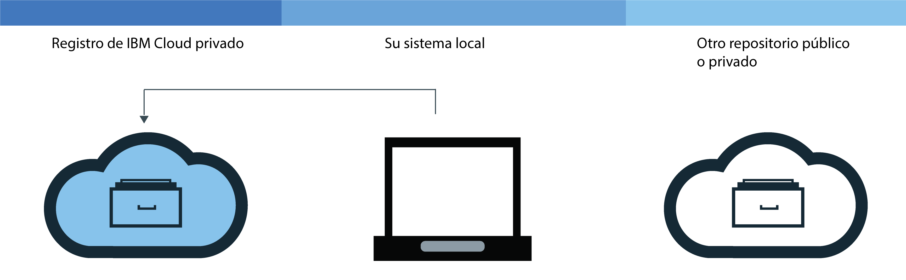
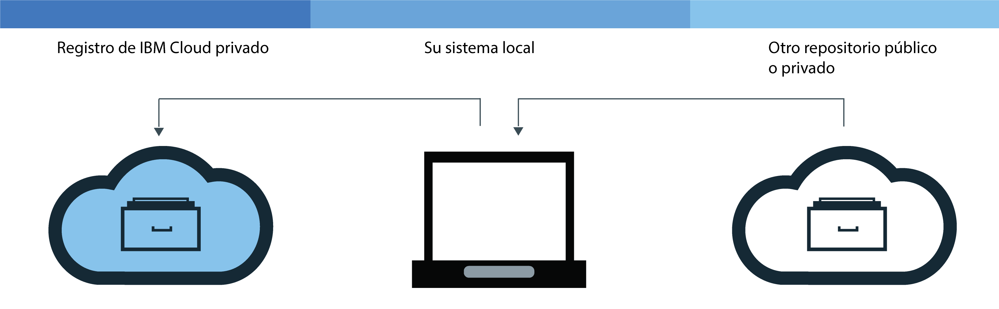

---

copyright:
  years: 2017, 2018
lastupdated: "2018-08-17"

---

{:new_window: target="_blank"}
{:shortdesc: .shortdesc}
{:screen: .screen}
{:pre: .pre}
{:table: .aria-labeledby="caption"}
{:codeblock: .codeblock}
{:tip: .tip}
{:download: .download}


# Adición de imágenes a su espacio de nombres
{: #registry_images_}

Puede almacenar y compartir de forma segura imágenes de Docker con otros usuarios añadiendo imágenes a su espacio de nombres en {{site.data.keyword.registrylong}}.
{:shortdesc}

Cada imagen que desea añadir a su espacio de nombres debe existir en su sistema local en primer lugar. Puede descargar (extraer) una imagen desde otro repositorio al sistema local, o crear su propia imagen de un Dockerfile utilizando el mandato de Docker `build`. Para añadir una imagen a su espacio de nombres, debe subir (enviar por push) la imagen local a su espacio de nombres en {{site.data.keyword.registrylong_notm}}.


No coloque información personal en las imágenes de contenedor, nombres de espacio de nombres, campos de descripción (por ejemplo, en señales de registro), o en cualesquiera datos de configuración de imágenes (por ejemplo, nombres de imágenes o etiquetas de imagen).
{:tip}


## Extracción de imágenes de otro registro
{: #registry_images_pulling}

Puede extraer (descargar) una imagen desde cualquier origen de registro privado o público, y, a continuación, etiquétela para utilizarla más adelante en {{site.data.keyword.registrylong_notm}}.
{:shortdesc}


Antes de empezar:

- [Instale la CLI](registry_setup_cli_namespace.html#registry_cli_install) para trabajar con imágenes en el espacio de nombres.
- [Configure su propio espacio de nombres en {{site.data.keyword.registrylong_notm}}](registry_setup_cli_namespace.html#registry_namespace_add).
- [Asegúrese de que puede ejecutar mandatos Docker sin permisos root](https://docs.docker.com/engine/installation/linux/linux-postinstall). Si el cliente Docker está configurado para requerir permisos root, debe ejecutar los mandatos `ibmcloud login`, `ibmcloud cr login`, `docker pull`, y `docker push` con `sudo`.

  Si cambia sus permisos para ejecutar mandatos Docker sin privilegios root, debe ejecutar de nuevo el mandato `ibmcloud login`.


Para descargar la imagen, consulte [Extraiga una imagen](index.html#registry_images_pulling) en la documentación de iniciación.

Si obtiene el mensaje "No autorizado: se necesita autorización" o el mensaje "denegado: se ha denegado el acceso al recurso", ejecute el mandato `ibmcloud cr login`.
{:tip}


Después de extraer una imagen y de etiquetarla para su espacio de nombres, puede subir (enviar por push) la imagen del sistema local al espacio de nombres.

## Envío por push de imágenes de Docker a su espacio de nombres
{: #registry_images_pushing}

Puede enviar por push (cargar) una imagen a su espacio de nombres en {{site.data.keyword.registrylong_notm}} para almacenar y compartir con seguridad su imagen con otros usuarios.
{:shortdesc}



Antes de empezar:

- [Instale la CLI](registry_setup_cli_namespace.html#registry_cli_install) para trabajar con imágenes en el espacio de nombres.
- [Configure su propio espacio de nombres en el registro privado de {{site.data.keyword.registrylong_notm}}](registry_setup_cli_namespace.html#registry_namespace_add).
- [Extraiga](#registry_images_pulling) o [cree](#registry_images_creating) una imagen en el sistema local y etiquetar la imagen con la información de espacio de nombres.
- [Asegúrese de que puede ejecutar mandatos Docker sin permisos root](https://docs.docker.com/engine/installation/linux/linux-postinstall). Si el cliente Docker está configurado para requerir permisos root, debe ejecutar los mandatos `ibmcloud login`, `ibmcloud cr login`, `docker pull`, y `docker push` con `sudo`.

  Si cambia sus permisos para ejecutar mandatos Docker sin privilegios root, debe ejecutar de nuevo el mandato `ibmcloud login`.


Para subir (enviar por push) una imagen, siga estos pasos.

1. Inicie la sesión en la CLI:

  ```
  ibmcloud cr login
  ```
  {: pre}

  Debe iniciar la sesión si extrae una imagen desde su {{site.data.keyword.registrylong_notm}} privado.
  {:tip}

2. Para ver todos los espacios de nombres que están disponibles en su cuenta, ejecute el mandato `ibmcloud cr namespace-list`.
3. [Cargue la imagen a su espacio de nombres.](index.html#registry_images_pushing)

  Si obtiene el mensaje "No autorizado: se necesita autorización" o el mensaje "denegado: se ha denegado el acceso al recurso", ejecute el mandato `ibmcloud cr login`.
  {:tip}


Después de enviar por push la imagen al registro privado, puede:

- [Gestionar la seguridad con Vulnerability Advisor](../va/va_index.html) para encontrar información sobre potenciales problemas de seguridad y vulnerabilidades.
- [Cree un clúster
y utilice esta imagen para desplegar un contenedor](/docs/containers/container_index.html#container_index) al clúster en {{site.data.keyword.containerlong_notm}}.

## Copia de imágenes entre registros
{: #registry_images_copying}

Puede extraer una imagen de un registro en una región y enviarla por push a un registro de otra región, de forma que puede compartir la imagen con usuarios de ambas regiones.
{:shortdesc}



Antes de empezar:

- [Instale la CLI](registry_setup_cli_namespace.html#registry_cli_install) para trabajar con imágenes en el espacio de nombres.
- [Configure su propio espacio de nombres en el registro privado de {{site.data.keyword.registrylong_notm}}](registry_setup_cli_namespace.html#registry_namespace_add).
- [Asegúrese de que puede ejecutar mandatos Docker sin permisos root](https://docs.docker.com/engine/installation/linux/linux-postinstall). Si el cliente Docker está configurado para requerir permisos root, debe ejecutar los mandatos `ibmcloud login`, `ibmcloud cr login`, `docker pull`, y `docker push` con `sudo`.

  Si cambia sus permisos para ejecutar mandatos Docker sin privilegios root, debe ejecutar de nuevo el mandato `ibmcloud login`.


Para copiar una imagen entre dos registros, siga estos pasos:

1. [Extraiga una imagen desde un registro](#registry_images_pulling).
2. [Envíe por push la imagen a otro registro](#registry_images_pushing). Asegúrese de utilizar el nombre de dominio correcto para la nueva región de destino.

Después de haber copiado la imagen, puede:

- [Gestionar la seguridad con Vulnerability Advisor](../va/va_index.html) para encontrar información sobre potenciales problemas de seguridad y vulnerabilidades.
- [Cree un clúster
y utilice esta imagen para desplegar un contenedor](/docs/containers/container_index.html#container_index) al clúster en {{site.data.keyword.containerlong_notm}}.

## Compilar imágenes de Docker para utilizarlas con su espacio de nombres
{: #registry_images_creating}

Puede crear una imagen de Docker directamente en {{site.data.keyword.Bluemix_notm}} o crear su propia imagen de Docker en su sistema local y subirla (enviar por push) a su espacio de nombres en {{site.data.keyword.registrylong_notm}}.
{:shortdesc}

Antes de empezar:

- [Instale la CLI](registry_setup_cli_namespace.html#registry_cli_install) para trabajar con imágenes en el espacio de nombres.
- [Configure su propio espacio de nombres en el registro privado de {{site.data.keyword.registrylong_notm}}](registry_setup_cli_namespace.html#registry_namespace_add).
- [Asegúrese de que puede ejecutar mandatos Docker sin permisos root](https://docs.docker.com/engine/installation/linux/linux-postinstall). Si el cliente Docker está configurado para requerir permisos root, debe ejecutar los mandatos `ibmcloud login`, `ibmcloud cr login`, `docker pull`, y `docker push` con `sudo`.

  Si cambia sus permisos para ejecutar mandatos Docker sin privilegios root, debe ejecutar de nuevo el mandato `ibmcloud login`.


Una imagen de Docker es la base para todos los contenedores que cree. Una imagen se crea a partir de un Dockerfile, que es un archivo que contiene las instrucciones para crear la imagen. Un Dockerfile podría hacer referencia a los artefactos de compilación en sus instrucciones que se almacenan por separado, como por ejemplo una app, la configuración de la app y sus dependencias.

Si desea sacar partido de los recursos informáticos de {{site.data.keyword.Bluemix_notm}} y no tiene instalado en su estación de trabajo la conexión a Internet o Docker, cree su imagen directamente en {{site.data.keyword.Bluemix_notm}}. Si durante la creación necesita acceder a los recursos que están en servidores detrás de su cortafuegos, cree la imagen localmente.

Para crear su propia imagen de Docker, siga estos pasos:

1. Cree un directorio local donde desea almacenar el contexto de construcción. El contexto de construcción contiene el Dockerfile y artefactos de compilación relacionados, como por ejemplo el código de la app. Navegue hasta este directorio en una ventana de línea de mandatos.
2. Cree un Dockerfile.
  1. Cree un Dockerfile en el directorio local.

    ```
    touch Dockerfile
    ```
    {: pre}

  2. Utilice un editor de texto para abrir el Dockerfile. Como mínimo, debe añadir la imagen base para crear su imagen. Sustituya _&lt;source_image&gt;_ y _&lt;tag&gt;_ por el repositorio de la imagen y etiquételo como que desea utilizarlo. Si está utilizando una imagen desde otro registro privado, defina la vía de acceso completa a la imagen en este registro privado.

    ```
    FROM <source_image>:<tag>
    ```
    {: pre}

    Ejemplo para crear un Dockerfile que se basa en la imagen pública de {{site.data.keyword.IBM_notm}} {{site.data.keyword.appserver_short}} Liberty (ibmliberty):

    ```
    FROM registry.<region>.bluemix.net/ibmliberty:latest
    LABEL description="Es mi prueba Dockerfile"
    EXPOSE 9080
    ```
    {: pre}

    Este ejemplo añade una etiqueta a los metadatos de imagen y expone el puerto 9080. Para obtener más instrucciones acerca de Dockerfile que puede utilizar, consulte la [Referencia de Dockerfile](https://docs.docker.com/engine/reference/builder/).

3. Decida un nombre para su imagen. El nombre de la imagen debe tener el formato siguiente:

  ```
  registry.<region>.bluemix.net/<my_namespace>/<repo_name>:<tag>
  ```
  {: pre}

  donde _&lt;my_namespace&gt;_ es la información del espacio de nombres, _&lt;repo_name&gt;_ es el nombre del repositorio y _&lt;tag&gt;_ es la versión que desea utilizar para su imagen. Para encontrar el espacio de nombres, ejecute el mandato `ibmcloud cr namespace-list`.

4. Anote la vía de acceso al directorio que contiene el Dockerfile. Si ejecuta los mandatos con los pasos siguientes mientras el directorio de trabajo está establecido donde está almacenado su contexto de construcción, puede sustituir _&lt;directory&gt;_ por un punto (.).
5. Puede crear la imagen directamente en {{site.data.keyword.Bluemix_notm}} o puede crearla y probarla localmente antes de enviarla por push a {{site.data.keyword.Bluemix_notm}}.
  - Para crear una imagen directamente en {{site.data.keyword.Bluemix_notm}}, ejecute el mandato siguiente:

    ```
    ibmcloud cr build -t <image_name> <directory>
    ```
    {: pre}

    donde _&lt;image_name&gt;_ es el nombre de su imagen y _&lt;directory&gt;_ es la vía de acceso al directorio.
   
   Para obtener más información sobre el mandato `ibmcloud cr build`, consulte [CLI de {{site.data.keyword.registrylong_notm}}](registry_cli.html).

  - Para crear y probar su imagen localmente antes de enviarla por push a {{site.data.keyword.Bluemix_notm}}, siga estos pasos:
    1. Cree la imagen del Dockerfile en el sistema local y etiquétela con el nombre de la imagen.

      ```
      docker build -t <image_name> <directory>
      ```
      {: pre}

      donde _&lt;image_name&gt;_ es el nombre de su imagen y _&lt;directory&gt;_ es la vía de acceso al directorio.

    2. Opcional: Pruebe la imagen en su sistema local antes de enviarla por push a su espacio de nombres.

      ```
      docker run <image_name>
      ```
      {: pre}

      Sustituya _&lt;image_name&gt;_ por el nombre de la imagen.

    3. Después de crear la imagen y etiquetarla para su espacio de nombres, [puede enviarla por push al registro privado de su espacio de nombres](#registry_images_pushing).

Puede utilizar Vulnerability Advisor para comprobar la seguridad de su imagen; consulte [Gestión de la seguridad de imágenes con Vulnerability Advisor](../va/va_index.html).


## Supresión de imágenes de un repositorio privado de {{site.data.keyword.Bluemix_notm}}
{: #registry_images_remove}

Puede suprimir imágenes no deseadas de un repositorio privado utilizando la interfaz gráfica de usuario (GUI) o la CLI.
{:shortdesc}

Si desea suprimir un repositorio privado y sus imágenes asociadas, consulte [Supresión de un repositorio privado y de cualquier imagen asociada](#registry_repo_remove).

Las imágenes públicas de {{site.data.keyword.IBM_notm}} no pueden suprimirse de un repositorio privado de {{site.data.keyword.Bluemix_notm}} y no cuentan para la cuota.

La supresión de una imagen no se puede deshacer. La supresión de una imagen que un despliegue existente utiliza puede provocar que un escalado, una replanificación, o ambas tareas, fallen.
{:tip}


### Supresión de imágenes de un repositorio privado de {{site.data.keyword.Bluemix_notm}} utilizando la CLI
{: #registry_images_remove_cli}

Puede suprimir imágenes no deseadas de un repositorio privado utilizando la CLI.
{:shortdesc}

La supresión de una imagen no se puede deshacer. La supresión de una imagen que un despliegue existente utiliza puede provocar que un escalado, una replanificación, o ambas tareas, fallen.
{:tip}

Complete los siguientes pasos para suprimir una imagen utilizando la CLI:

1.  Inicie sesión en {{site.data.keyword.Bluemix_notm}} con el mandato `ibmcloud login`.
2.  Para suprimir una imagen, ejecute el mandato siguiente:

  ```
  ibmcloud cr image-rm IMAGE
  ```
  {: pre}

  Donde _IMAGE_ es el nombre de la imagen que desea eliminar, en el formato `repository:tag`.

  Si no se especifica ninguna etiqueta en el nombre de la imagen, de forma predeterminada se suprime la imagen etiquetada como `latest`. Puede suprimir varias imágenes creando una lista de cada vía de acceso privada al registro de {{site.data.keyword.Bluemix_notm}} en el mandato con un espacio entre cada vía de acceso.

 Para encontrar los nombres de sus imágenes, ejecute `ibmcloud cr image-list`. Combine el contenido de las columnas Repositorio y Etiqueta para crear el nombre de imagen en el formato `repository:tag`.
 {:tip}

3.  Compruebe que la imagen se ha suprimido ejecutando el siguiente mandato y compruebe que la imagen no aparece en la lista.

  ```
  ibmcloud cr image-list
  ```
  {: pre}


### Supresión de imágenes de un repositorio privado de {{site.data.keyword.Bluemix_notm}} utilizando la GUI
{: #registry_images_remove_gui}

Puede suprimir imágenes no deseadas de un repositorio privado de imágenes utilizando la interfaz gráfica de usuario (GUI).
{:shortdesc}

La supresión de una imagen no se puede deshacer. La supresión de una imagen que un despliegue existente utiliza puede provocar que un escalado, una replanificación, o ambas tareas, fallen.
{:tip}

Complete los siguientes pasos para suprimir una imagen utilizando la GUI:

1.  Inicie la sesión en la consola de {{site.data.keyword.Bluemix_notm}} ([https://console.bluemix.net](https://console.bluemix.net)) con su IBMid.
2.  Si tiene varias cuentas de {{site.data.keyword.Bluemix_notm}}, seleccione la cuenta y región que desea utilizar desde el menú de la cuenta.
3.  Pulse **Catálogo**.
4.  Seleccione la categoría **Contenedores** y pulse el mosaico **Container Registry**.
5.  Pulse **Repositorios privados**. Se visualiza una lista de repositorios privados.
6.  Pulse la fila con el repositorio que contiene la imagen que desea suprimir.
7.  En la fila que contiene la imagen que desea suprimir, pulse el icono **abrir y cerrar lista de opciones**, seleccione **Suprimir imagen**. Asegúrese de que ha seleccionado la imagen correcta porque esta acción no se puede deshacer. Pulse **Suprimir**.


## Supresión de un repositorio privado y sus imágenes asociadas
{: #registry_repo_remove}

Puede suprimir los repositorios privados que ya no son necesarios y las imágenes asociadas, utilizando la interfaz gráfica de usuario (GUI).
{:shortdesc}

Cuando se suprime un repositorio, se suprimen todas las imágenes de dicho repositorio. Esta acción no se puede deshacer.
{:tip}

Antes de empezar, realice una copia de seguridad de las imágenes que desee conservar.

Complete los siguientes pasos para suprimir un repositorio utilizando la interfaz gráfica de usuario (GUI):

1.  Inicie la sesión en la consola de {{site.data.keyword.Bluemix_notm}} ([https://console.bluemix.net](https://console.bluemix.net)) con su IBMid.
2.  Si tiene varias cuentas de {{site.data.keyword.Bluemix_notm}}, seleccione la cuenta y región que desea utilizar desde el menú de la cuenta.
3.  Pulse **Catálogo**.
4.  Seleccione la categoría **Contenedores** y pulse el mosaico **Container Registry**.
5.  Pulse **Repositorios privados**. Se visualiza una lista de repositorios privados.
6.  En la fila que contiene el repositorio privado que desea suprimir, pulse el icono **abrir y cerrar lista de opciones**, seleccione **Suprimir repositorio**. Asegúrese de que ha seleccionado el repositorio correcto porque esta acción no se puede deshacer. Pulse **Suprimir**.

