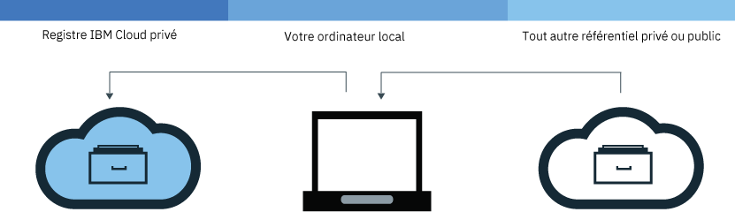
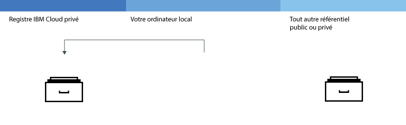

---

copyright:
  years: 2017, 2018
lastupdated: "2018-08-24"

---

{:new_window: target="_blank"}
{:shortdesc: .shortdesc}
{:screen: .screen}
{:pre: .pre}
{:table: .aria-labeledby="caption"}
{:codeblock: .codeblock}
{:tip: .tip}
{:download: .download}


# Ajout d'images à votre espace de nom
{: #registry_images_}

Vous pouvez stocker et partager de manière sécurisée des images Docker avec d'autres utilisateurs en ajoutant ces images à votre espace de nom dans {{site.data.keyword.registrylong}}.
{:shortdesc}

Chaque image que vous voulez ajouter à votre espace de nom doit d'abord exister sur votre ordinateur local. Vous pouvez télécharger une image sur votre ordinateur local (par commande pull) depuis un autre référentiel ou générer votre propre image depuis un fichier Dockerfile à l'aide de la commande Docker `build`. Pour ajouter une image à votre espace de nom, vous devez la télécharger
(par commande push) vers votre espace de nom dans {{site.data.keyword.registrylong_notm}}.


Ne placez pas d'informations personnelles dans vos images de conteneur, noms d'espace de nom, zones de description (par exemple, dans des jetons de registre), ou dans des données de configuration d'image (par exemple, dans des noms d'image ou des libellés d'image).
{:tip}


## Extraction d'images depuis un autre registre
{: #registry_images_pulling}

Vous pouvez extraire (par commande pull) une image depuis n'importe quelle source de registre privé ou public, puis lui attribuer une étiquette pour son utilisation ultérieure dans {{site.data.keyword.registrylong_notm}}.
{:shortdesc}



**Avant de commencer**

- [Installez l'interface de ligne de commande](registry_setup_cli_namespace.html#registry_cli_install) pour utiliser des images présentes dans votre espace de nom.
- [Configurez votre propre espace de nom dans {{site.data.keyword.registrylong_notm}}](registry_setup_cli_namespace.html#registry_namespace_add).
- [Vérifiez que vous pouvez utiliser des commandes Docker sans disposer pour autant d'autorisations de niveau root](https://docs.docker.com/engine/installation/linux/linux-postinstall). Si votre client
Docker est configuré pour exiger des autorisations root, vous devez exécuter le commandes `ibmcloud login`,
`ibmcloud cr login`, `docker pull` et `docker push` avec `sudo`.

  Si vous modifiez vos autorisations pour pouvoir exécuter des commandes Docker sans privilèges d'utilisateur root, vous devez exécuter à nouveau la commande `ibmcloud login`.


Téléchargez l'image ; voir la rubrique relative à l'[extraction des images](index.html#registry_images_pulling) dans le guide de mise en route.

Si le message "unauthorized: authentication required" ou "denied: requested access to the resource is denied" s'affiche, exécutez la commande `ibmcloud cr login`.
{:tip}


Après avoir extrait une image et lui avoir attribué une étiquette pour votre espace de nom, vous pouvez la transférer (par commande push) depuis votre ordinateur local vers votre espace de nom.


## Envoi par commande push d'images Docker à votre espace de nom
{: #registry_images_pushing}

Vous pouvez transférer par commande push une image à votre espace de nom dans {{site.data.keyword.registrylong_notm}} pour la stocker et la partager de manière sécurisée avec d'autres utilisateurs.
{:shortdesc}



**Avant de commencer**

- [Installez l'interface de ligne de commande](registry_setup_cli_namespace.html#registry_cli_install) pour utiliser des images présentes dans votre espace de nom.
- [Configurez votre propre espace de nom dans le registre {{site.data.keyword.registrylong_notm}} privé](registry_setup_cli_namespace.html#registry_namespace_add).
- [Extrayez par commande pull](#registry_images_pulling) ou [générez](#registry_images_creating) une image sur votre ordinateur local et étiquetez-la avec vos informations d'espace de nom.
- [Vérifiez que vous pouvez utiliser des commandes Docker sans disposer pour autant d'autorisations de niveau root](https://docs.docker.com/engine/installation/linux/linux-postinstall). Si votre client
Docker est configuré pour exiger des autorisations root, vous devez exécuter le commandes `ibmcloud login`,
`ibmcloud cr login`, `docker pull` et `docker push` avec `sudo`.

  Si vous modifiez vos autorisations pour pouvoir exécuter des commandes Docker sans privilèges d'utilisateur root, vous devez exécuter à nouveau la commande `ibmcloud login`.


Pour télécharger (par push) une image, procédez comme suit :

1. Connectez-vous à l'interface de ligne de commande.

   ```
   ibmcloud cr login
   ```
   {: pre}

   Vous devez vous connecter si vous extrayez une image depuis votre registre {{site.data.keyword.registrylong_notm}} privé.
  {:tip}

2. Si vous désirez afficher tous les espaces de nom disponibles dans votre compte, exécutez la commande `ibmcloud cr namespace-list`.
3. [Téléchargez l'image par commande push vers votre espace de nom.](index.html#registry_images_pushing)

   Si le message `unauthorized: authentication required` ou `denied: requested access to the resource is denied` s'affiche, exécutez la commande `ibmcloud cr login`.
   {:tip}


Après avoir envoyé à votre registre privé l'image par commande push, vous pouvez effectuer l'une des tâches suivantes :

- [Gérer la sécurité avec Vulnerability Advisor](../va/va_index.html) pour rechercher des informations sur les vulnérabilités et les problèmes de sécurité potentiels.
- [Créer un
cluster et utiliser cette image pour déployer un conteneur](/docs/containers/container_index.html#container_index) sur le cluster dans {{site.data.keyword.containerlong_notm}}.


## Copie d'images entre registres
{: #registry_images_copying}

Vous pouvez extraire une image depuis un registre dans une région donnée, puis la transférer par commande push vers une autre région afin de pouvoir partager l'image avec les utilisateurs dans les deux régions.
{:shortdesc}


**Avant de commencer**

- [Installez l'interface de ligne de commande](registry_setup_cli_namespace.html#registry_cli_install) pour utiliser des images présentes dans votre espace de nom.
- [Configurez votre propre espace de nom dans le registre {{site.data.keyword.registrylong_notm}} privé](registry_setup_cli_namespace.html#registry_namespace_add).
- [Vérifiez que vous pouvez utiliser des commandes Docker sans disposer pour autant d'autorisations de niveau root](https://docs.docker.com/engine/installation/linux/linux-postinstall). Si votre client
Docker est configuré pour exiger des autorisations root, vous devez exécuter le commandes `ibmcloud login`,
`ibmcloud cr login`, `docker pull` et `docker push` avec `sudo`.

  Si vous modifiez vos autorisations pour pouvoir exécuter des commandes Docker sans privilèges d'utilisateur root, vous devez exécuter à nouveau la commande `ibmcloud login`.


Pour copier une image entre deux registres, procédez comme suit :

1. [Extrayez (par commande pull) une image d'un registre](#registry_images_pulling).
2. [Envoyez (par commande push) l'image à un autre registre](#registry_images_pushing). Prenez soin d'utiliser le nom de domaine correct correspondant à la nouvelle région que vous ciblez.

Après avoir copié votre image, vous pouvez effectuer l'une des tâches suivantes :

- [Gérer la sécurité des images avec Vulnerability Advisor](../va/va_index.html) pour rechercher des informations sur les vulnérabilités et les problèmes de sécurité potentiels.
- [Créer un
cluster et utiliser cette image pour déployer un conteneur](/docs/containers/container_index.html#container_index) sur le cluster dans {{site.data.keyword.containerlong_notm}}.


## Génération d'images Docker pour les utiliser avec votre espace de nom
{: #registry_images_creating}

Vous pouvez générer une image Docker directement dans {{site.data.keyword.Bluemix_notm}} ou créer votre propre image Docker sur votre ordinateur local et la télécharger (par commande push) dans votre espace de nom dans {{site.data.keyword.registrylong_notm}}.
{:shortdesc}

**Avant de commencer**

- [Installez l'interface de ligne de commande](registry_setup_cli_namespace.html#registry_cli_install) pour utiliser des images présentes dans votre espace de nom.
- [Configurez votre propre espace de nom dans le registre {{site.data.keyword.registrylong_notm}} privé](registry_setup_cli_namespace.html#registry_namespace_add).
- [Vérifiez que vous pouvez utiliser des commandes Docker sans disposer pour autant d'autorisations de niveau root](https://docs.docker.com/engine/installation/linux/linux-postinstall). Si votre client
Docker est configuré pour exiger des autorisations root, vous devez exécuter le commandes `ibmcloud login`,
`ibmcloud cr login`, `docker pull` et `docker push` avec `sudo`.

  Si vous modifiez vos autorisations pour pouvoir exécuter des commandes Docker sans privilèges d'utilisateur root, vous devez exécuter à nouveau la commande `ibmcloud login`.


Une image Docker est la base de chaque conteneur que vous créez. L'image est créée depuis un
Dockerfile, lequel est un fichier contenant des instructions pour générer l'image. Un Dockerfile peut référencer dans ses
instructions des artefacts de génération stockés séparément, comme une application, sa configuration, et ses dépendances.

Si vous voulez tirer profit des ressources de calcul de {{site.data.keyword.Bluemix_notm}} ou d'une connexion internet ou si Docker n'est pas installé sur votre poste de travail, générez votre image directement sous {{site.data.keyword.Bluemix_notm}}. Si vous avez besoin d'accéder aux ressources de votre génération figurant sur des serveurs en dehors de votre pare-feu, générez votre image localement.

Pour générer votre propre image Docker, procédez comme suit :

1. Créez un répertoire local dans lequel stocker le contexte de génération. Ce dernier contient votre fichier Dockerfile et les artefacts de génération associés, comme le code d'application. Accédez à ce répertoire depuis une fenêtre de ligne de commande.
2. Créez un fichier Dockerfile.
  1. Créez un fichier Dockerfile sous votre répertoire local.

     ```
     touch Dockerfile
     ```
     {: pre}

  2. Utilisez un éditeur de texte pour ouvrir le Dockerfile. Au minimum, vous devez ajouter l'image de base depuis laquelle générer votre image. Remplacez
_&lt;source_image&gt;_ et _&lt;tag&gt;_ par le référentiel d'image et l'étiquette que vous désirez utiliser. Si vous utilisez une image d'un autre registre privé, spécifiez le chemin d'accès complet à l'image dans ce registre privé.

     ```
     FROM <source_image>:<tag>
     ```
     {: pre}

     **Exemple**
     Pour créer un fichier Dockerfile basé sur l'image publique {{site.data.keyword.IBM_notm}} {{site.data.keyword.appserver_short}} Liberty (ibmliberty), utilisez le code suivant :

     ```
     FROM registry.<region>.bluemix.net/ibmliberty:latest
    LABEL description="This is my test Dockerfile"
    EXPOSE 9080
      ```
     {: pre}

     Cet exemple ajoute un libellé aux métadonnées de l'image et expose le port 9080. Pour connaître les autres instructions Dockerfile que vous pouvez utiliser, reportez-vous au document [Dockerfile Reference](https://docs.docker.com/engine/reference/builder/).

3. Choisissez un nom pour votre image. Ce nom doit avoir le format suivant :

   ```
   registry.<region>.bluemix.net/<my_namespace>/<repo_name>:<tag>
   ```
   {: pre}

   où _&lt;my_namespace&gt;_ est votre espace de nom, _&lt;repo_name&gt;_, le nom de votre référentiel, et _&lt;tag&gt;_, la version que vous voulez utiliser pour votre image. Pour identifier votre espace de nom, exécutez la commande `ibmcloud cr namespace-list`.

4. Prenez note du chemin d'accès au répertoire qui contient votre fichier Dockerfile. Si vous exécutez les commandes des procédures suivantes alors que votre répertoire de travail est défini sur l'emplacement où est stocké votre contexte de génération, vous pensez remplacer _&lt;directory&gt;_ par un point (.).
5. Vous pouvez générer directement votre image dans
{{site.data.keyword.Bluemix_notm}} ou la générer et la tester localement avant de la transférer à
{{site.data.keyword.Bluemix_notm}}.
  - Pour générer l'image dans {{site.data.keyword.Bluemix_notm}}, exécutez la commande suivante :

    ```
    ibmcloud cr build -t <image_name> <directory>
    ```
    {: pre}

    où _&lt;image_name&gt;_ est le nom de votre image et _&lt;directory&gt;_ le chemin d'accès au répertoire.
   
   Pour plus d'informations sur la commande `ibmcloud cr build`, voir [Interface de ligne de commande d'{{site.data.keyword.registrylong_notm}}](registry_cli.html).

  - Pour générer et tester votre image localement avant de la transférer par push à {{site.data.keyword.Bluemix_notm}}, procédez comme suit :
    1. Générez l'image depuis votre fichier Dockerfile sur votre ordinateur local et étiquetez-la avec votre nom d'image.

       ```
       docker build -t <image_name> <directory>
       ```
       {: pre}

       où _&lt;image_name&gt;_ est le nom de votre image et _&lt;directory&gt;_ le chemin d'accès au répertoire.

    2. Facultatif : testez votre image sur votre ordinateur local avant de la transférer par commande push vers votre espace de nom.

       ```
       docker run <image_name>
       ```
       {: pre}

       Remplacez _&lt;image_name&gt;_ par le nom de votre image.

    3. Après avoir créé votre image et l'avoir étiquetée
pour votre espace de nom, [vous pouvez l'envoyer
par commande push dans votre registre privé d'espace de nom](#registry_images_pushing).

Pour utiliser Vulnerability Advisor pour vérifier la sécurité de votre image, voir [Gestion de la sécurité des images avec Vulnerability Advisor](../va/va_index.html).


## Suppression d'images de votre référentiel {{site.data.keyword.Bluemix_notm}} privé
{: #registry_images_remove}

Vous pouvez supprimer des images non désirées de votre référentiel privé en utilisant l'interface graphique ou l'interface de ligne de commande.
{:shortdesc}

Si vous souhaitez supprimer un référentiel privé et les pages qui lui sont associées, voir [Suppression d'un référentiel privé et des pages qui lui sont associées](#registry_repo_remove).

Les images {{site.data.keyword.IBM_notm}} publiques ne peuvent pas être supprimées de votre référentiel {{site.data.keyword.Bluemix_notm}} privé, et elles ne sont pas décomptées de votre quota.

La suppression d'une image est irréversible. La suppression d'une image qui est utilisée par un déploiement existant peut entraîner l'échec d'une augmentation et/ou d'une replanification.
{:tip}


### Suppression d'images de votre référentiel {{site.data.keyword.Bluemix_notm}} privé à l'aide de l'interface de ligne de commande
{: #registry_images_remove_cli}

Vous pouvez supprimer des images non désirées de votre référentiel privé en utilisant l'interface de ligne de commande.
{:shortdesc}

La suppression d'une image est irréversible. La suppression d'une image qui est utilisée par un déploiement existant peut entraîner l'échec d'une augmentation et/ou d'une replanification.
{:tip}

Pour supprimer une image à l'aide de l'interface de ligne de commande, procédez comme suit :

1.  Connectez-vous à {{site.data.keyword.Bluemix_notm}} en exécutant la commande `ibmcloud login`.
2.  Pour supprimer une image, exécutez la commande suivante :

    ```
    ibmcloud cr image-rm IMAGE
    ```
    {: pre}

    Où _IMAGE_ est le nom de l'image que vous souhaitez retirer, au format `repository:tag`.

    Si aucune étiquette n'est spécifiée dans le nom de l'image, l'image associée à l'étiquette `latest` est supprimée par défaut. Vous pouvez supprimer plusieurs images en listant dans la commande chaque chemin de registre {{site.data.keyword.Bluemix_notm}} privé et en les séparant par un espace.

    Pour trouver les noms de vos images, exécutez `ibmcloud cr image-list`. Associez le contenu des colonnes Repository et Tag pour créer le nom de l'image au format `repository:tag`.
 {:tip}

3.  Vérifiez que l'image a bien été supprimée en exécutant la commande suivant, puis assurez-vous que l'image n'apparaît pas dans la liste :

    ```
    ibmcloud cr image-list
    ```
    {: pre}


### Suppression d'images de votre référentiel {{site.data.keyword.Bluemix_notm}} privé à l'aide de l'interface graphique
{: #registry_images_remove_gui}

Vous pouvez supprimer des images non désirées de votre référentiel d'images privé en utilisant l'interface graphique.
{:shortdesc}

La suppression d'une image est irréversible. La suppression d'une image qui est utilisée par un déploiement existant peut entraîner l'échec d'une augmentation et/ou d'une replanification.
{:tip}

Pour supprimer une image à l'aide de l'interface graphique, procédez comme suit :

1.  Connectez-vous à la console {{site.data.keyword.Bluemix_notm}} ([https://console.bluemix.net](https://console.bluemix.net)) avec votre IBMid.
2.  Si vous disposez de plusieurs comptes {{site.data.keyword.Bluemix_notm}}, sélectionnez le compte et la région à utiliser dans le menu Compte.
3.  Cliquez sur **Catalogue**.
4.  Sélectionnez la catégorie **Conteneurs** et cliquez sur la vignette **Container Registry**.
5.  Cliquez sur **Référentiels privés**. La liste de vos référentiels privés s'affiche.
6.  Cliquez sur la ligne contenant le référentiel qui contient l'image que vous souhaitez supprimer.
7.  Sur la ligne qui contient l'image à supprimer, cliquez sur l'icône **Ouvrir et fermer la liste des options**, sélectionnez **Supprimer l'image**. Cette action ne peut pas être annulée, par conséquent, vérifiez que l'image sélectionnée est bien celle que vous souhaitez supprimer. Cliquez sur **Supprimer**.


## Suppression d'un référentiel privé et des images qui lui sont associées
{: #registry_repo_remove}

Vous pouvez supprimer les référentiels privés dont vous n'avez plus besoin, ainsi que les images qui leur sont associées, en utilisant l'interface graphique.
{:shortdesc}

Lorsque vous supprimez un référentiel, toutes les images qu'il contient sont également supprimées. Cette action est irréversible.
{:tip}

Avant de commencer, sauvegardez les images que vous souhaitez conserver.

Pour supprimer un référentiel à l'aide de l'interface graphique, procédez comme suit :

1.  Connectez-vous à la console {{site.data.keyword.Bluemix_notm}} ([https://console.bluemix.net](https://console.bluemix.net)) avec votre IBMid.
2.  Si vous disposez de plusieurs comptes {{site.data.keyword.Bluemix_notm}}, sélectionnez le compte et la région à utiliser dans le menu Compte.
3.  Cliquez sur **Catalogue**.
4.  Sélectionnez la catégorie **Conteneurs** et cliquez sur la vignette **Container Registry**.
5.  Cliquez sur **Référentiels privés**. La liste de vos référentiels privés s'affiche.
6.  Sur la ligne qui contient le référentiel privé à supprimer, cliquez sur l'icône **Ouvrir et fermer la liste des options**, sélectionnez **Supprimer le référentiel**. Cette action ne peut pas être annulée, par conséquent, vérifiez que le référentiel sélectionné est bien celui que vous souhaitez supprimer. Cliquez sur **Supprimer**.

