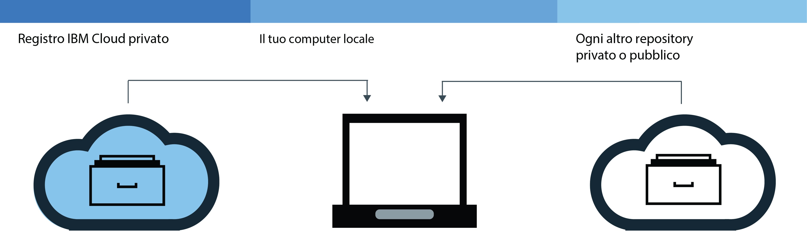
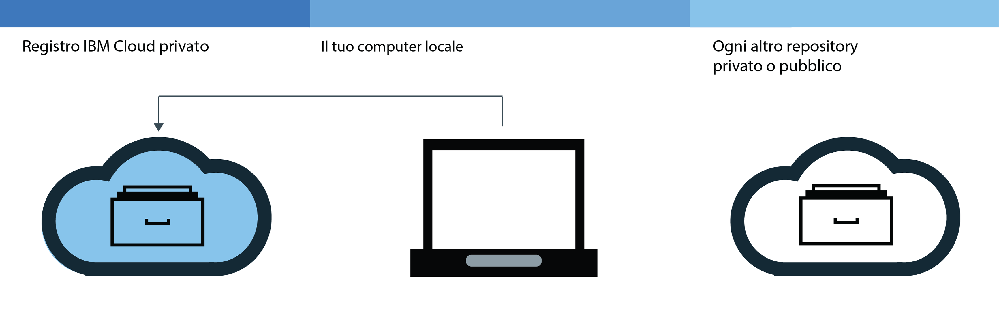
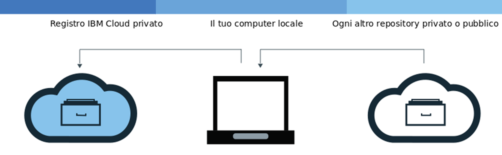

---

copyright:
  years: 2017, 2018
lastupdated: "2018-07-23"

---

{:new_window: target="_blank"}
{:shortdesc: .shortdesc}
{:screen: .screen}
{:pre: .pre}
{:table: .aria-labeledby="caption"}
{:codeblock: .codeblock}
{:tip: .tip}
{:download: .download}


# Aggiunta di immagini al tuo spazio dei nomi
{: #registry_images_}

Puoi memorizzare e condividere in modo sicuro le immagini Docker con altri utenti aggiungendo le immagini al tuo
spazio dei nomi in {{site.data.keyword.registrylong}}.
{:shortdesc}

Ogni immagine che vuoi aggiungere al tuo spazio dei nomi deve essere innanzitutto presente nella tua macchina locale. Puoi
scaricare (pull) un'immagine da un altro repository alla tua macchina locale o puoi creare la tua propria
immagine da un Dockerfile utilizzando il comando `build` di Docker. Per aggiungere un'immagine al tuo
spazio dei nomi, devi caricare (push) l'immagine locale nel tuo spazio dei nomi in {{site.data.keyword.registrylong_notm}}.


Non inserire informazioni personali nelle immagini del contenitore, nei nomi degli spazi dei nomi, nei campi di descrizione (ad esempio, nei token di registro) o in qualsiasi dato di configurazione dell'immagine (ad esempio, nomi o etichette dell'immagine).
{:tip}


## Esecuzione del pull di immagini da un altro registro
{: #registry_images_pulling}

Puoi eseguire il pull (scaricare) di un'immagine da una qualsiasi origine di registro privato o pubblico e contrassegnarla con una tag
per un uso successivo in {{site.data.keyword.registrylong_notm}}.
{:shortdesc}



Prima di iniziare:

- [Installa la CLI](registry_setup_cli_namespace.html#registry_cli_install) per lavorare con le immagini nel tuo
spazio dei nomi.
- [Configura il tuo spazio dei nomi in {{site.data.keyword.registrylong_notm}}](registry_setup_cli_namespace.html#registry_namespace_add).
- [Assicurati di poter eseguire i comandi Docker senza autorizzazioni root](https://docs.docker.com/engine/installation/linux/linux-postinstall). Se
il tuo client Docker è configurato per richiedere le autorizzazioni root, devi eseguire i comandi `ibmcloud login`, `ibmcloud cr login`, `docker pull` e `docker push`
con `sudo`.

  Se modifichi le tue autorizzazioni per eseguire i comandi Docker senza i privilegi root, devi eseguire di nuovo il comando `ibmcloud login`.


Scarica l'immagine; consulta [Esegui il pull di un'immagine](index.html#registry_images_pulling) nella documentazione introduttiva.

Se ricevi un messaggio del tipo "non autorizzato: autenticazione richiesta" o "negato: l'accesso richiesto alla risorsa è stato negato", esegui il comando `ibmcloud cr login`.{:tip}


Dopo aver eseguito il pull di un'immagine e averla contrassegnata con una tag per il tuo spazio dei nomi, puoi caricare (push) l'immagine dalla tua macchina locale al tuo spazio dei nomi.

## Esecuzione del push di immagini Docker al tuo spazio dei nomi
{: #registry_images_pushing}

Puoi eseguire il push (caricare) di un'immagine nel tuo spazio dei nomi in {{site.data.keyword.registrylong_notm}} per memorizzare e condividere in modo sicuro la tua immagine
con altri utenti.
{:shortdesc}



Prima di iniziare:

- [Installa la CLI](registry_setup_cli_namespace.html#registry_cli_install) per lavorare con le immagini nel tuo
spazio dei nomi.
- [Configura il tuo spazio dei nomi nel registro privato {{site.data.keyword.registrylong_notm}}](registry_setup_cli_namespace.html#registry_namespace_add).
- [Esegui il pull](#registry_images_pulling) o [crea](#registry_images_creating) un'immagine sulla tua macchina locale e contrassegna l'immagine tramite tag
con le informazioni sul tuo spazio dei nomi.
- [Assicurati di poter eseguire i comandi Docker senza autorizzazioni root](https://docs.docker.com/engine/installation/linux/linux-postinstall). Se
il tuo client Docker è configurato per richiedere le autorizzazioni root, devi eseguire i comandi `ibmcloud login`, `ibmcloud cr login`, `docker pull` e `docker push` con `sudo`.

  Se modifichi le tue autorizzazioni per eseguire i comandi Docker senza i privilegi root, devi eseguire di nuovo il comando `ibmcloud login`.


Per caricare (push) un'immagine, segui questi passi.

1. Effettua l'accesso alla CLI:

  ```
  ibmcloud cr login
  ```
  {: pre}

  Devi effettuare l'accesso se esegui il pull di un'immagine dal tuo {{site.data.keyword.registrylong_notm}} privato.
  {:tip}

2. Per visualizzare tutti gli spazi dei nomi disponibili nel tuo account, esegui il comando `ibmcloud cr namespace-list`.
3. [Carica l'immagine nel tuo spazio dei nomi.](index.html#registry_images_pushing)

  Se ricevi un messaggio del tipo "non autorizzato: autenticazione richiesta" o "negato: l'accesso richiesto alla risorsa è stato negato", esegui il comando `ibmcloud cr login`.{:tip}


Dopo aver eseguito il push dell'immagine al tuo registro privato, puoi:

- [Gestisci la sicurezza con il Controllo vulnerabilità](../va/va_index.html) per trovare informazioni su possibili vulnerabilità e problemi di sicurezza.
- [Creare un cluster
e utilizzare questa immagine per distribuire un contenitore](../../containers/container_index.html) al cluster in {{site.data.keyword.containerlong_notm}}.

## Copia di immagini tra i registri
{: #registry_images_copying}

Puoi eseguire il pull di un'immagine da un registro in una regione e trasmetterla a un registro in un'altra regione in modo da poter
condividere l'immagine in entrambe le regioni.
{:shortdesc}



Prima di iniziare:

- [Installa la CLI](registry_setup_cli_namespace.html#registry_cli_install) per lavorare con le immagini nel tuo
spazio dei nomi.
- [Configura il tuo spazio dei nomi nel registro privato {{site.data.keyword.registrylong_notm}}](registry_setup_cli_namespace.html#registry_namespace_add).
- [Assicurati di poter eseguire i comandi Docker senza autorizzazioni root](https://docs.docker.com/engine/installation/linux/linux-postinstall). Se
il tuo client Docker è configurato per richiedere le autorizzazioni root, devi eseguire i comandi `ibmcloud login`, `ibmcloud cr login`, `docker pull` e `docker push` con `sudo`.

  Se modifichi le tue autorizzazioni per eseguire i comandi Docker senza i privilegi root, devi eseguire di nuovo il comando `ibmcloud login`.


Per copiare un'immagine tra due registri, segui questi passi.

1. [Esegui il pull di un'immagine da un registro](#registry_images_pulling).
2. [Esegui il push dell'immagine a un altro
registro](#registry_images_pushing). Assicurati di utilizzare il nome del dominio corretto per la nuova regione di destinazione.

Dopo aver copiato l'immagine, puoi:

- [Gestire la sicurezza delle immagini con il Controllo vulnerabilità](../va/va_index.html) per trovare informazioni su potenziali vulnerabilità e problemi di sicurezza.
- [Creare un cluster
e utilizzare questa immagine per distribuire un contenitore](../../containers/container_index.html) al cluster in {{site.data.keyword.containerlong_notm}}.

## Creazione di immagini Docker da utilizzare con il tuo spazio dei nomi
{: #registry_images_creating}

Puoi creare un'immagine Docker direttamente in {{site.data.keyword.Bluemix_notm}} o creare la tua propria immagine Docker sulla macchina locale e caricarla nel tuo spazio dei nomi in {{site.data.keyword.registrylong_notm}}.
{:shortdesc}

Prima di iniziare:

- [Installa la CLI](registry_setup_cli_namespace.html#registry_cli_install) per lavorare con le immagini nel tuo
spazio dei nomi.
- [Configura il tuo spazio dei nomi nel registro privato {{site.data.keyword.registrylong_notm}}](registry_setup_cli_namespace.html#registry_namespace_add).
- [Assicurati di poter eseguire i comandi Docker senza autorizzazioni root](https://docs.docker.com/engine/installation/linux/linux-postinstall). Se
il tuo client Docker è configurato per richiedere le autorizzazioni root, devi eseguire i comandi `ibmcloud login`, `ibmcloud cr login`, `docker pull` e `docker push` con `sudo`.

  Se modifichi le tue autorizzazioni per eseguire i comandi Docker senza i privilegi root, devi eseguire di nuovo il comando `ibmcloud login`.


Un'immagine Docker è la base per ogni contenitore che crei. Un'immagine viene creata da un
Dockerfile, che è un file che contiene le istruzioni su come creare l'immagine. Nelle sue istruzioni, un Dockerfile
potrebbe fare riferimento alle risorse di build che vengono memorizzate separatamente, quali ad esempio un'applicazione, la configurazione
dell'applicazione e le relative dipendenze.

Se vuoi usufruire delle risorse di calcolo di {{site.data.keyword.Bluemix_notm}} e la connessione Internet o Docker non è disponibile sulla tua workstation, crea la tua immagine direttamente in {{site.data.keyword.Bluemix_notm}}. Se hai bisogno di accedere alle risorse della tua build che si trovano su server dietro il tuo firewall, crea l'immagine localmente.

Per creare la tua immagine Docker, completa la seguente procedura:

1. Crea una directory locale in cui memorizzare il contesto di build. Il contesto di build contiene il tuo Dockerfile e le risorse di build correlate, come il codice dell'applicazione. Passa a questa directory in una finestra della riga di comando.
2. Crea un Dockerfile.
  1. Crea un Dockerfile nella tua directory locale.

    ```
    touch Dockerfile
    ```
    {: pre}

  2. Utilizza un editor di testo per aprire il Dockerfile. Come minimo, devi aggiungere l'immagine di base da cui creare la tua immagine. Sostituisci
_&lt;source_image&gt;_ e _&lt;tag&gt;_ con il repository di immagini e la
tag che vuoi utilizzare. Se utilizzi l'immagine proveniente da un altro registro privato, definisci il percorso
completo dell'immagine contenuta in questo registro privato.

    ```
    FROM <source_image>:<tag>
    ```
    {: pre}

    Esempio per creare un Dockerfile basato sull'immagine pubblica {{site.data.keyword.IBM_notm}} {{site.data.keyword.appserver_short}} Liberty (ibmliberty):

    ```
    FROM registry.<region>.bluemix.net/ibmliberty:latest
    LABEL description="This is my test Dockerfile"
    EXPOSE 9080
    ```
    {: pre}

    Questo esempio aggiunge un'etichetta ai metadati dell'immagine ed espone la porta 9080. Per ulteriori informazioni sui Dockerfile
che puoi utilizzare, vedi [Guida di riferimento per
Dockerfile](https://docs.docker.com/engine/reference/builder/).

3. Scegli un nome per la tua immagine. Il nome immagine deve avere il seguente formato:

  ```
  registry.<region>.bluemix.net/<my_namespace>/<repo_name>:<tag>
  ```
  {: pre}

  dove _&lt;my_namespace&gt;_ indica le informazioni sul tuo spazio dei nomi, _&lt;repo_name&gt;_ è il nome del tuo repository e _&lt;tag&gt;_ è la versione che vuoi utilizzare per la tua immagine. Per trovare il tuo spazio dei nomi, esegui il comando `ibmcloud cr namespace-list`.

4. Prendi nota del percorso della directory che contiene il tuo Dockerfile. Se esegui i comandi indicati nella seguente procedura mentre la tua directory di lavoro è impostata sulla posizione in cui è memorizzato il contesto di build, puoi sostituire _&lt;directory&gt;_ con un punto (.).
5. Scegli se creare la tua immagine direttamente in {{site.data.keyword.Bluemix_notm}} oppure se creare e testare la tua immagine in locale prima di eseguirne il push a {{site.data.keyword.Bluemix_notm}}.
  - Per creare l'immagine direttamente in {{site.data.keyword.Bluemix_notm}}, esegui questo comando:

    ```
    ibmcloud cr build -t <image_name> <directory>
    ```
    {: pre}

    dove _&lt;image_name&gt;_ è il nome della tua immagine e _&lt;directory&gt;_ è il percorso della directory.
   
   Per ulteriori informazioni sul comando `ibmcloud cr build`, vedi [CLI di {{site.data.keyword.registrylong_notm}}](registry_cli.html).

  - Per creare e testare la tua immagine in locale prima di eseguirne il push a {{site.data.keyword.Bluemix_notm}}, completa la seguente procedura:
    1. Crea l'immagine dal Dockerfile sulla tua macchina locale e contrassegnala tramite tag con il tuo nome immagine.

      ```
      docker build -t <image_name> <directory>
      ```
      {: pre}

      dove _&lt;image_name&gt;_ è il nome della tua immagine e _&lt;directory&gt;_ è il percorso della directory.

    2. Facoltativo: testa la tua immagine nella macchina locale prima di eseguirne il push al tuo spazio dei nomi.

      ```
      docker run <image_name>
      ```
      {: pre}

      Sostituisci _&lt;image_name&gt;_ con il nome della tua immagine.

    3. Dopo aver creato la tua immagine e averla contrassegnata con una tag per il tuo spazio dei nomi,
[puoi eseguire il push dell'immagine al tuo registro privato dello spazio dei nomi](#registry_images_pushing).

Per utilizzare il Controllo vulnerabilità per verificare la sicurezza della tua immagine, vedi [Gestione della sicurezza delle immagini con il Controllo vulnerabilità](../va/va_index.html).


## Eliminazione di immagini dal tuo repository {{site.data.keyword.Bluemix_notm}} privato
{: #registry_images_remove}

Puoi eliminare le immagini non desiderate dal tuo repository privato utilizzando la GUI (graphical user interface) o la CLI.
{:shortdesc}

Se vuoi eliminare un repository privato e le relative immagini associate, consulta [Eliminazione di un repository privato e delle eventuali immagini associate](#registry_repo_remove).

Le immagini {{site.data.keyword.IBM_notm}} pubbliche non possono essere eliminate dal tuo repository {{site.data.keyword.Bluemix_notm}} privato e non vengono conteggiate nella tua quota.

L'eliminazione di un'immagine non può essere annullata. L'eliminazione di un'immagine utilizzata da una distribuzione esistente potrebbe causare la mancata riuscita di un ridimensionamento, di una ripianificazione o di entrambe le operazioni.
{:tip}


### Eliminazione di immagini dal tuo repository {{site.data.keyword.Bluemix_notm}} privato utilizzando la CLI
{: #registry_images_remove_cli}

Puoi eliminare le immagini indesiderate dal tuo repository privato utilizzando la CLI.
{:shortdesc}

L'eliminazione di un'immagine non può essere annullata. L'eliminazione di un'immagine utilizzata da una distribuzione esistente potrebbe causare la mancata riuscita di un ridimensionamento, di una ripianificazione o di entrambe le operazioni.
{:tip}

Per eliminare un'immagine utilizzando la CLI, completa la seguente procedura:

1.  Effettua l'accesso a {{site.data.keyword.Bluemix_notm}} eseguendo il comando `ibmcloud login`.
2.  Per eliminare un'immagine, esegui questo comando:

  ```
  ibmcloud cr image-rm IMMAGINE
  ```
  {: pre}

  Dove _IMMAGINE_ è il nome dell'immagine che vuoi rimuovere, nel formato `repository:tag`.

  Se nel nome dell'immagine non è specificata alcuna tag, per impostazione predefinita verrà eliminata l'immagine con tag `latest`.Puoi eliminare più immagini elencando ogni percorso del registro {{site.data.keyword.Bluemix_notm}} privato nel comando con uno spazio tra ogni percorso.

 Per trovare i nomi delle tue immagini, esegui `ibmcloud cr image-list`. Combina il contenuto delle colonne Repository e Tag per creare il nome dell'immagine nel formato `repository:tag`.
 {:tip}

3.  Verifica che l'immagine sia stata eliminata immettendo il seguente comando e controlla che l'immagine non sia visualizzata nell'elenco.

  ```
  ibmcloud cr image-list
  ```
  {: pre}


### Eliminazione di immagini dal tuo repository {{site.data.keyword.Bluemix_notm}} privato utilizzando la GUI
{: #registry_images_remove_gui}

Puoi eliminare le immagini indesiderate dal tuo repository di immagini privato utilizzando la GUI (graphical user interface).
{:shortdesc}

L'eliminazione di un'immagine non può essere annullata. L'eliminazione di un'immagine utilizzata da una distribuzione esistente potrebbe causare la mancata riuscita di un ridimensionamento, di una ripianificazione o di entrambe le operazioni.
{:tip}

Per eliminare un'immagine utilizzando la GUI, completa la seguente procedura:

1.  Effettua l'accesso alla console {{site.data.keyword.Bluemix_notm}} ([https://console.bluemix.net](https://console.bluemix.net)) con il tuo ID IBM.
2.  Se hai più account {{site.data.keyword.Bluemix_notm}}, seleziona l'account e la regione che desideri utilizzare dal menu dell'account.
3.  Fai clic su **Catalogo**.
4.  Seleziona la categoria **Contenitori** e fai clic sul tile **Registro contenitore**.
5.  Fai clic su **Private Repositories**. Viene visualizzato un elenco dei tuoi repository privati.
6.  Fai clic sulla riga che contiene il repository che contiene l'immagine che vuoi eliminare.
7.  Nella riga che contiene l'immagine che vuoi eliminare, fai clic sull'icona **apri e chiudi elenco di opzioni** e seleziona **Delete Image**. Assicurati di aver selezionato l'immagine corretta perché questa azione non può essere annullata. Fai clic su **Delete**.


## Eliminazione di un repository privato e delle eventuali immagini associate
{: #registry_repo_remove}

Puoi eliminare i repository privati che non sono più necessari, e le eventuali immagini associate, utilizzando la GUI (graphical user interface).
{:shortdesc}

Quando elimini un repository, tutte le immagini in tale repository vengono eliminate. Questa azione non può essere annullata.
{:tip}

Prima di iniziare, esegui il backup delle immagini che vuoi conservare.

Per eliminare un repository utilizzando la GUI, completa la seguente procedura:

1.  Effettua l'accesso alla console {{site.data.keyword.Bluemix_notm}} ([https://console.bluemix.net](https://console.bluemix.net)) con il tuo ID IBM.
2.  Se hai più account {{site.data.keyword.Bluemix_notm}}, seleziona l'account e la regione che desideri utilizzare dal menu dell'account.
3.  Fai clic su **Catalogo**.
4.  Seleziona la categoria **Contenitori** e fai clic sul tile **Registro contenitore**.
5.  Fai clic su **Private Repositories**. Viene visualizzato un elenco dei tuoi repository privati.
6.  Nella riga che contiene il repository privato che vuoi eliminare, fai clic sull'icona **apri e chiudi elenco di opzioni** e seleziona **Delete Repository**. Assicurati di aver selezionato il repository corretto perché questa azione non può essere annullata. Fai clic su **Delete**.

