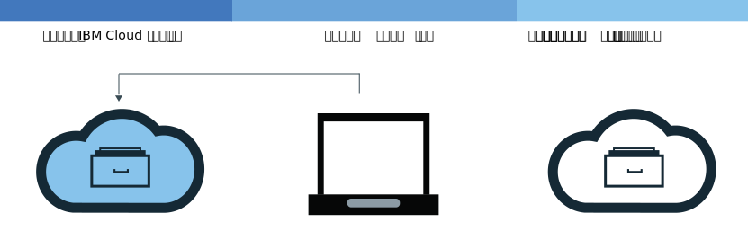

---

copyright:
  years: 2017, 2019
lastupdated: "2019-02-20"

keywords: IBM Cloud Container Registry, Docker build command, delete images, add images, pull images, push images, copy images

subcollection: registry

---

{:new_window: target="_blank"}
{:shortdesc: .shortdesc}
{:screen: .screen}
{:pre: .pre}
{:table: .aria-labeledby="caption"}
{:codeblock: .codeblock}
{:tip: .tip}
{:note: .note}
{:important: .important}
{:deprecated: .deprecated}
{:download: .download}

# 名前空間へのイメージの追加
{: #registry_images_}

{{site.data.keyword.registrylong}} 内の名前空間にイメージを追加することで、安全に Docker イメージを保管して他のユーザーと共有することができます。
{:shortdesc}

名前空間に追加するすべてのイメージは、まずローカル・コンピューターに存在していなければなりません。 別のリポジトリーからローカル・コンピューターにイメージをダウンロード (プル) するか、または Docker `build` コマンドを使用して Dockerfile から独自のイメージをビルドすることができます。 名前空間にイメージを追加するには、{{site.data.keyword.registrylong_notm}} 内の名前空間にローカル・イメージをアップロード (プッシュ) する必要があります。

コンテナー・イメージ、名前空間名、(レジストリー・トークンなどの) 説明フィールド、イメージ構成データ (イメージ名やイメージ・ラベルなど) に個人情報を含めないでください。
{:tip}

## 別のレジストリーからのイメージのプル
{: #registry_images_pulling_reg}

専用レジストリーまたはパブリック・レジストリーのソースからイメージをプル (ダウンロード) してタグ付けし、後に {{site.data.keyword.registrylong_notm}} で使用することができます。
{:shortdesc}


**始めに**

- 名前空間内のイメージを処理するための [CLI をインストールします](/docs/services/Registry/registry_setup_cli_namespace.html#cli_namespace_registry_cli_install)。
- [独自の名前空間を {{site.data.keyword.registrylong_notm}} にセットアップします](/docs/services/Registry/registry_setup_cli_namespace.html#registry_namespace_setup)。
- [root 権限なしで Docker コマンドを実行できることを確認します ](https://docs.docker.com/engine/installation/linux/linux-postinstall)。 Docker クライアントが root 権限を必要とするようにセットアップされている場合は、`ibmcloud login`、`ibmcloud cr login`、`docker pull`、および `docker push` の各コマンドを `sudo` を使用して実行する必要があります。

  root 権限なしで Docker コマンドを実行できるように権限を変更した場合は、再度 `ibmcloud login` コマンドを実行する必要があります。

概説資料の[イメージのプル](/docs/services/Registry/index.html#registry_images_pulling)を参照して、イメージをダウンロードします。

「`unauthorized: authentication required`」または「`denied: requested access to the resource is denied`」というメッセージを受け取った場合は、`ibmcloud cr login` コマンドを実行してください。
{:tip}

イメージをプルして名前空間のタグを付けたら、イメージをローカル・コンピューターから名前空間にアップロード (プッシュ) できます。

## Docker イメージの名前空間へのプッシュ
{: #registry_images_pushing_namespace}

イメージを {{site.data.keyword.registrylong_notm}} 内の名前空間にプッシュ (アップロード) して、イメージを保管して他のユーザーと共有することができます。
{:shortdesc}



**始めに**

- 名前空間内のイメージを処理するための [CLI をインストールします](/docs/services/Registry/registry_setup_cli_namespace.html#cli_namespace_registry_cli_install)。
- [独自の名前空間を {{site.data.keyword.registrylong_notm}} にセットアップします](/docs/services/Registry/registry_setup_cli_namespace.html#registry_namespace_setup)。
- イメージを[プル](#registry_images_pulling_reg)するか、ローカル・コンピューターで[ビルド](#registry_images_creating)し、そのイメージに名前空間情報のタグを付けます。
- [root 権限なしで Docker コマンドを実行できることを確認します ](https://docs.docker.com/engine/installation/linux/linux-postinstall)。 Docker クライアントが root 権限を必要とするようにセットアップされている場合は、`ibmcloud login`、`ibmcloud cr login`、`docker pull`、および `docker push` の各コマンドを `sudo` を使用して実行する必要があります。

  root 権限なしで Docker コマンドを実行できるように権限を変更した場合は、再度 `ibmcloud login` コマンドを実行する必要があります。

イメージをアップロード (プッシュ) するには、以下の手順を実行します。

1. CLI にログインします。

   ```
   ibmcloud cr login
   ```
   {: pre}

   専用 {{site.data.keyword.registrylong_notm}} からイメージをプルする場合、ログインする必要があります。
  {:tip}

2. ご使用のアカウントで利用できるすべての名前空間を表示するには、`ibmcloud cr namespace-list` コマンドを実行します。
3. [イメージを名前空間にアップロードします。](/docs/services/Registry/index.html#registry_images_pushing)

   「`unauthorized: authentication required`」または「`denied: requested access to the resource is denied`」というメッセージを受け取った場合は、`ibmcloud cr login` コマンドを実行してください。
   {:tip}

イメージを{{site.data.keyword.registrylong_notm}}にプッシュしたら、以下のいずれかのタスクを実行できます。

- [脆弱性アドバイザーでセキュリティーを管理](/docs/services/va/va_index.html)して、潜在的なセキュリティー問題や脆弱性に関する情報を探します。
- {{site.data.keyword.containerlong_notm}} で、[クラスターを作成し、このイメージを使用してコンテナーをそのクラスターにデプロイします](/docs/containers/container_index.html#container_index)。

## レジストリー間でのイメージのコピー
{: #registry_images_copying}

ある領域内のレジストリーからイメージをプルし、別の領域内のレジストリーにそれをプッシュすることで、両方の領域のユーザー間でそのイメージを共有することができます。
{:shortdesc}


**始めに**

- 名前空間内のイメージを処理するための [CLI をインストールします](/docs/services/Registry/registry_setup_cli_namespace.html#cli_namespace_registry_cli_install)。
- [独自の名前空間を {{site.data.keyword.registrylong_notm}} にセットアップします](/docs/services/Registry/registry_setup_cli_namespace.html#registry_namespace_setup)。
- [root 権限なしで Docker コマンドを実行できることを確認します ](https://docs.docker.com/engine/installation/linux/linux-postinstall)。 Docker クライアントが root 権限を必要とするようにセットアップされている場合は、`ibmcloud login`、`ibmcloud cr login`、`docker pull`、および `docker push` の各コマンドを `sudo` を使用して実行する必要があります。

  root 権限なしで Docker コマンドを実行できるように権限を変更した場合は、再度 `ibmcloud login` コマンドを実行する必要があります。

2 つのレジストリー間でイメージをコピーするには、次の手順を実行します。

1. [レジストリーからイメージをプルします](#registry_images_pulling_reg)。
2. [イメージを別のレジストリーにプッシュします](#registry_images_pushing_namespace)。 対象となる新しい領域について、正しいドメイン・ネームを使用していることを確認してください。

イメージをコピーした後、以下のいずれかのタスクを実行できます。

- [脆弱性アドバイザーでイメージのセキュリティーを管理](/docs/services/va/va_index.html)して、潜在的なセキュリティー問題や脆弱性に関する情報を見つけます。
- {{site.data.keyword.containerlong_notm}} で、[クラスターを作成し、このイメージを使用してコンテナーをそのクラスターにデプロイします](/docs/containers/container_index.html#container_index)。

## ソース・イメージを参照する新しいイメージの作成
{: #registry_images_source}

ログインしている領域で、同じ領域にある既存のイメージを参照する新しいイメージを {{site.data.keyword.registrylong_notm}} 内に作成します。 この操作は、Docker Engine バージョン 1.12 以降を使用して作成したソース・イメージでのみサポートされます。

このメカニズムを使用して作成した新しいイメージは、シグニチャーを保持しません。 新しいイメージに署名が必要な場合は、このメカニズムを使用しないでください。
{: tip}

**始めに**

- 名前空間内のイメージを処理するための [CLI をインストールします](/docs/services/Registry/registry_setup_cli_namespace.html#cli_namespace_registry_cli_install)。
- 別のイメージの参照に使用するソース・イメージを含む専用名前空間 {{site.data.keyword.registrylong_notm}} へのアクセス権限があることを確認してください。

コマンドについて詳しくは、[`ibmcloud cr image-tag`](/docs/container-registry-cli-plugin/container-registry-cli.html#bx_cr_image_tag) を参照してください。

ソース・イメージから新しいイメージを作成するには、以下の手順を実行します。

1. CLI にログインします。

   ```
   ibmcloud cr login
   ```
   {: pre}

2. 以下のコマンドを実行して、新しい参照を追加します。`SOURCE_IMAGE` はソース・イメージの名前、`TARGET_IMAGE` はターゲット・イメージの名前です。 ソース・イメージとターゲット・イメージは、同一の領域内になければなりません。 `SOURCE_IMAGE` および `TARGET_IMAGE` は `<REPOSITORY>:<TAG>` という形式である必要があります。例: `registry.ng.bluemix.net/namespace/image:latest`

   ```
   ibmcloud cr image-tag [SOURCE_IMAGE] [TARGET_IMAGE]
   ```
   {: pre}

3. 以下のコマンドを実行して、新しいイメージが作成されたことを確認し、そのイメージがソース・イメージと同じイメージ・ダイジェストによってリスト内に示されていることを検証します。

   ```
   ibmcloud cr image-list
   ```
   {: pre}

## 名前空間で使用する Docker イメージのビルド
{: #registry_images_creating}

{{site.data.keyword.Bluemix_notm}} で Docker イメージを直接ビルドするか、ローカル・コンピューターで独自の Docker イメージを作成してから {{site.data.keyword.registrylong_notm}} の名前空間にアップロード (プッシュ) することができます。
{:shortdesc}

**始めに**

- 名前空間内のイメージを処理するための [CLI をインストールします](/docs/services/Registry/registry_setup_cli_namespace.html#cli_namespace_registry_cli_install)。
- [独自の名前空間を {{site.data.keyword.registrylong_notm}} にセットアップします](/docs/services/Registry/registry_setup_cli_namespace.html#registry_namespace_setup)。
- [root 権限なしで Docker コマンドを実行できることを確認します ](https://docs.docker.com/engine/installation/linux/linux-postinstall)。 Docker クライアントが root 権限を必要とするようにセットアップされている場合は、`ibmcloud login`、`ibmcloud cr login`、`docker pull`、および `docker push` の各コマンドを `sudo` を使用して実行する必要があります。

  root 権限なしで Docker コマンドを実行できるように権限を変更した場合は、再度 `ibmcloud login` コマンドを実行する必要があります。

Docker イメージは、作成するすべてのコンテナーの基礎となるものです。 イメージは、Dockerfile (イメージをビルドするための指示が入ったファイル) から作成されます。 Dockerfile の別個に保管されている指示の中で、ビルド成果物 (アプリ、アプリの構成、その従属関係) が参照されることもあります。

{{site.data.keyword.Bluemix_notm}} の計算リソースとインターネット接続を利用する必要がある場合、または Docker がワークステーションにインストールされていない場合は、{{site.data.keyword.Bluemix_notm}} でイメージを直接ビルドします。 ファイアウォールの内側に存在するサーバーのリソースにビルドでアクセスする必要がある場合は、イメージをローカルでビルドします。

独自の Docker イメージをビルドするには、以下の手順を実行します。

1. ビルド・コンテキストを保管するローカル・ディレクトリーを作成します。 ビルド・コンテキストには、Dockerfile および関連するビルド成果物 (アプリ・コードなど) が保管されます。 コマンド・ライン・ウィンドウで、このディレクトリーにナビゲートします。
2. Dockerfile を作成します。
    1. ローカル・ディレクトリーに Dockerfile を作成します。

        ```
        touch Dockerfile
        ```
        {: pre}

    2. テキスト・エディターを使用して Dockerfile を開きます。 少なくとも、イメージをビルドする元の基本イメージを追加する必要があります。 `<source_image>` と `<tag>` を、使用するイメージ・リポジトリーとタグに置き換えてください。別の専用レジストリーのイメージを使用する場合は、{{site.data.keyword.registrylong_notm}}のイメージに対する絶対パスを定義します。

       ```
       FROM <source_image>:<tag>
       ```
       {: pre}

       **例**
     パブリック {{site.data.keyword.IBM_notm}} {{site.data.keyword.appserver_short}} Liberty (ibmliberty) イメージをベースとする Dockerfile を作成するには、次のコードを使用してください。

       ```
       FROM registry.<region>.bluemix.net/ibmliberty:latest
    LABEL description="This is my test Dockerfile"
    EXPOSE 9080
       ```
       {: pre}

       この例では、イメージ・メタデータにラベルを追加し、ポート 9080 を公開します。 使用できる Dockerfile 指示の詳細については、[Dockerfile リファレンス ](https://docs.docker.com/engine/reference/builder/)を参照してください。

3. イメージの名前を決めます。 イメージ名は以下の形式でなければなりません。

   ```
   registry.<region>.bluemix.net/<my_namespace>/<repo_name>:<tag>
   ```
   {: pre}

   `<my_namespace>` は名前空間の情報、`<repo_name>` はリポジトリーの名前、`<tag>` はイメージに使用するバージョンです。名前空間を見つけるには、`ibmcloud cr namespace-list` コマンドを実行します。

4. Dockerfile を含むディレクトリーのパスをメモします。 作業ディレクトリーをビルド・コンテキストの保管場所に設定した状態で、以下の手順のコマンドを実行する場合は、`<directory>` をピリオド (.) に置き換えることができます。
5. {{site.data.keyword.Bluemix_notm}} でイメージを直接ビルドするか、それとも、イメージをローカルでビルドしてテストしてから {{site.data.keyword.Bluemix_notm}} にプッシュするかを選択します。
   - イメージを {{site.data.keyword.Bluemix_notm}} で直接ビルドする場合は、以下のコマンドを実行します。

     ```
     ibmcloud cr build -t <image_name> <directory>
     ```
     {: pre}

     `<image_name>` はイメージの名前、`<directory>` はディレクトリーのパスです。作業ディレクトリーをビルド・コンテキストの保管場所に設定した状態でコマンドを実行する場合は、`<directory>` をピリオド (.) に置き換えることができます。
  
     `ibmcloud cr build` コマンドについて詳しくは、[{{site.data.keyword.registrylong_notm}} CLI](/docs/container-registry-cli-plugin/container-registry-cli.html#bx_cr_build) を参照してください。

   - イメージをローカルでビルドしてテストしてから {{site.data.keyword.Bluemix_notm}} にプッシュする場合は、以下の手順を実行します。
      1. ローカル・コンピューターで Dockerfile からイメージをビルドし、イメージ名のタグを付けます。

         ```
         docker build -t <image_name> <directory>
         ```
         {: pre}

         `<image_name>` はイメージの名前、`<directory>` はディレクトリーのパスです。

      2. オプション: イメージを名前空間にプッシュする前に、ローカル・コンピューターでテストします。

         ```
         docker run <image_name>
         ```
         {: pre}

         `<image_name>` をイメージの名前に置き換えます。

      3. イメージを作成して名前空間用にタグ付けしたら、[{{site.data.keyword.registrylong_notm}} 内の名前空間にイメージをプッシュできます](#registry_images_pushing_namespace)。

脆弱性アドバイザーを使用してイメージのセキュリティーをチェックする方法については、[脆弱性アドバイザーによるイメージのセキュリティーの管理](/docs/services/va/va_index.html)を参照してください。

## プライベート {{site.data.keyword.Bluemix_notm}} リポジトリーからのイメージの削除
{: #registry_images_remove}

グラフィカル・ユーザー・インターフェース (GUI) または CLI を使用して、不要なイメージをプライベート・リポジトリーから削除することができます。
{:shortdesc}

プライベート・リポジトリーとそれに関連したイメージを削除する場合は、[プライベート・リポジトリーおよび関連イメージの削除](#registry_repo_remove)を参照してください。

パブリック {{site.data.keyword.IBM_notm}} イメージは、プライベート {{site.data.keyword.Bluemix_notm}} リポジトリーから削除できません。割り当て量までのカウントにも含まれません。

イメージの削除は元に戻せません。 既存のデプロイメントで使用されているイメージを削除すると、スケールアップ、スケジュール変更、またはその両方が失敗する場合があります。
{:tip}

### CLI を使用したプライベート {{site.data.keyword.Bluemix_notm}} リポジトリーからのイメージの削除
{: #registry_images_remove_cli}

CLI を使用して、不要なイメージをプライベート・リポジトリーから削除できます。
{:shortdesc}

イメージの削除は元に戻せません。 既存のデプロイメントで使用されているイメージを削除すると、スケールアップ、スケジュール変更、またはその両方が失敗する場合があります。
{:tip}

CLI を使用してイメージを削除するには、以下の手順を実行します。

1. `ibmcloud login` コマンドを実行して {{site.data.keyword.Bluemix_notm}} にログインします。
2. イメージを削除するには、次のコマンドを実行します。

   ```
   ibmcloud cr image-rm IMAGE
   ```
   {: pre}

   _IMAGE_ は、削除するイメージの名前 (形式は `repository:tag`) です。

   イメージ名の中にタグを指定しない場合、デフォルトでは、`latest` というタグが付いたイメージが削除されます。 複数のイメージを削除するには、各専用 {{site.data.keyword.Bluemix_notm}} レジストリー・パスをスペースで区切ってコマンドにリストします。

   イメージの名前を調べるには、`ibmcloud cr image-list` を実行します。 Repository 列と Tag 列の内容を組み合わせると、`repository:tag` の形式のイメージ名になります。
   {:tip}

3. 以下のコマンドを実行し、リスト中にイメージが表示されないことを確認して、イメージが削除されたことを検証します。

   ```
   ibmcloud cr image-list
   ```
   {: pre}

### GUI を使用した、プライベート {{site.data.keyword.Bluemix_notm}} リポジトリーからのイメージの削除
{: #registry_images_remove_gui}

グラフィカル・ユーザー・インターフェース (GUI) を使用して、不要なイメージをプライベート・イメージ・リポジトリーから削除することができます。
{:shortdesc}

イメージの削除は元に戻せません。 既存のデプロイメントで使用されているイメージを削除すると、スケールアップ、スケジュール変更、またはその両方が失敗する場合があります。
{:tip}

GUI を使用してイメージを削除するには、以下の手順を実行します。

1. IBMid を使用して {{site.data.keyword.cloud_notm}} コンソール ([https://cloud.ibm.com/login ](https://cloud.ibm.com/login)) にログインします。
2. 複数の {{site.data.keyword.Bluemix_notm}} アカウントをお持ちの場合は、使用するアカウントと領域をアカウント・メニューから選択します。
3. **「カタログ」**をクリックします。
4. **「コンテナー」**カテゴリーを選択し、**「Container Registry」**タイルをクリックします。
5. **「イメージ」**をクリックします。 イメージのリストが表示されます。
6. 削除しようとしているイメージを含む行で、チェック・ボックスを選択します。

   この操作は元に戻せないので、正しいイメージを選択したことを確認してください。
   {: tip}

7. **「イメージの削除 (Delete Image)」**をクリックします。

## プライベート・リポジトリーおよび関連イメージの削除
{: #registry_repo_remove}

グラフィカル・ユーザー・インターフェース (GUI) を使用して、不要になったプライベート・イメージ・リポジトリーおよび関連イメージを削除できます。
{:shortdesc}

リポジトリーを削除すると、そのリポジトリー内のすべてのイメージも削除されます。 このアクションは元に戻せません。
{:tip}

**始めに**

保持する必要のあるイメージをすべてバックアップしなければなりません。

GUI を使用してプライベート・リポジトリーを削除するには、以下の手順を実行します。

1. IBMid を使用して {{site.data.keyword.cloud_notm}} コンソール ([https://cloud.ibm.com/login ](https://cloud.ibm.com/login)) にログインします。
2. 複数の {{site.data.keyword.Bluemix_notm}} アカウントをお持ちの場合は、使用するアカウントと領域をアカウント・メニューから選択します。
3. **「カタログ」**をクリックします。
4. **「コンテナー」**カテゴリーを選択し、**「Container Registry」**タイルをクリックします。
5. **「リポジトリー」**をクリックします。 プライベート・リポジトリーのリストが表示されます。
6. 削除しようとしているプライベート・リポジトリーを含む行で、チェック・ボックスを選択します。

    この操作は元に戻せないので、正しいリポジトリーを選択したことを確認してください。
    {: tip}

7. **「リポジトリーの削除 (Delete Repository)」**をクリックします。
