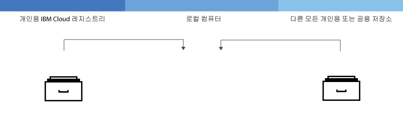
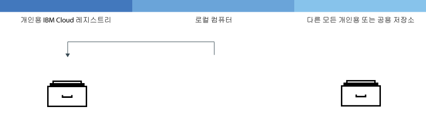
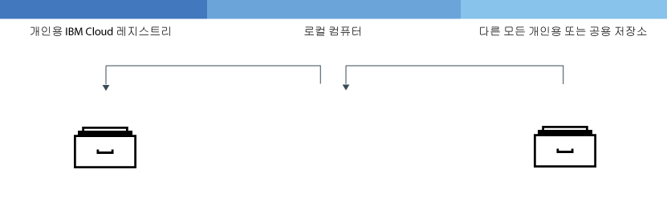

---

copyright:
  years: 2017, 2018
lastupdated: "2018-08-17"

---

{:new_window: target="_blank"}
{:shortdesc: .shortdesc}
{:screen: .screen}
{:pre: .pre}
{:table: .aria-labeledby="caption"}
{:codeblock: .codeblock}
{:tip: .tip}
{:download: .download}


# 네임스페이스에 이미지 추가
{: #registry_images_}

{{site.data.keyword.registrylong}}의 네임스페이스에 이미지를 추가하여 Docker 이미지를 안전하게 저장하고 다른 사용자와 공유할 수 있습니다.
{:shortdesc}

네임스페이스에 추가할 모든 이미지는 먼저 로컬 컴퓨터에 있어야 합니다. 다른 저장소에서 로컬 컴퓨터로 이미지를 다운로드(가져오기)하거나, Docker `build` 명령을 사용하여 Dockerfile에서 고유의 이미지를 빌드할 수 있습니다. 네임스페이스에 이미지를 추가하려면 {{site.data.keyword.registrylong_notm}}의 네임스페이스에 로컬 이미지를 업로드(푸시)해야 합니다.


컨테이너 이미지, 네임스페이스 이름, 설명 필드(예: 레지스트리 토큰) 또는 이미지 구성 데이터(예: 이미지 이름 또는 이미지 레이블)에 개인 정보를 입력하지 마십시오.
{:tip}


## 다른 레지스트리에서 이미지 가져오기
{: #registry_images_pulling}

개인용 또는 공용 레지스트리 소스에서 이미지를 가져온(다운로드) 후에 {{site.data.keyword.registrylong_notm}}에서 나중에 사용할 수 있도록 태그를 지정할 수 있습니다.
{:shortdesc}



시작하기 전에:

- 네임스페이스의 이미지로 작업하려면 [CLI를 설치](registry_setup_cli_namespace.html#registry_cli_install)하십시오.
- [{{site.data.keyword.registrylong_notm}}](registry_setup_cli_namespace.html#registry_namespace_add)에서 고유 네임스페이스를 설정하십시오.
- [루트 권한 없이 Docker 명령을 실행할 수 있는지 확인](https://docs.docker.com/engine/installation/linux/linux-postinstall)하십시오. 루트 권한이 필요하도록 Docker 클라이언트가 설정된 경우, `sudo`를 사용하여 `ibmcloud login`, `ibmcloud cr login`, `docker pull` 및 `docker push` 명령을 실행해야 합니다.

  루트 권한 없이 Docker 명령을 실행하도록 권한을 변경하는 경우 `ibmcloud login` 명령을 다시 실행해야 합니다.


이미지를 다운로드하고 시작하기 문서에서 [이미지 가져오기](index.html#registry_images_pulling)를 참조하십시오.

"unauthorized: authentication required" 또는 "denied: requested access to the resource is denied" 메시지가 표시되면 `ibmcloud cr login` 명령을 실행하십시오.
{:tip}


이미지를 가져와 네임스페이스에 대한 태그를 지정한 후에는 로컬 컴퓨터에서 네임스페이스로 이미지를 업로드(푸시)할 수 있습니다. 

## 네임스페이스에 Docker 이미지 푸시
{: #registry_images_pushing}

이미지를 안전하게 저장하고 다른 사용자와 공유하기 위해 {{site.data.keyword.registrylong_notm}}의 네임스페이스에 이미지를 푸시(업로드)할 수 있습니다.
{:shortdesc}



시작하기 전에:

- 네임스페이스의 이미지로 작업하려면 [CLI를 설치](registry_setup_cli_namespace.html#registry_cli_install)하십시오.
- [{{site.data.keyword.registrylong_notm}} 개인용 레지스트리에서 고유 네임스페이스를 설정](registry_setup_cli_namespace.html#registry_namespace_add)하십시오.
- 로컬 컴퓨터에서 이미지 [가져오기](#registry_images_pulling) 또는 [빌드](#registry_images_creating)를 수행하고 네임스페이스 정보로 이미지에 태그를 지정하십시오. 
- [루트 권한 없이 Docker 명령을 실행할 수 있는지 확인](https://docs.docker.com/engine/installation/linux/linux-postinstall)하십시오. 루트 권한이 필요하도록 Docker 클라이언트가 설정된 경우, `sudo`를 사용하여 `ibmcloud login`, `ibmcloud cr login`, `docker pull` 및 `docker push` 명령을 실행해야 합니다.

  루트 권한 없이 Docker 명령을 실행하도록 권한을 변경하는 경우 `ibmcloud login` 명령을 다시 실행해야 합니다.


이미지를 업로드(푸시)하려면 다음 단계를 따르십시오.

1. 다음을 사용하여 CLI에 로그인하십시오.

  ```
  ibmcloud cr login
  ```
  {: pre}

  개인용 {{site.data.keyword.registrylong_notm}}에서 이미지를 가져오는 경우 로그인해야 합니다.
  {:tip}

2. 계정에서 사용 가능한 모든 네임스페이스를 보려면 `ibmcloud cr namespace-list` 명령을 실행하십시오.
3. [네임스페이스에 이미지를 업로드](index.html#registry_images_pushing)하십시오.

  "unauthorized: authentication required" 또는 "denied: requested access to the resource is denied" 메시지가 표시되면 `ibmcloud cr login` 명령을 실행하십시오.
  {:tip}


이미지를 개인용 레지스트리에 푸시한 후 다음을 수행할 수 있습니다.

- [Vulnerability Advisor를 사용하여 보안을 관리](../va/va_index.html)함으로써 잠재적 보안 문제 및 취약성에 대한 정보를 찾습니다.
- [클러스터를 작성하고
이 이미지를 사용하여 컨테이너](/docs/containers/container_index.html#container_index)를 {{site.data.keyword.containerlong_notm}}의 클러스터에 배치합니다.

## 레지스트리 간에 이미지 복사
{: #registry_images_copying}

두 지역에 있는 사용자와 이미지를 공유할 수 있도록 한 지역의 레지스트리에서 이미지를 가져와 다른 지역의 레지스트리에 푸시할 수 있습니다.
{:shortdesc}



시작하기 전에:

- 네임스페이스의 이미지로 작업하려면 [CLI를 설치](registry_setup_cli_namespace.html#registry_cli_install)하십시오.
- [{{site.data.keyword.registrylong_notm}} 개인용 레지스트리에서 고유 네임스페이스를 설정](registry_setup_cli_namespace.html#registry_namespace_add)하십시오.
- [루트 권한 없이 Docker 명령을 실행할 수 있는지 확인](https://docs.docker.com/engine/installation/linux/linux-postinstall)하십시오. 루트 권한이 필요하도록 Docker 클라이언트가 설정된 경우, `sudo`를 사용하여 `ibmcloud login`, `ibmcloud cr login`, `docker pull` 및 `docker push` 명령을 실행해야 합니다.

  루트 권한 없이 Docker 명령을 실행하도록 권한을 변경하는 경우 `ibmcloud login` 명령을 다시 실행해야 합니다.


두 개의 레지스트리 간에 이미지를 복사하려면 다음 단계를 따르십시오.

1. [레지스트리에서 이미지를 가져오십시오](#registry_images_pulling).
2. [다른 레지스트리에 이미지를 푸시하십시오](#registry_images_pushing). 대상으로 지정하는 새 지역에 대한 올바른 도메인 이름을 사용해야 합니다.

이미지를 복사한 후에 다음을 수행할 수 있습니다.

- [Vulnerability Advisor를 사용하여 이미지 보안을 관리](../va/va_index.html)함으로써 잠재적 보안 문제 및 취약성에 대한 정보를 찾습니다.
- [클러스터를 작성하고
이 이미지를 사용하여 컨테이너](/docs/containers/container_index.html#container_index)를 {{site.data.keyword.containerlong_notm}}의 클러스터에 배치합니다.

## 네임스페이스와 사용할 Docker 이미지 빌드
{: #registry_images_creating}

{{site.data.keyword.Bluemix_notm}}에서 직접 Docker 이미지를 빌드하거나 로컬 컴퓨터에 고유 Docker 이미지를 작성하고 {{site.data.keyword.registrylong_notm}}의 네임스페이스에 업로드(푸시)할 수 있습니다.
{:shortdesc}

시작하기 전에:

- 네임스페이스의 이미지로 작업하려면 [CLI를 설치](registry_setup_cli_namespace.html#registry_cli_install)하십시오.
- [{{site.data.keyword.registrylong_notm}} 개인용 레지스트리에서 고유 네임스페이스를 설정](registry_setup_cli_namespace.html#registry_namespace_add)하십시오.
- [루트 권한 없이 Docker 명령을 실행할 수 있는지 확인](https://docs.docker.com/engine/installation/linux/linux-postinstall)하십시오. 루트 권한이 필요하도록 Docker 클라이언트가 설정된 경우, `sudo`를 사용하여 `ibmcloud login`, `ibmcloud cr login`, `docker pull` 및 `docker push` 명령을 실행해야 합니다.

  루트 권한 없이 Docker 명령을 실행하도록 권한을 변경하는 경우 `ibmcloud login` 명령을 다시 실행해야 합니다.


Docker 이미지는 작성하는 모든 컨테이너의 기초가 됩니다. 이미지는 이미지를 빌드하는 지시사항이 포함된 파일인 Dockerfile에서 작성됩니다. Dockerfile은 앱, 해당 앱의 구성 및 그 종속 항목과 같이 개별적으로 저장되는 해당 지시사항의 빌드 아티팩트를 참조할 수 있습니다.

{{site.data.keyword.Bluemix_notm}} 컴퓨팅 리소스 및 인터넷 연결을 이용하거나 워크스테이션에 Docker가 설치되지 않은 경우 {{site.data.keyword.Bluemix_notm}}에서 직업 이미지를 빌드하십시오. 방화벽 뒤의 서버에 있는 빌드의 리소스에 액세스해야 하는 경우 로컬에서 이미지를 빌드하십시오.

고유 Docker 이미지를 빌드하려면 다음 단계를 완료하십시오.

1. 빌드 컨텍스트를 저장할 로컬 디렉토리를 작성하십시오. 빌드 컨텍스트에는 Dockerfile과 관련 빌드 아티팩트(예: 앱 코드)가 포함되어 있습니다. 명령행 창에서 이 디렉토리로 이동하십시오.
2. Dockerfile을 작성하십시오.
  1. 로컬 디렉토리에 Dockerfile을 작성하십시오.

    ```
    touch Dockerfile
    ```
    {: pre}

  2. 텍스트 편집기를 사용하여 Dockerfile을 여십시오. 최소한, 이미지를 빌드하려면 기본 이미지를 추가해야 합니다. _&lt;source_image&gt;_ 및 _&lt;tag&gt;_를 사용하려는 이미지 저장소 및 태그로 대체하십시오. 다른 개인용 레지스트리의 이미지를 사용하는 경우, 이 개인용 레지스트리에서 이미지에 대한 전체 경로를 정의하십시오.

    ```
    FROM <source_image>:<tag>
    ```
    {: pre}

    공용 {{site.data.keyword.IBM_notm}} {{site.data.keyword.appserver_short}} Liberty(ibmliberty) 이미지를 기반으로 하는 Dockerfile을 작성하는 예:

    ```
    FROM registry.<region>.bluemix.net/ibmliberty:latest
    LABEL description="This is my test Dockerfile"
    EXPOSE 9080
    ```
    {: pre}

    이 예는 이미지 메타데이터에 레이블을 추가하고 포트 9080을 노출합니다. 사용할 수 있는 추가 Dockerfile 지시사항은 [Dockerfile 참조](https://docs.docker.com/engine/reference/builder/)를 참조하십시오.

3. 이미지의 이름을 결정하십시오. 이미지 이름의 형식은 다음과 같아야 합니다.

  ```
  registry.<region>.bluemix.net/<my_namespace>/<repo_name>:<tag>
  ```
  {: pre}

  여기서 _&lt;my_namespace&gt;_는 네임스페이스 정보이고, _&lt;repo_name&gt;_은 저장소의 이름이며, _&lt;tag&gt;_는 이미지에 사용할 버전입니다. 네임스페이스를 찾으려면 `ibmcloud cr namespace-list` 명령을 실행하십시오.

4. Dockerfile을 포함하는 디렉토리의 경로를 기록해 두십시오. 작업 디렉토리를 빌드 컨텍스트가 저장된 위치로 설정한 상태에서 다음 단계의 명령을 실행하면 _&lt;directory&gt;_를 점(.)으로 바꿀 수 있습니다.
5. {{site.data.keyword.Bluemix_notm}}에서 직접 이미지를 빌드하거나, {{site.data.keyword.Bluemix_notm}}에 푸시하기 전에 로컬로 이미지를 빌드하고 테스트하십시오.
  - {{site.data.keyword.Bluemix_notm}}에서 직접 이미지를 빌드하려면 다음 명령을 실행하십시오.

    ```
    ibmcloud cr build -t <image_name> <directory>
    ```
    {: pre}

    여기서 _&lt;image_name&gt;_은 이미지의 이름이고 _&lt;directory&gt;_는 디렉토리의 경로입니다.
   
   `ibmcloud cr build` 명령에 대한 자세한 정보는 [{{site.data.keyword.registrylong_notm}} CLI](registry_cli.html)를 참조하십시오.

  - {{site.data.keyword.Bluemix_notm}}에 푸시하기 전에 로컬에서 이미지를 빌드하고 테스트하려면 다음 단계를 완료하십시오.
    1. 로컬 컴퓨터의 Dockerfile에서 이미지를 빌드하고 이미지 이름으로 태그를 지정하십시오. 

      ```
      docker build -t <image_name> <directory>
      ```
      {: pre}

      여기서 _&lt;image_name&gt;_은 이미지의 이름이고 _&lt;directory&gt;_는 디렉토리의 경로입니다.

    2. 선택사항: 네임스페이스에 이미지를 푸시하기 전에 로컬 컴퓨터에서 이를 테스트하십시오. 

      ```
      docker run <image_name>
      ```
      {: pre}

      _&lt;image_name&gt;_을 이미지의 이름으로 바꾸십시오.

    3. 이미지를 작성하고 여기에 사용자의 네임스페이스에 대한 태그를 지정한 후에 [이미지를 네임스페이스 개인용 레지스트리로 푸시할 수 있습니다](#registry_images_pushing).

Vulnerability Advisor를 사용하여 이미지의 보안을 확인하려면 [Vulnerability Advisor로 이미지 보안 관리](../va/va_index.html)를 참조하십시오.


## 개인용 {{site.data.keyword.Bluemix_notm}} 저장소에서 이미지 삭제
{: #registry_images_remove}

그래픽 사용자 인터페이스(GUI) 또는 CLI를 사용하여 개인용 저장소에서 원치 않는 이미지를 삭제할 수 있습니다.
{:shortdesc}

개인용 저장소 및 해당 연관된 이미지를 삭제하려는 경우에는 [개인용 저장소 및 연관된 이미지 삭제](#registry_repo_remove)를 참조하십시오.

공용 {{site.data.keyword.IBM_notm}} 이미지는 개인용 {{site.data.keyword.Bluemix_notm}} 저장소에서 삭제할 수 없으며 할당량에 대해 계산되지 않습니다.

이미지 삭제는 실행 취소할 수 없습니다. 기존 배치에서 사용 중인 이미지를 삭제하면 스케일 업 또는 재스케줄(또는 둘 다)이 실패할 수 있습니다.
{:tip}


### CLI를 사용하여 개인용 {{site.data.keyword.Bluemix_notm}} 저장소에서 이미지 삭제
{: #registry_images_remove_cli}

CLI를 사용하여 개인용 저장소에서 원치 않는 이미지를 삭제할 수 있습니다.
{:shortdesc}

이미지 삭제는 실행 취소할 수 없습니다. 기존 배치에서 사용 중인 이미지를 삭제하면 스케일 업 또는 재스케줄(또는 둘 다)이 실패할 수 있습니다.
{:tip}

CLI를 사용하여 이미지를 삭제하려면 다음 단계를 완료하십시오.

1.  `ibmcloud login` 명령을 실행하여 {{site.data.keyword.Bluemix_notm}}에 로그인하십시오.
2.  이미지를 삭제하려면 다음 명령을 실행하십시오.

  ```
  ibmcloud cr image-rm IMAGE
  ```
  {: pre}

  여기서 _IMAGE_는 `repository:tag` 형식으로 된 제거할 이미지의 이름입니다.

  이미지 이름에 태그가 지정되지 않은 경우에는 `latest`로 태그 지정된 이미지가 기본적으로 삭제됩니다. 명령에 각 개인용 {{site.data.keyword.Bluemix_notm}} 레지스트리 경로를 공백으로 구분하여 나열함으로써 여러 이미지를 삭제할 수 있습니다.

 이미지의 이름을 찾으려면 `ibmcloud cr image-list`를 실행하십시오. 저장소 및 태그 열의 컨텐츠를 결합하여 `repository:tag` 형식의 이미지 이름을 작성하십시오.
 {:tip}

3.  다음 명령을 실행하여 이미지가 삭제되었는지 확인하고 이미지가 목록에 표시되지 않는지 검사하십시오.

  ```
  ibmcloud cr image-list
  ```
  {: pre}


### GUI를 사용하여 개인용 {{site.data.keyword.Bluemix_notm}} 저장소에서 이미지 삭제
{: #registry_images_remove_gui}

그래픽 사용자 인터페이스(GUI)를 사용하여 개인용 저장소에서 원치 않는 이미지를 삭제할 수 있습니다.
{:shortdesc}

이미지 삭제는 실행 취소할 수 없습니다. 기존 배치에서 사용 중인 이미지를 삭제하면 스케일 업 또는 재스케줄(또는 둘 다)이 실패할 수 있습니다.
{:tip}

GUI를 사용하여 이미지를 삭제하려면 다음 단계를 완료하십시오.

1.  IBM ID를 사용하여 {{site.data.keyword.Bluemix_notm}} 콘솔([https://console.bluemix.net](https://console.bluemix.net))에 로그인하십시오.
2.  {{site.data.keyword.Bluemix_notm}} 계정이 여러 개인 경우 계정 메뉴에서 사용할 계정과 지역을 선택하십시오.
3.  **카탈로그**를 클릭하십시오.
4.  **컨테이너** 카테고리를 선택하고 **컨테이너 레지스트리** 타일을 클릭하십시오.
5.  **개인용 저장소**를 클릭하십시오. 개인용 저장소의 목록이 표시됩니다.
6.  삭제할 이미지를 포함하는 저장소가 있는 행을 클릭하십시오.
7.  삭제할 이미지를 포함하는 행에서 **옵션 목록 열기 및 닫기** 아이콘을 클릭하고 **이미지 삭제**를 선택하십시오. 이 조치는 실행 취소할 수 없으므로 올바른 이미지를 선택했는지 확인하십시오. **삭제**를 클릭하십시오.


## 개인용 저장소 및 연관된 이미지 삭제
{: #registry_repo_remove}

그래픽 사용자 인터페이스(GUI)를 사용하여 더 이상 필요하지 않은 개인용 저장소 및 이와 연관된 이미지를 삭제할 수 있습니다.
{:shortdesc}

특정 저장소를 삭제하면 해당 저장소의 모든 이미지가 삭제됩니다. 이 조치는 실행 취소할 수 없습니다.
{:tip}

시작하기 전에 보존할 이미지를 백업하십시오.

GUI를 사용하여 저장소를 삭제하려면 다음 단계를 완료하십시오.

1.  IBM ID를 사용하여 {{site.data.keyword.Bluemix_notm}} 콘솔([https://console.bluemix.net](https://console.bluemix.net))에 로그인하십시오.
2.  {{site.data.keyword.Bluemix_notm}} 계정이 여러 개인 경우 계정 메뉴에서 사용할 계정과 지역을 선택하십시오.
3.  **카탈로그**를 클릭하십시오.
4.  **컨테이너** 카테고리를 선택하고 **컨테이너 레지스트리** 타일을 클릭하십시오.
5.  **개인용 저장소**를 클릭하십시오. 개인용 저장소의 목록이 표시됩니다.
6.  삭제할 개인용 저장소를 포함하는 행에서 **옵션 목록 열기 및 닫기** 아이콘을 클릭하고 **저장소 삭제**를 선택하십시오. 이 조치는 실행 취소할 수 없으므로 올바른 저장소를 선택했는지 확인하십시오. **삭제**를 클릭하십시오.

