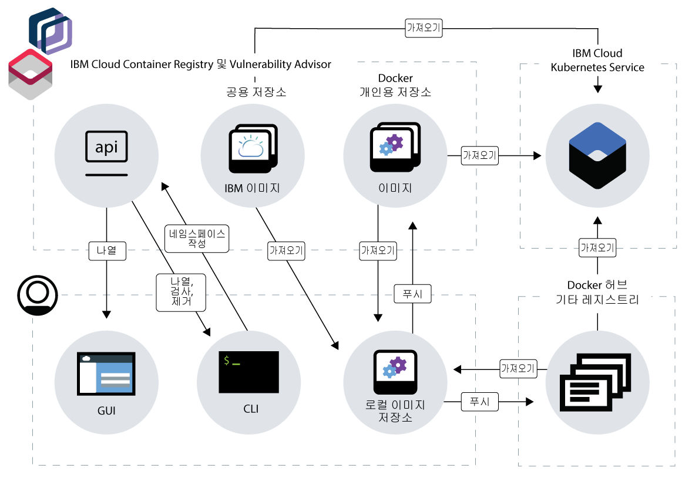

---

copyright:
  years: 2017, 2018
lastupdated: "2018-08-24"

---

{:new_window: target="_blank"}
{:shortdesc: .shortdesc}
{:screen: .screen}
{:pre: .pre}
{:table: .aria-labeledby="caption"}
{:codeblock: .codeblock}
{:tip: .tip}
{:download: .download}


# {{site.data.keyword.registrylong_notm}} 정보
{: #registry_overview}

{{site.data.keyword.registrylong}}를 사용하여 높은 가용성과 확장성을 갖춘 아키텍처에 개인용 Docker 이미지를 안전하게 저장하고 액세스하십시오.
{:shortdesc}

{{site.data.keyword.registrylong_notm}}에서는 IBM에서 호스팅하고 관리하는 멀티 테넌트의 높은 가용성과 확장성을 갖춘 개인용 이미지 레지스트리를 제공합니다. 고유의 이미지 네임스페이스를 설정하고 네임스페이스에 Docker 이미지를 푸시하여 개인용 레지스트리를 사용할 수 있습니다.



**그림 1. {{site.data.keyword.registrylong_notm}}가 Docker 이미지와 상호작용하는 방법**

Docker 이미지는 작성하는 모든 컨테이너의 기초가 됩니다. 이미지는 이미지를 빌드하는 지시사항이 포함된 파일인 Dockerfile에서 작성됩니다. Dockerfile은 앱, 해당 앱의 구성 및 그 종속 항목과 같이 개별적으로 저장되는 해당 지시사항의 빌드 아티팩트를 참조할 수 있습니다. 일반적으로 이미지는 공용으로 액세스 가능한 레지스트리(공용 레지스트리) 또는 소규모의 사용자 그룹에 대해
제한된 액세스를 제공하는 레지스트리(개인용 레지스트리)에 저장됩니다. {{site.data.keyword.registrylong_notm}}를 사용하면 {{site.data.keyword.Bluemix_notm}} 계정에 대한 액세스 권한이 있는 사용자만 이미지에 액세스할 수 있습니다.

{{site.data.keyword.registrylong_notm}}에 이미지를 푸시하는 경우, 잠재적 보안 문제 및 취약성을 확인하는 기본 제공 Vulnerability Advisor 기능을
활용할 수 있습니다. Vulnerability Advisor는 특정 Docker 기본 이미지에서 취약한 패키지를 확인하고
앱 구성 설정에서 알려진 취약성을 확인합니다. 취약성이 발견되면 그 취약성에 대한 정보가 제공됩니다. 취약한 이미지에서 컨테이너가 배치되지 않도록 이 정보를 사용하여
보안 문제를 해결할 수 있습니다.

{{site.data.keyword.registrylong_notm}} 사용에 대한 이점의 개요를 알아보려면 다음 표를 검토하십시오.

|이점|설명|
|-------|-----------|
|고가용성 및 확장 가능 개인용 레지스트리|<ul><li>IBM에서 호스팅하고 관리하는 멀티 테넌트, 고가용성 및 확장 가능 개인용 레지스트리에서 고유의 이미지 네임스페이스를 설정합니다.</li><li>개인용 Docker 이미지를 안전하게 저장하고 {{site.data.keyword.Bluemix_notm}} 계정의 사용자들과 공유합니다.</li></ul>|
|Vulnerability Advisor를 사용하여 이미지 보안 규제 준수|<ul><li>네임스페이스의 이미지에 대한 자동 스캔을 활용할 수 있습니다.</li><li>잠재적 취약성을 수정하고 컨테이너가 손상되지 않도록 보호하기 위해 운영 체제별 권장사항을 검토합니다.</li></ul>|
|스토리지 및 가져오기 트래픽에 대한 할당량 한계|<ul><li>무료 할당량에 도달하기 전까지 개인용 이미지에 대한 스토리지 및 가져오기 트래픽을 활용할 수 있습니다.</li><li>선호하는 결제 레벨을 초과하지 않도록 월별 스토리지 및 가져오기 트래픽 양에 대한 사용자 정의 할당량 한계를 설정할 수 있습니다.</li></ul>|
{: caption="표 1. {{site.data.keyword.registrylong_notm}} 이점" caption-side="top"}

## 서비스 플랜
{: #registry_plans}

무료 또는 표준 {{site.data.keyword.registrylong_notm}} 서비스 플랜을 선택하여 Docker 이미지를 저장하고 {{site.data.keyword.Bluemix_notm}} 계정의 사용자에게 이미지를 제공할 수 있습니다.
{:shortdesc}

{{site.data.keyword.registrylong_notm}} 서비스 플랜은 개인용 이미지를 위해 사용할 수 있는 스토리지 및 가져오기 트래픽의 양을 판별합니다. 서비스 플랜은 {{site.data.keyword.Bluemix_notm}} 계정과 연관되어 있으며, 사용자의 계정에서 설정한 모든 네임스페이스에 대한 스토리지 및 이미지 가져오기 트래픽 적용을 제한합니다.

다음 표에 사용 가능한 {{site.data.keyword.registrylong_notm}} 서비스 플랜 및 해당 특성이 표시됩니다. 서비스 플랜 한계를 초과할 때 발생하는 문제와 비용 청구 방식에 대한 자세한 정보는 [{{site.data.keyword.registrylong_notm}}의 할당량 한계와 비용 청구](#registry_plan_billing)를 참조하십시오.

|특성|무료|표준|
|---------------|----|--------|
|설명|Docker 이미지를 안전하게 저장하고 공유하도록 {{site.data.keyword.registrylong_notm}}의 개인용 지스트리를 사용해 보십시오. 이 플랜은 {{site.data.keyword.registrylong_notm}}에서 첫 번째 네임스페이스를 설정할 때 기본으로 적용되는 서비스 플랜입니다.|무제한의 스토리지 및 가져오기 트래픽 사용량으로 {{site.data.keyword.Bluemix_notm}} 계정의 모든 네임스페이스에 대한 Docker 이미지를 관리하십시오.|
|이미지의 스토리지 양|500MB|무제한|
|가져오기 트래픽|월별 5GB|무제한|
|청구|스토리지 또는 가져오기 트래픽 한계를 초과하는 경우, 이미지를 네임스페이스에 푸시하거나 이미지를 네임스페이스에서 가져올 수 없습니다. 자세한 정보는 [{{site.data.keyword.registrylong_notm}}의 할당량 한계 및 비용 청구](#registry_plan_billing)를 참조하십시오.|<ul><li>스토리지: 기가바이트-월 사용량을 기준으로 비용이 부과됩니다. 처음 0.5GB-월은 무료입니다. 그 후에는 가격 책정 계산기에 설명된 대로 비용이 부과됩니다.</li><li>가져오기 트래픽: 월별 기가바이트 사용량을 기준으로 비용이 부과됩니다. 처음 5GB는 무료입니다. 그 후에는 가격 책정 계산기에 설명된 대로 비용이 부과됩니다. 스토리지 또는 가져오기 트래픽 한계를 초과하는 경우, 이미지를 네임스페이스에 푸시하거나 이미지를 네임스페이스에서 가져올 수 없습니다. 스토리지, 가져오기 트래픽 및 가격 책정 계산기에 대한 자세한 정보는 [{{site.data.keyword.registrylong_notm}}의 할당량 한계 및 비용 청구](#registry_plan_billing)를 참조하십시오.</li></ul>|
{: caption="표 2. {{site.data.keyword.registrylong_notm}} 플랜" caption-side="top"}

## 할당량 한계 및 청구
{: #registry_plan_billing}

{{site.data.keyword.registrylong_notm}}의 청구 프로세스 및 할당량 한계 방식에 대한 정보와 예제를 설명합니다.
{:shortdesc}

모든 이미지는 각각 기본 이미지의 증분 변경을 나타내는 다수의 계층에서 빌드됩니다. 이미지를 푸시하거나 가져올 때 각 계층에 필요한 스토리지 및 가져오기 트래픽의 양이 월별 사용량에 추가됩니다. 동일한 계층이 자동으로
{{site.data.keyword.Bluemix_notm}} 계정의 이미지 간에 공유되며 다른 이미지를 작성하는 경우
재사용됩니다. 동일한 각 계층에 대한 스토리지는 사용자 계정에서 얼마나 많은 이미지가 해당 계층을 참조하는지에 상관없이 한 번만 청구됩니다.

이미지 푸시에 대한 예:

> Ubuntu 이미지를 기반으로 하는 네임스페이스에 이미지를 푸시합니다. Ubuntu 이미지에는 몇 개의 계층이 포함되어 있습니다. 사용자의 계정에 이러한 계층이 아직 없기 때문에 해당 계층에서 필요로 하는 스토리지의 양이 사용자의 월별 사용량에 추가됩니다.
>
> 나중에 Ubuntu 이미지를 기반으로 하는 두 번째 이미지를 작성합니다. 예를 들면,  Dockerfile에 선택적 명령 또는 파일을 추가하여 Ubuntu 기본 이미지를 변경합니다. 각 변경사항은 새 이미지 계층을 나타냅니다. 두 번째 이미지를 푸시하면 {{site.data.keyword.registrylong_notm}}는 기본 Ubuntu 이미지의 모든 계층이 이미 사용자의 계정에 저장되었음을 인식합니다. 이미지를 다른 네임스페이스에 푸시했더라도 해당 계층을 두 번째 저장하는 데 비용이 부과되지는 않습니다. {{site.data.keyword.registrylong_notm}}는 모든 새 계층의 크기를 판별하고 스토리지의 양을 월별 사용량에 추가합니다.

### 스토리지 및 가져오기 트래픽에 대한 청구
{: #registry_billing_traffic}

선택하는 서비스 플랜에 따라서 월별 사용하는 스토리지 및 가져오기 트래픽에 대해 비용이 부과됩니다.
{:shortdesc}

**스토리지: **

  모든 {{site.data.keyword.registrylong_notm}} 서비스 플랜은 {{site.data.keyword.Bluemix_notm}} 계정의 네임스페이스에서 Docker 이미지를 안전하게 저장하기 위해 사용할 수 있는 일정한 양의 스토리지와 함께 제공됩니다. 표준 플랜인 경우, GB-월 사용량 기준으로 비용이 부과됩니다. 처음 0.5GB-월은 무료입니다. 무료 사용제인 경우, 무료 사용제에 대한 할당량 한계에 도달할 때까지 {{site.data.keyword.registrylong_notm}}에서 이미지를 무료로 저장할 수 있습니다. GB-월은 한 달(730시간)에 대한 1GB 스토리지의 평균입니다.

  표준 플랜에 대한 예:

  > 정확히 한 달의 반 동안 5GB를 사용한 후에 사용자의 네임스페이스로 몇 개의 이미지를 푸시하여 그 달의 나머지 기간 동안 10GB를 사용합니다. 월별 사용량은 다음과 같이 계산됩니다.
  >
  > (5GB x 0.5(월)) + (10GB x 0.5(월)) = 2.5 + 5 = 7.5GB-월
  >
  > 표준 플랜에서 처음 0.5GB-월은 무료이므로 7GB-월에 대해 비용이 부과됩니다(7.5GB-월 - 0.5GB-월).

  

**가져오기 트래픽: **

  모든 {{site.data.keyword.registrylong_notm}} 서비스 플랜에는 네임스페이스에 저장된 개인용 이미지에 대한 일정한 양의 무료 가져오기 트래픽이 포함되어 있습니다. 가져오기 트래픽은 네임스페이스에서 사용자의 로컬 시스템으로 이미지의 계층을 가져올 때 사용하는 데이터 전송량입니다. 표준 플랜인 경우, 월별 GB 사용량 기준으로 비용이 부과됩니다. 매월 처음 5GB는 무료입니다. 무료 사용제인 경우, 무료 사용제에 대한 할당량 한계에 도달할 때까지 네임스페이스에서 이미지를 가져올 수 있습니다.

  표준 플랜에 대한 예:

  > 해당 월에 전체 크기 14GB의 계층이 포함된 이미지를 가져왔습니다. 월별 사용량은 다음과 같이 계산됩니다.
  >
  > 표준 플랜에서 월별 처음 5GB는 무료이므로 9GB에 대해 비용이 부과됩니다(14GB - 5GB).

  

### 스토리지 및 가져오기 트래픽에 대한 할당량 한계
{: #registry_quota_limits}

선택하는 서비스 플랜에 따라서 플랜별 또는 사용자 정의 할당량 한계에 도달할 때까지 네임스페이스에 이미지를 푸시하고 네임스페이스에서 이미지를 가져올 수 있습니다.
{:shortdesc}

**스토리지: **

  플랜에 대한 할당량 한계에 도달하거나 초과하면 네임스페이스에서 [이미지를 제거하여 여유 공간을 확보](registry_quota.html#registry_quota_freeup)하거나 [표준 플랜으로 업그레이드](#registry_plan_upgrade)할 때까지 {{site.data.keyword.Bluemix_notm}} 계정의 네임스페이스에 이미지를 푸시할 수 없습니다. 무료 또는 표준 플랜에서 스토리지에 대한 할당량 한계를 설정한 경우, [이 할당량 한계를 늘려](registry_quota.html#registry_quota_set) 새 이미지를 푸시할 수 있습니다.

  표준 플랜에 대한 예:

  > 스토리지에 대한 현재 할당량 한계는 1GB로 설정되어 있습니다. {{site.data.keyword.Bluemix_notm}} 계정의 네임스페이스에 저장된 모든 개인용 이미지는 이 스토리지 중에서 900MB를 이미 사용하고 있습니다. 할당량 한계에 도달할 때까지 100MB 스토리지가 사용 가능합니다. 한 사용자가 로컬 시스템의 2GB 크기의 이미지를 푸시하려고 합니다. 할당량 한계에 아직 도달하지 않았기 때문에 {{site.data.keyword.registrylong_notm}}는 사용자가 이 이미지를 푸시하도록 허용합니다.
  >
  > 푸시 후에 {{site.data.keyword.registrylong_notm}}는 네임스페이스에서 이미지의 실제 크기를 판별합니다(이 크기는 로컬 시스템에 대한 크기에 따라 달라질 수 있음). 그리고 스토리지 한계에 도달했는지 여부를 확인합니다. 이 예에서 스토리지 사용량은 900MB에서 2GB만큼 늘어납니다. 현재 할당량 한계가 1GB이기 때문에 {{site.data.keyword.registrylong_notm}}는 네임스페이스에 추가 이미지를 푸시하지 못하게 합니다.

**가져오기 트래픽: **

  플랜에 대한 할당량 한계에 도달하거나 이를 초과하면
다음 청구 기간이 시작되기를 기다리거나, [표준 플랜으로 업그레이드](#registry_plan_upgrade)하거나, [가져오기 트래픽에 대한 할당량
한계를 늘릴](registry_quota.html#registry_quota_set) 때까지 {{site.data.keyword.Bluemix_notm}} 계정의
네임스페이스에서 이미지를 가져올 수 없습니다.

  표준 플랜에 대한 예:

  > 해당 월에 가져오기 트래픽에 대한 사용자의 할당량 한계가 5GB로 설정되었습니다. 네임스페이스에서 이미지를 이미 가져왔고 이 가져오기 트래픽에서
4.5GB를 사용했습니다. 할당량 한계에 도달할 때까지 0.5GB 가져오기 트래픽이 사용 가능합니다. 한 사용자가 네임스페이스에서 1GB 크기의 이미지를 가져오려고 합니다. 할당량 한계에 아직 도달하지 않았기 때문에 {{site.data.keyword.registrylong_notm}}는 사용자가 이 이미지를 가져오도록 허용합니다.
  >
  > 이미지를 가져온 후에 {{site.data.keyword.registrylong_notm}}는 가져오기 중에 사용한 데이터 전송량을 판별하고
가져오기 트래픽에 대한 한계에 도달했는지 여부를 확인합니다. 이 예에서 가져오기 트래픽 사용량은 4.5GB에서 5.5GB로 늘어납니다. 현재 할당량 한계가 5GB이기 때문에 {{site.data.keyword.registrylong_notm}}는 네임스페이스에서 이미지를 가져오지 못하게 합니다.

### 비용 추정
{: #registry_estimating_costs}

{{site.data.keyword.Bluemix_notm}} 가격 책정 계산기를 사용하여 플랜의 비용을 예상하십시오.
{:shortdesc}

{{site.data.keyword.Bluemix_notm}}에서 제공한 비용 계산기를 사용하여 앱의 가격을 책정할 수 있습니다.

1.  가격 책정 시트를 열고 [{{site.data.keyword.Bluemix_notm}} 가격 책정](https://www.ibm.com/cloud-computing/bluemix/pricing)을 확인하십시오.
2.  **종량과금제(Pay As You Go)** 섹션에서 **계산기를 사용하여 비용 추정**을 클릭하십시오. 계산기가 열립니다.
3.  **컨테이너 비용** 섹션의 **컨테이너 레지스트리** 섹션으로 화면이동하십시오.
4.  제공된 필드에 스토리지와 트래픽 추정값을 입력하십시오.

추정 비용이 계산기에 표시됩니다.

## 서비스 플랜 업그레이드
{: #registry_plan_upgrade}

{{site.data.keyword.Bluemix_notm}} 계정의 모든 네임스페이스에 대한 Docker 이미지를 관리하기 위해 무제한의 스토리지 및 가져오기 트래픽 사용량의 혜택을 활용하도록 서비스 플랜을 업그레이드할 수 있습니다.
{:shortdesc}

사용 중인 서비스 플랜을 알아보려면 `ibmcloud cr plan` 명령을 실행하십시오.

1.  {{site.data.keyword.Bluemix_notm}}에 로그인하십시오.

    ```
    ibmcloud login
    ```
    {: pre}

    연합 ID가 있는 경우에는 `ibmcloud login --sso`를 사용하여 {{site.data.keyword.Bluemix_notm}} CLI에 로그인하십시오. 사용자 이름을 입력하고 CLI 출력에서 제공된 URL을 사용하여 일회성 패스코드를 검색하십시오. 로그인이 `--sso`가 없으면 실패하고 `--sso` 옵션이 있으면 성공하는 경우 연합 ID가 있는 것입니다.
    {:tip}

2.  표준 플랜으로 업그레이드하십시오.

    ```
    ibmcloud cr plan-upgrade standard
    ```
    {: pre}

    {{site.data.keyword.Bluemix_notm}} 라이트 계정이 있는 경우에는 `ibmcloud cr plan-upgrade`를 실행하기 전에 {{site.data.keyword.Bluemix_notm}} 종량과금제 또는 구독 계정으로 업그레이드해야 합니다.
    {:tip}


## 기본 사항 학습
{: #registry_planning}

레지스트리 기본 사항을 학습하여 {{site.data.keyword.registrylong_notm}}에 Docker 이미지를 안전하게 저장하고 공유하도록 준비하십시오.
{:shortdesc}

컨테이너 이미지, 네임스페이스 이름, 설명 필드(예: 레지스트리 토큰) 또는 이미지 구성 데이터(예: 이미지 이름 또는 이미지 레이블)에 개인 정보를 입력하지 마십시오.
{:tip}


### {{site.data.keyword.registrylong_notm}}에서 사용되는 용어의 이해
{: #terms}


<dl>
  <dt>레지스트리</dt>
  <dd>레지스트리는 Docker 이미지를 저장할 인프라를 제공하고 레지스트리 호스트 URL과 선택적 포트를 사용하여 액세스할 수 있는 서비스입니다. 레지스트리는 공용(공용 레지스트리)으로 액세스할 수 있거나 소규모 사용자 그룹(개인용 레지스트리)에 대한 제한된 액세스를 설정할 수 있습니다. {{site.data.keyword.registrylong_notm}}에서는 IBM에서 호스팅하고 관리하는 멀티 테넌트의 고가용성 개인용 이미지 레지스트리를 제공합니다. 고유의 이미지 네임스페이스를 설정하여 개인용 레지스트리를 사용하고 네임스페이스에 Docker 이미지 푸시를 시작할 수 있습니다.</dd>
</dl>

<dl>
  <dt>네임스페이스</dt>
  <dd>네임스페이스는 {{site.data.keyword.registrylong_notm}}에서 이미지의 저장소를 구성하는 방법입니다. 네임스페이스는 {{site.data.keyword.Bluemix_notm}} 계정과 연관됩니다. {{site.data.keyword.registrylong_notm}}에서 고유 네임스페이스를 설정할 때 다음과 같이 네임스페이스가 레지스트리 URL에 추가됩니다. <code>registry.<em>&lt;region&gt;</em>.bluemix.net/my_namespace</code>.

  {{site.data.keyword.Bluemix_notm}} 계정의 모든 사용자가 레지스트리 네임스페이스에 저장된 이미지를 보고 해당 이미지로 작업할 수 있습니다. 예를 들면, 프로덕션 및 스테이징 환경용으로 개별 저장소를 갖도록 여러 네임스페이스를 설정할 수 있습니다.</dd>
</dl>

<dl>
  <dt>저장소</dt>
  <dd>이미지 저장소는 레지스트리에서 태그가 지정된 관련 이미지의 콜렉션입니다. 저장소는 이미지와 서로 바꿔서 사용되는 경우가 많지만, 저장소는 잠재적으로 다양하게 태그 지정된 여러 이미지를 보유할 수 있습니다.</dd>
</dl>

<dl>
  <dt>이미지</dt>
  <dd>컨테이너를 작성하기 위해 컨테이너 런타임 내에서 사용되는 파일 시스템 및 해당 실행 매개변수입니다. 이 파일 시스템은 이미지가 연속적인 업데이트를 통해 빌드되면서 작성된, 런타임 시에 결합되는 일련의 계층으로 구성되어 있습니다. 이미지는 컨테이너 실행 상태를 보존하지 않습니다.</dd>
</dl>

<dl>
  <dt>태그</dt>
  <dd>태그는 저장소에 있는 이미지의 ID입니다. 태그를 사용하여 저장소에 있는 동일한 기본 이미지의 여러 다른 버전을 구분할 수 있습니다. Docker 명령을 실행할 때 저장소 이미지의 태그를 지정하지 않으면 <code>latest</code>로 태그가 지정된 이미지가 기본적으로 사용됩니다.</dd>
</dl>

<dl>
  <dt>Dockerfile</dt>
  <dd>Dockerfile은 Docker 이미지를 빌드하기 위한 지시사항을 포함하는 텍스트 파일입니다. 일반적으로 이미지는 Ubuntu와 같은 기본 운영 체제를 포함하는 기본 이미지를 기반으로 빌드됩니다. Dockerfile 지시사항을 사용하여 기본 이미지를 점진적으로 변경하여 앱에서 실행해야 하는 환경을 정의할 수 있습니다. 기본 이미지의 변경사항은 각각 새로운 이미지 계층을 설명하며 단일 Dockerfile 행에서 여러 사항을 변경할 수 있습니다. Dockerfile 앱의 지시사항은 앱, 앱의 구성 및 해당 종속 항목과 같이 개별적으로 저장되는 빌드 아티팩트도 참조할 수 있습니다.</dd>
</dl>

Docker 고유 용어에 대해 자세히 알아보려면 [Docker 용어집을 참조](https://docs.docker.com/glossary/)하십시오.


### 네임스페이스 계획
{: #registry_namespaces}

{{site.data.keyword.registrylong_notm}}에서는 IBM에서 호스팅하고 관리하는 멀티 테넌트 개인용 이미지 레지스트리를 제공합니다. 레지스트리 네임스페이스를 설정하여 이 레지스트리에서 Docker 이미지를 안전하게 저장하고 공유할 수 있습니다.
{:shortdesc}

예를 들면, 프로덕션 및 스테이징 환경용으로 개별 저장소를 갖도록 여러 네임스페이스를 설정할 수 있습니다. 여러 {{site.data.keyword.Bluemix_notm}} 지역에서 레지스트리를 사용하려는 경우, 각 지역에 대해 네임스페이스를 설정해야 합니다. 네임스페이스 이름은 지역에서 고유합니다. 다른 사용자가 지역에서 이미 해당 이름을 사용하여 네임스페이스를 설정한 경우가 아니면 각 지역에 대해 동일한 네임스페이스 이름을 사용해야 합니다.

IBM 제공 공용 이미지로만 작업하는 경우 네임스페이스를 설정하지 않아도 됩니다.

계정에 대한 네임스페이스 설정 여부가 확실하지 않은 경우에는 `ibmcloud cr namespace-list` 명령을 실행하여 기존 네임스페이스 정보를 검색하십시오.
{:tip}

네임스페이스를 선택할 때 다음 규칙을 고려하십시오.

-   네임스페이스는 {{site.data.keyword.Bluemix_notm}} 지역에서 고유해야 합니다.
-   네임스페이스의 길이는 4 - 30자여야 합니다.
-   네임스페이스는 하나 이상의 문자 또는 숫자로 시작해야 합니다.
-   네임스페이스에는 소문자, 숫자 또는 밑줄(_)만 포함되어야 합니다.

네임스페이스 이름에 개인 정보를 입력하지 마십시오.
{:tip}

아직 [플랜 업그레이드](#registry_plan_upgrade)를 수행하지 않은 경우 첫 번째 네임스페이스를 설정하고 나면 무료 {{site.data.keyword.registrylong_notm}} 서비스 플랜이 지정됩니다.

## 지역
{: #registry_regions}

{{site.data.keyword.registrylong_notm}} 레지스트리는 여러 지역에서 사용할 수 있습니다.
{:shortdesc}

### 로컬 지역
{: #registry_regions_local}

지역은 데디케이티드 엔드포인트에서 액세스하는 지리적 영역입니다. {{site.data.keyword.registrylong_notm}} 레지스트리는 다음 지역에서 사용할 수 있습니다.

-   ap-south: `registry.au-syd.bluemix.net`
-   eu-central: `registry.eu-de.bluemix.net`
-   uk-south: `registry.eu-gb.bluemix.net`
-   us-south: `registry.ng.bluemix.net`

모든 레지스트리 아티팩트의 범위는 현재 작업 중인 특정 지역 레지스트리로 지정됩니다. 예를 들어, 네임스페이스, 이미지, 토큰, 할당량 설정 및 플랜 설정은 모두 각 지역 레지스트리에서 개별적으로 관리해야 합니다.

로컬 지역이 아닌 지역을 사용하려는 경우에는 `ibmcloud cr region-set` 명령을 실행하여 액세스할 지역을 대상으로 지정할 수 있습니다. 매개변수 없이 명령을 실행하여 사용 가능한 지역의 목록을 가져오거나 지역을 매개변수로 지정할 수 있습니다.

매개변수를 사용하여 명령을 실행하려면 _&lt;region&gt;_을 지역 이름으로 대체하십시오(예: `eu-central`).

```
ibmcloud cr region-set <region>
```
{: pre}

예를 들어, eu-central 지역을 대상으로 지정하려면 다음 명령을 실행하십시오.

```
ibmcloud cr region-set eu-central
```
{: pre}

다른 지역을 대상으로 지정한 후 `ibmcloud cr login` 명령을 실행하여 레지스트리에 다시 로그인하십시오.

### 글로벌 레지스트리
{: #registry_regions_global}

글로벌 레지스트리가 사용 가능하며, 해당 이름(`registry.bluemix.net`)에 있는 지역은 포함하지 않습니다. IBM 제공 공용 이미지는 이 레지스트리에서 호스팅됩니다. 네임스페이스를 설정하거나 이미지에 태그를 지정하고 이 이미지를 레지스트리로 푸시하여 고유 이미지를 관리하려면 [로컬 지역 레지스트리](#registry_regions_local)를 사용하십시오.
{:shortdesc}

`ibmcloud cr region-set` 명령을 실행하여 글로벌 레지스트리를 대상으로 지정할 수 있습니다.

예를 들어, 글로벌 레지스트리를 대상으로 지정하려면 다음 명령을 실행하십시오.

```
ibmcloud cr region-set global
```
{: pre}

`ibmcloud cr region-set` 명령에 대한 자세한 정보는 [{{site.data.keyword.registrylong_notm}} CLI](registry_cli.html#bx_cr_region_set)를 참조하십시오.

글로벌 레지스트리를 대상으로 지정한 후에는 {{site.data.keyword.IBM_notm}} 제공 공용 이미지를 가져올 수 있도록 `ibmcloud cr login` 명령을 실행하여 로컬 Docker 디먼을 글로벌 레지스트리에 로그인시키십시오.
