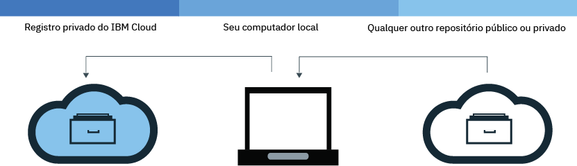
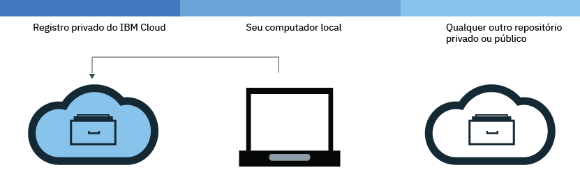
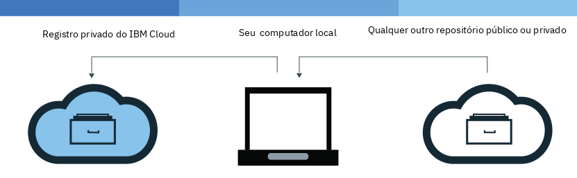

---

copyright:
  years: 2017, 2018
lastupdated: "2018-05-2"

---

{:new_window: target="_blank"}
{:shortdesc: .shortdesc}
{:screen: .screen}
{:pre: .pre}
{:table: .aria-labeledby="caption"}
{:codeblock: .codeblock}
{:tip: .tip}
{:download: .download}


# Incluindo imagens para seu namespace
{: #registry_images_}

É possível armazenar e compartilhar, de forma segura, imagens do Docker com outros usuários ao incluir imagens em seu namespace no
{{site.data.keyword.registrylong}}.
{:shortdesc}

Cada imagem que você deseja incluir em seu namespace deve primeiro existir em sua máquina local. Também é possível fazer download de (extrair) uma imagem de outro repositório para sua máquina local ou construir sua própria imagem de
um Dockerfile, usando o comando `build` do Docker. Para incluir uma imagem em seu namespace, deve-se fazer upload da (enviar por push) imagem local para seu namespace no
{{site.data.keyword.registrylong_notm}}.


**Nota**: não coloque informações pessoais em imagens de contêiner, nomes de namespace, campos de descrição (por exemplo, em tokens de registro) ou em quaisquer dados de configuração de imagem (por exemplo, nomes de imagem ou rótulos de imagem).


## Puxando imagens de outro registro
{: #registry_images_pulling}

É possível puxar (fazer download) de uma imagem de qualquer origem de registro privado ou público e, depois, identificá-la para
uso posterior no {{site.data.keyword.registrylong_notm}}.
{:shortdesc}



Antes de iniciar:

- [Instale a CLI](registry_setup_cli_namespace.html#registry_cli_install) para trabalhar com imagens em seu namespace.
- [Configure seu próprio namespace no {{site.data.keyword.registrylong_notm}}](registry_setup_cli_namespace.html#registry_namespace_add).
- [Certifique-se de que seja possível executar comandos do Docker sem permissões raiz](https://docs.docker.com/engine/installation/linux/linux-postinstall). Se o cliente Docker está configurado para requerer permissões raiz, deve-se executar os comandos `bx login`, `bx cr
login`, `docker pull` e `docker push` com `sudo`.

  Se você mudar as suas permissões para executar comandos do Docker sem privilégios de administrador, o comando `bx login` deverá ser executado novamente.


Faça download da imagem, veja [Puxar uma imagem](index.html#registry_images_pulling) na documentação de Introdução.

  **Dica:** se você obtém uma mensagem "desautorizado: autenticação necessária" ou "negado: o acesso solicitado ao recurso foi negado", execute o comando `bx cr login`.


Depois de puxar uma imagem e identificá-la para o seu namespace, é possível fazer upload (enviar por push) da imagem de sua máquina local para o namespace.

## Enviando por push imagens do Docker para seu namespace
{: #registry_images_pushing}

É possível enviar por push (upload) uma imagem para seu namespace no {{site.data.keyword.registrylong_notm}} para armazenar e compartilhar com segurança sua imagem
com outros usuários.
{:shortdesc}



Antes de iniciar:

- [Instale a CLI](registry_setup_cli_namespace.html#registry_cli_install) para trabalhar com imagens em seu namespace.
- [Configure seu próprio namespace no registro privado do {{site.data.keyword.registrylong_notm}}](registry_setup_cli_namespace.html#registry_namespace_add).
- [Extraia](#registry_images_pulling) ou [construa](#registry_images_creating) uma imagem em sua máquina local e identifique a imagem com informações do seu namespace.
- [Certifique-se de que seja possível executar comandos do Docker sem permissões raiz](https://docs.docker.com/engine/installation/linux/linux-postinstall). Se o cliente Docker está configurado para requerer permissões raiz, deve-se executar os comandos `bx login`, `bx cr
login`, `docker pull` e `docker push` com `sudo`.

  Se você mudar as suas permissões para executar comandos do Docker sem privilégios de administrador, o comando `bx login` deverá ser executado novamente.


Para fazer upload (enviar por push) de uma imagem, siga estas etapas.

1. Efetue login na CLI:

  ```
  bx cr login
  ```
  {: pre}

  **Nota:** deve-se efetuar login se você puxa uma imagem de seu {{site.data.keyword.registrylong_notm}} privado.

2. Para visualizar todos os namespaces que estão disponíveis em sua conta, execute o comando `bx cr namespace-list`.
3. [Faça upload da imagem para seu namespace.](index.html#registry_images_pushing)

  **Dica:** se você obtém uma mensagem "desautorizado: autenticação necessária" ou "negado: o acesso solicitado ao recurso foi negado", execute o comando `bx cr login`.


Após enviar sua imagem por push para seu registro privado, será possível:

- [Gerenciar a segurança com o Vulnerability Advisor](../va/va_index.html) para localizar informações sobre possíveis problemas e vulnerabilidade de segurança.
- [Criar um cluster e usar essa imagem para implementar um contêiner](../../containers/container_index.html)
para o cluster no {{site.data.keyword.containerlong_notm}}.

## Copiando imagens entre registros
{: #registry_images_copying}

É possível puxar uma imagem de um registro em uma região e enviá-la por push para um registro em outra região para que seja possível
compartilhar a imagem com usuários em ambas as regiões.
{:shortdesc}



Antes de iniciar:

- [Instale a CLI](registry_setup_cli_namespace.html#registry_cli_install) para trabalhar com imagens em seu namespace.
- [Configure seu próprio namespace no registro privado do {{site.data.keyword.registrylong_notm}}](registry_setup_cli_namespace.html#registry_namespace_add).
- [Certifique-se de que seja possível executar comandos do Docker sem permissões raiz](https://docs.docker.com/engine/installation/linux/linux-postinstall). Se o cliente Docker está configurado para requerer permissões raiz, deve-se executar os comandos `bx login`, `bx cr
login`, `docker pull` e `docker push` com `sudo`.

  Se você mudar as suas permissões para executar comandos do Docker sem privilégios de administrador, o comando `bx login` deverá ser executado novamente.


Para copiar uma imagem entre dois registros, siga estas etapas.

1. [Puxe uma imagem a partir de um registro](#registry_images_pulling).
2. [Empurre a imagem para outro registro](#registry_images_pushing). Certifique-se de usar o nome de domínio correto para a nova região que você está destinando.

Após copiar sua imagem, será possível:

- [Gerenciando a segurança de imagens com o Vulnerability Advisor](../va/va_index.html) para localizar informações sobre potenciais problemas e vulnerabilidades de segurança.
- [Criar um cluster e usar essa imagem para implementar um contêiner](../../containers/container_index.html)
para o cluster no {{site.data.keyword.containerlong_notm}}.

## Construindo imagens do Docker para usá-las com seu namespace
{: #registry_images_creating}

É possível construir uma imagem do Docker diretamente no {{site.data.keyword.Bluemix_notm}} ou criar sua própria imagem do Docker na máquina local e fazer upload dela (enviá-la por push) para o namespace no {{site.data.keyword.registrylong_notm}}.
{:shortdesc}

Antes de iniciar:

- [Instale a CLI](registry_setup_cli_namespace.html#registry_cli_install) para trabalhar com imagens em seu namespace.
- [Configure seu próprio namespace no registro privado do {{site.data.keyword.registrylong_notm}}](registry_setup_cli_namespace.html#registry_namespace_add).
- [Certifique-se de que seja possível executar comandos do Docker sem permissões raiz](https://docs.docker.com/engine/installation/linux/linux-postinstall). Se o cliente Docker está configurado para requerer permissões raiz, deve-se executar os comandos `bx login`, `bx cr
login`, `docker pull` e `docker push` com `sudo`.

  Se você mudar as suas permissões para executar comandos do Docker sem privilégios de administrador, o comando `bx login` deverá ser executado novamente.


Uma imagem do Docker é a base para cada contêiner que você cria. Uma imagem é criada por meio
de um Dockerfile, que é um arquivo que contém instruções para construir a imagem. Um Dockerfile pode
referenciar os artefatos de construção em suas instruções que são armazenadas separadamente, como um app, a configuração
do app e suas dependências.

Se você deseja aproveitar os recursos de cálculo do {{site.data.keyword.Bluemix_notm}} e a conexão de Internet ou o Docker não está instalado em sua estação de trabalho, construa sua imagem diretamente no {{site.data.keyword.Bluemix_notm}}. Se você precisa acessar recursos em sua construção que estão em servidores sob seu firewall, construa sua imagem localmente.

Para construir sua própria imagem do Docker, conclua as etapas a seguir:

1. Crie um diretório local no qual você deseja armazenar o contexto de compilação. O contexto de compilação contém seu Dockerfile e artefatos de construção relacionados, como o código do app. Navegue para esse diretório em uma janela de linha de comandos.
2. Crie um Dockerfile.
  1. Crie um Dockerfile em seu diretório local.

    ```
    touch Dockerfile
    ```
    {: pre}

  2. Use um editor de texto para abrir o Dockerfile. Deve-se incluir, no mínimo, a imagem base para construir a imagem. Substitua
_&lt;source_image&gt;_ e _&lt;tag&gt;_ pelo repositório de imagem e pela tag que você
deseja usar. Se você estiver usando uma imagem de outro registro privado, defina o caminho completo para a imagem nesse registro
privado.

    ```
    FROM <source_image>:<tag>
    ```
    {: pre}

    Exemplo para criar um Dockerfile que seja baseado na imagem pública do {{site.data.keyword.IBM_notm}} {{site.data.keyword.appserver_short}} Liberty (ibmliberty):

    ```
    FROM registry.<region>.bluemix.net/ibmliberty:latest
    LABEL description="This is my test Dockerfile"
    EXPOSE 9080
    ```
    {: pre}

    Este exemplo inclui um rótulo nos metadados da imagem e expõe a porta 9080. Para obter mais instruções do Dockerfile que podem ser usadas, consulte a
[Referência do Dockerfile](https://docs.docker.com/engine/reference/builder/).

3. Decida sobre um nome para sua imagem. O nome da imagem deve estar no formato a seguir:

  ```
  registry.<region>.bluemix.net/<my_namespace>/<repo_name>:<tag>
  ```
  {: pre}

  em que _&lt;my_namespace&gt;_ é sua informação de namespace, _&lt;repo_name&gt;_ é o nome de seu repositório e _&lt;tag&gt;_ é a versão que você deseja usar para sua imagem. Para localizar seu namespace, execute o comando `bx cr namespace-list`.

4. Anote o caminho para o diretório que contém o Dockerfile. Se você executa os comandos nas etapas a seguir enquanto seu diretório ativo está configurado para onde o contexto de compilação é armazenado, é possível substituir _&lt;directory&gt;_ por um ponto (.).
5. Escolha construir a imagem diretamente no {{site.data.keyword.Bluemix_notm}} ou construir e testar a imagem localmente
antes de enviá-la por push para o {{site.data.keyword.Bluemix_notm}}.
  - Para construir a imagem diretamente no {{site.data.keyword.Bluemix_notm}}, execute o comando a seguir:

    ```
    bx cr build -t <image_name> <directory>
    ```
    {: pre}

    em que _&lt;image_name&gt;_ é o nome de sua imagem e _&lt;directory&gt;_ é o caminho para o diretório.
   
   Para obter mais informações sobre o comando `bx cr build`, consulte [CLI do {{site.data.keyword.registrylong_notm}}](registry_cli.html).

  - Para construir e testar sua imagem localmente antes de enviá-la por push para o {{site.data.keyword.Bluemix_notm}}, conclua as etapas a seguir:
    1. Construa a imagem de seu Dockerfile na máquina local e identifique-a com o nome da imagem.

      ```
      docker build -t <image_name> <directory>
      ```
      {: pre}

      em que _&lt;image_name&gt;_ é o nome de sua imagem e _&lt;directory&gt;_ é o caminho para o diretório.

    2. Opcional: teste sua imagem na máquina local antes de enviá-la por push para o namespace.

      ```
      docker run <image_name>
      ```
      {: pre}

      Substitua _&lt;image_name&gt;_ pelo nome de sua imagem.

    3. Após criar a imagem e identificá-la para o seu namespace, [será possível enviar a imagem para o registro privado do seu namespace](#registry_images_pushing).

Para usar o Vulnerability Advisor para verificar a segurança de sua imagem, veja [Gerenciando a segurança de imagens com o Vulnerability Advisor](../va/va_index.html).


## Removendo imagens de seu registro de imagens privadas do {{site.data.keyword.Bluemix_notm}}
{: #registry_images_remove}

É possível remover imagens indesejadas de seu registro de imagem privada.
{:shortdesc}

Antes de iniciar, remova quaisquer contêineres que estejam usando a imagem.

As imagens públicas da {{site.data.keyword.IBM_notm}} não podem ser removidas de seu registro privado do {{site.data.keyword.Bluemix_notm}} e não contam para sua cota.

1. Efetue login no {{site.data.keyword.Bluemix_notm}} executando o comando `bx login`.
2. Para remover uma imagem, execute o comando a seguir:

  ```
  bx cr image-rm IMAGE
  ```
  {: pre}

  Em que _IMAGE_ é o caminho completo do registro do {{site.data.keyword.Bluemix_notm}} para a imagem que você deseja remover, no formato `namespace/image:tag`.

  Se uma tag não for especificada no caminho da imagem, a imagem identificada como `latest` será excluída por padrão. É possível excluir múltiplas imagens listando cada caminho de registro privado do {{site.data.keyword.Bluemix_notm}} no comando com um espaço entre cada caminho.

  **Dica:** é possível executar o comando `bx cr namespace-list` para recuperar seu valor de namespace.

3. Verifique se a imagem foi removida executando o comando a seguir e verifique se a imagem não aparece na lista.

  ```
  bx cr image-list
  ```
  {: pre}

  


