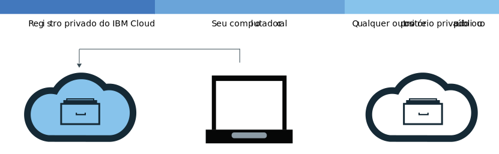
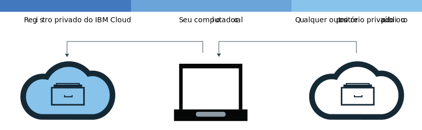

---

copyright:
  years: 2017, 2019
lastupdated: "2019-07-01"

keywords: IBM Cloud Container Registry, Docker build command, delete images, add images, pull images, push images, copy images, delete private repositories,

subcollection: registry

---

{:new_window: target="_blank"}
{:shortdesc: .shortdesc}
{:screen: .screen}
{:pre: .pre}
{:table: .aria-labeledby="caption"}
{:codeblock: .codeblock}
{:tip: .tip}
{:note: .note}
{:important: .important}
{:deprecated: .deprecated}
{:download: .download}

# Incluindo imagens para seu namespace
{: #registry_images_}

É possível armazenar e compartilhar, de forma segura, imagens do Docker com outros usuários ao incluir imagens em seu namespace no
{{site.data.keyword.registrylong}}.
{:shortdesc}

Todas as imagens que desejar incluir no namespace deverão existir primeiro no computador local. É possível fazer download
(puxar) de uma imagem de outro repositório para o computador local ou construir a sua própria imagem de um Dockerfile usando o comando `build` do Docker. Para incluir uma imagem em seu namespace, deve-se fazer upload da (enviar por push) imagem local para seu namespace no
{{site.data.keyword.registrylong_notm}}.

Não coloque informações pessoais em suas imagens de contêiner, nomes de namespace, campos de descrição ou em quaisquer dados de configuração de imagem (por exemplo, nomes de imagem ou rótulos de imagem).
{: important}

## Puxando imagens de outro registro
{: #registry_images_pulling_reg}

É possível puxar (fazer download) de uma imagem de qualquer origem de registro privado ou público e, depois, identificá-la para
uso posterior no {{site.data.keyword.registrylong_notm}}.
{:shortdesc}


**Antes de iniciar**

- [Instale a CLI](/docs/services/Registry?topic=registry-registry_setup_cli_namespace#cli_namespace_registry_cli_install) para trabalhar com imagens em seu namespace.
- [Configure seu próprio namespace no {{site.data.keyword.registrylong_notm}}](/docs/services/Registry?topic=registry-registry_setup_cli_namespace#registry_namespace_setup).
- [Certifique-se de que seja possível executar comandos do Docker sem permissões raiz ](https://docs.docker.com/install/linux/linux-postinstall/). Caso o cliente Docker esteja configurado para requerer permissões raiz, deve-se executar os comandos
`ibmcloud login`, `ibmcloud cr login`, `docker pull` e `docker push` com `sudo`.

  Caso as permissões para executar comandos do Docker mudem sem privilégios de administrador,
deve-se executar o comando `ibmcloud login` novamente.

Faça download da imagem, veja [Puxar uma imagem](/docs/services/Registry?topic=registry-getting-started#gs_registry_images_pulling) na documentação de Introdução.

Se você receber uma mensagem `unauthorized: authentication required` ou `denied: requested access to the resource is denied`, execute o comando `ibmcloud cr login`.
{:tip}

Depois de puxar uma imagem e identificá-la para o namespace, é possível fazer upload (enviar por
push) da imagem do computador local para o namespace.

## Enviando por push imagens do Docker para seu namespace
{: #registry_images_pushing_namespace}

É possível enviar por push (fazer upload) uma imagem para o namespace no {{site.data.keyword.registrylong_notm}} para armazenar e compartilhar sua imagem com outros usuários.
{:shortdesc}



**Antes de iniciar**

- [Instale a CLI](/docs/services/Registry?topic=registry-registry_setup_cli_namespace#cli_namespace_registry_cli_install) para trabalhar com imagens em seu namespace.
- [Configure seu próprio namespace no {{site.data.keyword.registrylong_notm}}](/docs/services/Registry?topic=registry-registry_setup_cli_namespace#registry_namespace_setup).
- [Puxe](#registry_images_pulling_reg) ou [construa](#registry_images_creating) uma imagem no
computador local e identifique-a com as informações do namespace.
- [Certifique-se de que seja possível executar comandos do Docker sem permissões raiz ](https://docs.docker.com/install/linux/linux-postinstall/). Caso o cliente Docker esteja configurado para requerer permissões raiz, deve-se executar os comandos
`ibmcloud login`, `ibmcloud cr login`, `docker pull` e `docker push` com `sudo`.

  Caso as permissões para executar comandos do Docker mudem sem privilégios de administrador,
deve-se executar o comando `ibmcloud login` novamente.

Para fazer upload de uma imagem (enviá-la por push), conclua as etapas a seguir:

1. Efetue login no CLI.

   ```
   ibmcloud cr login
   ```
   {: pre}

   Deve-se efetuar login se você puxa uma imagem de seu {{site.data.keyword.registrylong_notm}} privado.
  {:tip}

2. Para visualizar todos os namespaces disponíveis em sua conta, execute o comando `ibmcloud cr namespace-list`.
3. [Faça upload da imagem para seu namespace.](/docs/services/Registry?topic=registry-getting-started#gs_registry_images_pushing)

   Se você receber uma mensagem `unauthorized: authentication required` ou `denied: requested access to the resource is denied`, execute o comando `ibmcloud cr login`.
   {:tip}

Depois de enviar por push sua imagem para o {{site.data.keyword.registrylong_notm}}, é possível executar uma das tarefas a seguir:

- [Gerenciar a segurança com o Vulnerability Advisor](/docs/services/va?topic=va-va_index) para localizar informações sobre possíveis problemas e vulnerabilidade de segurança.
- [Criar um cluster e usar essa imagem para implementar um contêiner](/docs/containers?topic=containers-getting-started#getting-started)
para o cluster no {{site.data.keyword.containerlong_notm}}.

## Copiando imagens entre registros
{: #registry_images_copying}

É possível puxar uma imagem de um registro em uma região e enviá-la por push para um registro em outra região para que seja possível
compartilhar a imagem com usuários em ambas as regiões.
{:shortdesc}



**Antes de iniciar**

- [Instale a CLI](/docs/services/Registry?topic=registry-registry_setup_cli_namespace#cli_namespace_registry_cli_install) para trabalhar com imagens em seu namespace.
- [Configure seu próprio namespace no {{site.data.keyword.registrylong_notm}}](/docs/services/Registry?topic=registry-registry_setup_cli_namespace#registry_namespace_setup).
- [Certifique-se de que seja possível executar comandos do Docker sem permissões raiz ](https://docs.docker.com/install/linux/linux-postinstall/). Caso o cliente Docker esteja configurado para requerer permissões raiz, deve-se executar os comandos
`ibmcloud login`, `ibmcloud cr login`, `docker pull` e `docker push` com `sudo`.

  Caso as permissões para executar comandos do Docker mudem sem privilégios de administrador,
deve-se executar o comando `ibmcloud login` novamente.

Para copiar uma imagem entre dois registros, conclua as etapas a seguir:

1. [Puxe uma imagem a partir de um registro](#registry_images_pulling_reg).
2. [Empurre a imagem para outro registro](#registry_images_pushing_namespace). Certifique-se de usar o nome de domínio correto para a nova região que você está destinando.

Após copiar sua imagem, será possível fazer uma das tarefas a seguir:

- [Gerenciando a segurança de imagens com o Vulnerability Advisor](/docs/services/va?topic=va-va_index) para localizar informações sobre potenciais problemas e vulnerabilidades de segurança.
- [Criar um cluster e usar essa imagem para implementar um contêiner](/docs/containers?topic=containers-getting-started#getting-started)
para o cluster no {{site.data.keyword.containerlong_notm}}.

## Criando novas imagens que se referem a uma imagem de origem
{: #registry_images_source}

Na região em que você está conectado, crie uma nova imagem no {{site.data.keyword.registrylong_notm}} que se refira a uma imagem existente na mesma região. Essa ação é suportada para imagens de origem criadas usando o Docker Engine versão 1.12 ou mais recente, somente.

Novas imagens criadas usando esse mecanismo não retêm assinaturas. Se você precisar que a nova imagem seja assinada, não use esse mecanismo.
{: tip}

**Antes de iniciar**

- [Instale a CLI](/docs/services/Registry?topic=registry-registry_setup_cli_namespace#cli_namespace_registry_cli_install) para trabalhar com imagens em seu namespace.
- Assegure-se de que tenha acesso a um namespace privado no {{site.data.keyword.registrylong_notm}} que contenha uma imagem de origem à qual você deseja fazer referência a outra imagem.

Para obter mais informações sobre o comando, consulte [`ibmcloud cr image-tag`](/docs/services/Registry?topic=container-registry-cli-plugin-containerregcli#bx_cr_image_tag).

Para criar uma nova imagem de uma imagem de origem, conclua as etapas a seguir:

1. Efetue login no CLI.

   ```
   ibmcloud cr login
   ```
   {: pre}

2. Execute o comando a seguir para incluir a nova referência, em que `SOURCE_IMAGE` é o nome de sua imagem de origem e `TARGET_IMAGE` é o nome de sua imagem de destino. As imagens de origem e de destino devem estar na mesma região. `SOURCE_IMAGE` e `TARGET_IMAGE` devem estar no formato `<REPOSITORY>:<TAG>`, por exemplo: `us.icr.io/namespace/image:latest`

   ```
   ibmcloud cr image-tag [SOURCE_IMAGE] [TARGET_IMAGE]
   ```
   {: pre}

3. Verifique se a nova imagem foi criada, executando o comando a seguir e verifique se a imagem é mostrada na lista com a mesma compilação de imagem que a imagem de origem.

   ```
   ibmcloud cr image-list
   ```
   {: pre}

## Construindo imagens do Docker para usá-las com seu namespace
{: #registry_images_creating}

É possível construir uma imagem Docker diretamente no {{site.data.keyword.cloud_notm}} ou criar uma imagem Docker
própria no computador local e transferi-la por upload (enviar por push) para o namespace no {{site.data.keyword.registrylong_notm}}.
{:shortdesc}

**Antes de iniciar**

- [Instale a CLI](/docs/services/Registry?topic=registry-registry_setup_cli_namespace#cli_namespace_registry_cli_install) para trabalhar com imagens em seu namespace.
- [Configure seu próprio namespace no {{site.data.keyword.registrylong_notm}}](/docs/services/Registry?topic=registry-registry_setup_cli_namespace#registry_namespace_setup).
- [Certifique-se de que seja possível executar comandos do Docker sem permissões raiz ](https://docs.docker.com/install/linux/linux-postinstall/). Caso o cliente Docker esteja configurado para requerer permissões raiz, deve-se executar os comandos
`ibmcloud login`, `ibmcloud cr login`, `docker pull` e `docker push` com `sudo`.

  Caso as permissões para executar comandos do Docker mudem sem privilégios de administrador,
deve-se executar o comando `ibmcloud login` novamente.

Uma imagem do Docker é a base para cada contêiner que você cria. Uma imagem é criada por meio
de um Dockerfile, que é um arquivo que contém instruções para construir a imagem. Um Dockerfile pode
referenciar os artefatos de construção em suas instruções que são armazenadas separadamente, como um app, a configuração
do app e suas dependências.

Se você deseja aproveitar os recursos de cálculo do {{site.data.keyword.cloud_notm}} e a conexão de Internet ou o Docker não está instalado em sua estação de trabalho, construa sua imagem diretamente no {{site.data.keyword.cloud_notm}}. Se você precisa acessar recursos em sua construção que estão em servidores sob seu firewall, construa sua imagem localmente.

Para construir sua própria imagem do Docker, conclua as etapas a seguir:

1. Crie um diretório local no qual você deseja armazenar o contexto de compilação. O contexto de compilação contém seu Dockerfile e artefatos de construção relacionados, como o código do app. Navegue para esse diretório em uma janela de linha de comandos.
2. Crie um Dockerfile.
    1. Crie um Dockerfile em seu diretório local.

        ```
        touch Dockerfile
        ```
        {: pre}

    2. Use um editor de texto para abrir o Dockerfile. Deve-se incluir, no mínimo, a imagem base para construir a imagem. Substitua `<source_image>` e `<tag>` pelo repositório de imagem e pela tag que você deseja usar. Se estiver usando uma imagem de outro registro privado, defina o caminho completo para a imagem no {{site.data.keyword.registrylong_notm}}.

       ```
       FROM <source_image>:<tag>
       ```
       {: pre}

       **Exemplo**
     Para criar um Dockerfile que seja baseado na imagem pública do {{site.data.keyword.IBM_notm}} {{site.data.keyword.appserver_short}} Liberty (ibmliberty), use o código a seguir:

       ```
       FROM <region>.icr.io/ibmliberty:latest
       LABEL description="This is my test Dockerfile"
       EXPOSE 9080
       ```
       {: pre}

       Este exemplo inclui um rótulo nos metadados da imagem e expõe a porta 9080. Para obter mais instruções do Dockerfile que possam ser usadas, consulte a [Referência do Dockerfile ](https://docs.docker.com/engine/reference/builder/).

3. Decida sobre um nome para sua imagem. O nome da imagem deve estar no formato a seguir:

   ```
   <region>.icr.io/<my_namespace>/<repo_name>:<tag>
   ```
   {: pre}

   em que `<my_namespace>` são as informações do seu namespace, `<repo_name>` é o nome do seu repositório e `<tag>` é a versão que você deseja usar para a sua imagem. Para localizar seu namespace, execute o comando `ibmcloud cr namespace-list`.

4. Anote o caminho para o diretório que contém o Dockerfile. Se você executar os comandos nas etapas a seguir enquanto seu diretório ativo estiver configurado como o local no qual seu contexto de compilação está armazenado, será possível substituir `<directory>` por um ponto-final (.).
5. Escolha construir a imagem diretamente no {{site.data.keyword.cloud_notm}} ou construir e testar a imagem localmente
antes de enviá-la por push para o {{site.data.keyword.cloud_notm}}.
   - Para construir a imagem diretamente no {{site.data.keyword.cloud_notm}}, execute o comando a seguir:

     ```
     ibmcloud cr build -t <image_name> <directory>
     ```
     {: pre}

     em que `<image_name>` é o nome da sua imagem e `<directory>` é o caminho para o diretório. Se você executar o comando quando seu diretório ativo estiver configurado como o local no qual seu contexto de compilação está armazenado, será possível substituir `<directory>` por um ponto-final (.).
  
     Para obter mais informações sobre o comando `ibmcloud cr build`, consulte [CLI do {{site.data.keyword.registrylong_notm}}](/docs/services/Registry?topic=container-registry-cli-plugin-containerregcli#bx_cr_build).

   - Para construir e testar sua imagem localmente antes de enviá-la por push para o {{site.data.keyword.cloud_notm}}, conclua as etapas a seguir:
      1. Construa a imagem do Dockerfile no computador local e identifique-a com o nome da imagem.

         ```
         docker build -t <image_name> <directory>
         ```
         {: pre}

         em que `<image_name>` é o nome da sua imagem e `<directory>` é o caminho para o diretório.

      2. Opcional: teste a imagem no computador local antes de enviá-la por push para o namespace.

         ```
         docker run <image_name>
         ```
         {: pre}

         Substitua `<image_name>` pelo nome da sua imagem.

      3. Depois de criar sua imagem e identificá-la para o namespace, [é possível enviá-la por push para o namespace no {{site.data.keyword.registrylong_notm}}](#registry_images_pushing_namespace).

Para usar o Vulnerability Advisor para verificar a segurança de sua imagem, veja [Gerenciando a segurança de imagens com o Vulnerability Advisor](/docs/services/va?topic=va-va_index).

## Enviando imagens por push para o {{site.data.keyword.registrylong_notm}} usando uma chave de API
{: #registry_api_key_push_image}

Crie um ID de serviço que use uma chave de API para enviar imagens por push para o {{site.data.keyword.registrylong_notm}}.
{:shortdesc}

1. Crie um ID de serviço. Consulte [Criando e trabalhando com IDs de serviço](/docs/iam?topic=iam-serviceids#serviceids).
2. Crie uma política que forneça a permissão de ID de serviço para acessar o registro, por exemplo, as funções `Administrator` e `Manager`. Consulte [Gerenciando o acesso de usuário com o Identity and Access Management](/docs/services/Registry?topic=registry-iam#iam).
3. Crie uma chave de API. Consulte [Criando uma chave de API para um ID de serviço](/docs/iam?topic=iam-serviceidapikeys#create_service_key).
4. Use a chave de API para efetuar login no registro, a fim de que seja possível enviar imagens por push para o registro. Consulte [Usando uma chave de API para automatizar o acesso](/docs/services/Registry?topic=registry-registry_access#registry_api_key_use).
5. Envie suas imagens por push. Consulte [Enviando imagens por push do Docker para seu namespace](#registry_images_pushing_namespace).

Agora é possível usar clusters para fazer pull das imagens. Consulte [Construindo contêineres por meio de imagens](/docs/containers?topic=containers-images#other_registry_accounts).

## Removendo tags de imagens em seu repositório privado do {{site.data.keyword.cloud_notm}}
{: #registry_images_untag}

É possível remover uma ou diversas tag de uma imagem, mas manter a imagem subjacente e quaisquer outras tags, usando o comando [`ibmcloud cr image-untag`](/docs/services/Registry?topic=container-registry-cli-plugin-containerregcli#bx_cr_image_untag).
{:shortdesc}

Onde houver diversas tags para a mesma compilação de imagens em um repositório, consulte [Excluindo imagens do seu repositório privado do {{site.data.keyword.cloud_notm}}](#registry_images_remove) para remover a imagem subjacente e todas as suas tags.
{: tip}

Para remover uma ou diversas tags usando a CLI, conclua as etapas a seguir:

1. Efetue login no {{site.data.keyword.cloud_notm}} executando o comando `ibmcloud login`.
2. Para remover uma tag, execute o seguinte comando:

   ```
   ibmcloud cr image-untag IMAGE
   ```
   {: pre}

   Em que `IMAGE` é o nome da imagem que você deseja remover, no formato `repository:tag`.

   Se uma tag não estiver especificada no nome da imagem, o comando falhará. É possível excluir as tags de diversas imagens listando cada caminho de registro privado do {{site.data.keyword.cloud_notm}} no comando com um espaço entre eles.

   Para localizar os nomes de suas imagens, execute `ibmcloud cr image-list`. Combine o conteúdo das colunas **Repositório** e **Tag** para criar o nome da imagem no formato `repository:tag`.
   {:tip}

3. Verifique se a tag foi removida executando o seguinte comando e verifique se ela não é mostrada na lista.

   ```
   ibmcloud cr image-list
   ```
   {: pre}

## Excluindo imagens de seu repositório privado do  {{site.data.keyword.cloud_notm}}
{: #registry_images_remove}

É possível excluir imagens indesejadas de seu repositório privado usando a interface gráfica com o usuário (GUI) ou a CLI.
{:shortdesc}

Se desejar excluir um repositório privado e suas imagens associadas, consulte [Excluindo um repositório privado e quaisquer imagens associadas](#registry_repo_remove).

As imagens públicas da {{site.data.keyword.IBM_notm}} não podem ser excluídas do seu repositório privado do {{site.data.keyword.cloud_notm}} e não são contabilizadas para sua cota.

A exclusão de uma imagem não pode ser desfeita. A exclusão de uma imagem que está sendo usada por uma implementação existente pode causar falha de aumento de capacidade, reagendamento ou ambos.
{: important}

Onde houver diversas tags para a mesma compilação de imagens em um repositório, o comando [`ibmcloud cr image-rm`](/docs/services/Registry?topic=container-registry-cli-plugin-containerregcli#bx_cr_image_rm) remove a imagem subjacente e todas as suas tags. Se a mesma imagem existir em um repositório ou namespace diferente, essa cópia não será removida. Se desejar remover uma tag de uma imagem, mas manter a imagem subjacente e quaisquer outras tags, consulte o comando em [Removendo tags de imagens em seu repositório privado do {{site.data.keyword.cloud_notm}}](#registry_images_untag).
{: tip}

### Excluindo imagens de seu repositório privado do {{site.data.keyword.cloud_notm}} usando a CLI
{: #registry_images_remove_cli}

É possível excluir imagens indesejadas e todas as suas tags de seu repositório privado usando a CLI.
{:shortdesc}

A exclusão de uma imagem não pode ser desfeita. A exclusão de uma imagem que está sendo usada por uma implementação existente pode causar falha de aumento de capacidade, reagendamento ou ambos.
{: important}

Para excluir uma imagem usando a CLI, conclua as etapas a seguir:

1. Efetue login no {{site.data.keyword.cloud_notm}} executando o comando `ibmcloud login`.
2. Para excluir uma imagem, execute o comando a seguir:

   ```
   ibmcloud cr image-rm IMAGE
   ```
   {: pre}

   Em que `IMAGE` é o nome da imagem que você deseja remover, no formato `repository:tag`.

   Se uma tag não for especificada no nome da imagem, a imagem identificada por último (`latest`) será excluída, por padrão. É possível excluir múltiplas imagens listando cada caminho de registro privado do {{site.data.keyword.cloud_notm}} no comando com um espaço entre cada caminho.

   Para localizar os nomes de suas imagens, execute `ibmcloud cr image-list`. Combine o conteúdo das colunas **Repositório** e **Tag** para criar o nome da imagem no formato `repository:tag`.
   {:tip}

3. Execute o comando a seguir para ver se a imagem foi excluída e verifique se ela não é mostrada na lista.

   ```
   ibmcloud cr image-list
   ```
   {: pre}

### Excluindo imagens de seu repositório privado do {{site.data.keyword.cloud_notm}} usando a GUI
{: #registry_images_remove_gui}

É possível excluir imagens indesejadas e todas as suas tags de seu repositório de imagem privada usando a interface gráfica com o usuário (GUI).
{:shortdesc}

A exclusão de uma imagem não pode ser desfeita. A exclusão de uma imagem que está sendo usada por uma implementação existente pode causar falha de aumento de capacidade, reagendamento ou ambos.
{: important}

Para excluir uma imagem usando a GUI, conclua as etapas a seguir:

1. Efetue login no console do {{site.data.keyword.cloud_notm}} ([https://cloud.ibm.com/login
](https://cloud.ibm.com/login))
com o seu IBMid.
2. Se você tiver múltiplas contas do {{site.data.keyword.cloud_notm}}, selecione a conta e região que você deseja usar por meio do menu de conta.
3. Clique em **Catálogo**.
4. Selecione a categoria **Contêineres** e clique no tile **Registro de contêiner**.
5. Clique em **Imagens**. Uma lista de suas imagens é exibida.
6. Na linha que contém a imagem que você deseja excluir, selecione a caixa de opção.

   Assegure-se de selecionar a imagem correta, porque essa ação não pode ser desfeita.
   {: important}

7. Clique em **Excluir imagem**.

## Excluindo um repositório privado e quaisquer imagens associadas
{: #registry_repo_remove}

É possível excluir repositórios privados que não são mais necessários e quaisquer imagens associadas usando a interface gráfica com o usuário (GUI).
{:shortdesc}

Quando você exclui um repositório, todas as imagens nesse repositório são excluídas. Essa ação não pode ser desfeita.
{: important}

**Antes de iniciar**

Deve-se fazer backup de todas as imagens que deseja manter.

Para excluir um repositório privado usando a GUI, conclua as etapas a seguir:

1. Efetue login no console do {{site.data.keyword.cloud_notm}} ([https://cloud.ibm.com/login
](https://cloud.ibm.com/login))
com o seu IBMid.
2. Se você tiver múltiplas contas do {{site.data.keyword.cloud_notm}}, selecione a conta e região que você deseja usar por meio do menu de conta.
3. Clique em **Catálogo**.
4. Selecione a categoria **Contêineres** e clique no tile **Registro de contêiner**.
5. Clique em **Repositórios**. Uma lista de seus repositórios privados é exibida.
6. Na linha que contém o repositório privado que você deseja excluir, selecione a caixa de opção.

    Assegure-se de que tenha selecionado o repositório correto, porque essa ação não pode ser desfeita.
    {: important}

7. Clique em **Excluir repositório**.
