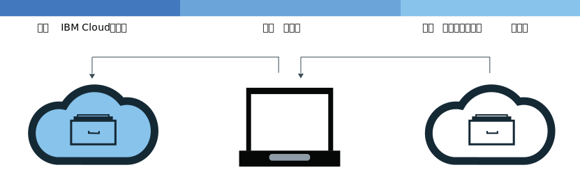

---

copyright:
  years: 2017, 2019
lastupdated: "2019-01-24"

---

{:new_window: target="_blank"}
{:shortdesc: .shortdesc}
{:screen: .screen}
{:pre: .pre}
{:table: .aria-labeledby="caption"}
{:codeblock: .codeblock}
{:tip: .tip}
{:download: .download}

# 将映像添加到名称空间
{: #registry_images_}

您可以通过将映像添加到 {{site.data.keyword.registrylong}} 中的名称空间，安全地存储 Docker 映像并与其他用户共享。
{:shortdesc}

您要添加到名称空间的每个映像首先必须在您的本地计算机上存在。您可以将映像从其他存储库下载（拉出）到本地计算机，或者使用 Docker `build` 命令通过 Dockerfile 构建自己的映像。要将映像添加到名称空间，必须将本地映像上传（推送）到 {{site.data.keyword.registrylong_notm}} 中的名称空间。

不要将个人信息放入容器映像、名称空间名称、描述字段（例如，注册表令牌）或任何映像配置数据（例如，映像名称或映像标签）中。
{:tip}

## 从其他注册表拉出映像
{: #registry_images_pulling}

您可以从任何专用或公共注册表源拉出（下载）映像，然后对其进行标记，以便稍后在 {{site.data.keyword.registrylong_notm}} 中使用。
{:shortdesc}


**开始之前**

- [安装 CLI](/docs/services/Registry/registry_setup_cli_namespace.html#registry_cli_install) 以在名称空间中使用映像。

- [在 {{site.data.keyword.registrylong_notm}} 中设置自己的名称空间](/docs/services/Registry/registry_setup_cli_namespace.html#registry_namespace_add)。
- [确保您可以在没有 root 用户许可权的情况下运行 Docker 命令 ](https://docs.docker.com/engine/installation/linux/linux-postinstall)。如果您的 Docker 客户机设置为需要 root 用户许可权，那么必须使用 `sudo` 运行 `ibmcloud login`、`ibmcloud cr login`、`docker pull` 和 `docker push` 命令。

  如果将许可权更改为在没有 root 用户特权的情况下运行 Docker 命令，那么必须重新运行 `ibmcloud login` 命令。

下载映像；请参阅“入门”文档中的[拉出映像](/docs/services/Registry/index.html#registry_images_pulling)。

如果您收到`未获授权：需要认证`或`被拒绝：请求的资源访问权被拒绝`消息，请运行 `ibmcloud cr login` 命令。
   {:tip}

拉出映像并针对名称空间对其进行标记后，可以将该映像从本地计算机上传（推送）至名称空间。

## 将 Docker 映像推送到名称空间
{: #registry_images_pushing}

您可以将映像推送（上传）至 {{site.data.keyword.registrylong_notm}} 中的名称空间，以存储映像并与其他用户共享。
{:shortdesc}


**开始之前**

- [安装 CLI](/docs/services/Registry/registry_setup_cli_namespace.html#registry_cli_install) 以在名称空间中使用映像。

- [在 {{site.data.keyword.registrylong_notm}} 中设置自己的名称空间](/docs/services/Registry/registry_setup_cli_namespace.html#registry_namespace_add)。
- 在本地计算机上[拉出](#registry_images_pulling)或[构建](#registry_images_creating)映像，并使用名称空间信息对该映像进行标记。

- [确保您可以在没有 root 用户许可权的情况下运行 Docker 命令 ](https://docs.docker.com/engine/installation/linux/linux-postinstall)。如果您的 Docker 客户机设置为需要 root 用户许可权，那么必须使用 `sudo` 运行 `ibmcloud login`、`ibmcloud cr login`、`docker pull` 和 `docker push` 命令。

  如果将许可权更改为在没有 root 用户特权的情况下运行 Docker 命令，那么必须重新运行 `ibmcloud login` 命令。

要上传（推送）映像，请完成以下步骤：

1. 登录到 CLI。

   ```
  ibmcloud cr login
  ```
   {: pre}

   必须登录才能从专用 {{site.data.keyword.registrylong_notm}} 拉出映像。
  {:tip}

2. 要查看帐户中可用的所有名称空间，请运行 `ibmcloud cr namespace-list` 命令。
3. [将映像上传到名称空间。](/docs/services/Registry/index.html#registry_images_pushing)

   如果您收到`未获授权：需要认证`或`被拒绝：请求的资源访问权被拒绝`消息，请运行 `ibmcloud cr login` 命令。
   {:tip}

将映像推送到 {{site.data.keyword.registrylong_notm}} 后，可以执行下列其中一项任务：

- [使用漏洞顾问程序管理安全性](/docs/services/va/va_index.html)，以查找潜在安全问题和漏洞的相关信息。
- [创建集群并使用此映像部署容器](/docs/containers/container_index.html#container_index)至 {{site.data.keyword.containerlong_notm}} 中的集群。

## 在注册表之间复制映像
{: #registry_images_copying}

您可以从一个区域的注册表中拉出映像，并将其推送到另一个区域的注册表中，这样就可以在两个区域的用户之间共享该映像。
{:shortdesc}



**开始之前**

- [安装 CLI](/docs/services/Registry/registry_setup_cli_namespace.html#registry_cli_install) 以在名称空间中使用映像。

- [在 {{site.data.keyword.registrylong_notm}} 中设置自己的名称空间](/docs/services/Registry/registry_setup_cli_namespace.html#registry_namespace_add)。
- [确保您可以在没有 root 用户许可权的情况下运行 Docker 命令 ](https://docs.docker.com/engine/installation/linux/linux-postinstall)。如果您的 Docker 客户机设置为需要 root 用户许可权，那么必须使用 `sudo` 运行 `ibmcloud login`、`ibmcloud cr login`、`docker pull` 和 `docker push` 命令。

  如果将许可权更改为在没有 root 用户特权的情况下运行 Docker 命令，那么必须重新运行 `ibmcloud login` 命令。

要在两个注册表之间复制映像，请完成以下步骤：

1. [从注册表拉出映像](#registry_images_pulling)。
2. [将映像推送到另一个注册表](#registry_images_pushing)。确保为新目标区域使用正确的域名。

复制映像后，可以执行下列其中一项任务：

- [使用漏洞顾问程序管理映像安全性](/docs/services/va/va_index.html)，以查找潜在安全问题和漏洞的相关信息。
- [创建集群并使用此映像部署容器](/docs/containers/container_index.html#container_index)至 {{site.data.keyword.containerlong_notm}} 中的集群。

## 创建引用源映像的新映像
{: #registry_images_source}

在您登录到的区域中，在 {{site.data.keyword.registrylong_notm}} 中创建引用同一区域中现有映像的新映像。仅对于使用 Docker Engine V1.12 或更高版本创建的源映像，才支持此操作。

使用此机制创建的新映像不会保留签名。如果需要对新映像进行签名，请不要使用此机制。
{: tip}

**开始之前**

- [安装 CLI](/docs/services/Registry/registry_setup_cli_namespace.html#registry_cli_install) 以在名称空间中使用映像。

- 确保您有权访问 {{site.data.keyword.registrylong_notm}} 中包含要被其他映像引用的源映像的专用名称空间。

有关命令的更多信息，请参阅 [`ibmcloud cr image-tag`](/docs/services/Registry/registry_cli.html#bx_cr_image_tag)。

要基于源映像创建新映像，请完成以下步骤：

1. 登录到 CLI。

   ```
  ibmcloud cr login
  ```
   {: pre}

2. 运行以下命令以添加新引用，其中 `SOURCE_IMAGE` 是源映像的名称，`TARGET_IMAGE` 是目标映像的名称。源映像和目标映像必须位于同一区域中。`SOURCE_IMAGE` 和 `TARGET_IMAGE` 的格式必须为 `<REPOSITORY>:<TAG>`，例如：`registry.ng.bluemix.net/namespace/image:latest`

   ```
   ibmcloud cr image-tag [SOURCE_IMAGE] [TARGET_IMAGE]
   ```
   {: pre}

3. 通过运行以下命令，验证是否已创建新映像，然后检查该映像是否显示在列表中并具有与源映像相同的映像摘要。

   ```
    ibmcloud cr image-list
    ```
   {: pre}

## 构建 Docker 映像以用于名称空间
{: #registry_images_creating}

您可以直接在 {{site.data.keyword.Bluemix_notm}} 中构建 Docker 映像，也可以在本地计算机上创建自己的 Docker 映像，然后将其上传（推送）至 {{site.data.keyword.registrylong_notm}} 中的名称空间。
{:shortdesc}

**开始之前**

- [安装 CLI](/docs/services/Registry/registry_setup_cli_namespace.html#registry_cli_install) 以在名称空间中使用映像。

- [在 {{site.data.keyword.registrylong_notm}} 中设置自己的名称空间](/docs/services/Registry/registry_setup_cli_namespace.html#registry_namespace_add)。
- [确保您可以在没有 root 用户许可权的情况下运行 Docker 命令 ](https://docs.docker.com/engine/installation/linux/linux-postinstall)。如果您的 Docker 客户机设置为需要 root 用户许可权，那么必须使用 `sudo` 运行 `ibmcloud login`、`ibmcloud cr login`、`docker pull` 和 `docker push` 命令。

  如果将许可权更改为在没有 root 用户特权的情况下运行 Docker 命令，那么必须重新运行 `ibmcloud login` 命令。

Docker 映像是您所创建的每个容器的基础。映像是通过 Dockerfile 创建的，该文件包含构建映像的指令。Dockerfile 可能在其分开存储的指令中参考构建工件，如应用程序、应用程序的配置及其依赖关系。


如果要利用 {{site.data.keyword.Bluemix_notm}} 计算资源和因特网连接，或者 Docker 未安装在工作站上，请直接在 {{site.data.keyword.Bluemix_notm}} 中构建映像。如果需要访问构建中位于防火墙后的服务器上的资源，请本地构建映像。

要构建自己的 Docker 映像，请完成以下步骤：

1. 创建要用于存储构建上下文的本地目录。构建上下文包含 Dockerfile 及相关构建工件（如应用程序代码）。在命令行窗口中导航至此目录。
2. 创建 Dockerfile。
    1. 在本地目录中创建 Dockerfile。

        ```
    touch Dockerfile
    ```
        {: pre}

    2. 使用文本编辑器打开 Dockerfile。您至少必须添加基本映像，以从中构建映像。将 _&lt;source_image&gt;_ 和 _&lt;tag&gt;_ 替换为您要使用的映像存储库和标记。
如果您使用来自其他专用注册表的映像，请在 {{site.data.keyword.registrylong_notm}} 中定义映像的完整路径。


       ```
    FROM <source_image>:<tag>
    ```
       {: pre}

       **示例**
     要创建基于公共 {{site.data.keyword.IBM_notm}} {{site.data.keyword.appserver_short}} Liberty (ibmliberty) 映像的 Dockerfile，请使用以下代码：

       ```
    FROM registry.<region>.bluemix.net/ibmliberty:latest
    LABEL description="This is my test Dockerfile"
    EXPOSE 9080
    ```
       {: pre}

       此示例可向映像元数据添加标签并公开 9080 端口。有关您可以使用的更多 Dockerfile 指令，请参阅 [Dockerfile 参考 ](https://docs.docker.com/engine/reference/builder/)。

3. 确定映像的名称。映像名称必须采用以下格式：

   ```
  registry.<region>.bluemix.net/<my_namespace>/<repo_name>:<tag>
  ```
   {: pre}

   其中，_&lt;my_namespace&gt;_ 是名称空间信息，_&lt;repo_name&gt;_ 是存储库的名称，_&lt;tag&gt;_ 是要用于映像的版本。要查找名称空间，请运行 `ibmcloud cr namespace-list` 命令。

4. 记下包含 Dockerfile 的目录的路径。如果在工作目录设置为构建上下文的存储位置时，按以下步骤运行命令，那么可以用句点 (.) 替换 _&lt;directory&gt;_.
5. 选择直接在 {{site.data.keyword.Bluemix_notm}} 中构建映像，或者先在本地构建并测试映像，然后再将其推送到 {{site.data.keyword.Bluemix_notm}}。
   - 要直接在 {{site.data.keyword.Bluemix_notm}} 中构建映像，请运行以下命令：

     ```
    ibmcloud cr build -t <image_name> <directory>
    ```
     {: pre}

     其中，_&lt;image_name&gt;_ 是映像的名称，_&lt;directory&gt;_ 是目录的路径。如果在工作目录设置为构建上下文的存储位置时运行命令，那么可以用句点 (.) 替换 _&lt;directory&gt;_.
  
     有关 `ibmcloud cr build` 命令的更多信息，请参阅 [{{site.data.keyword.registrylong_notm}} CLI](/docs/services/Registry/registry_cli.html#bx_cr_build)。

   - 要先在本地构建并测试映像，然后再将其推送到 {{site.data.keyword.Bluemix_notm}}，请完成以下步骤：
      1. 在本地计算机上通过 Dockerfile 构建映像，并使用映像名称对其进行标记。

         ```
      docker build -t <image_name> <directory>
      ```
         {: pre}

         其中，_&lt;image_name&gt;_ 是映像的名称，_&lt;directory&gt;_ 是目录的路径。

      2. 可选：在本地计算机上测试映像，然后再将其推送到名称空间。

         ```
      docker run <image_name>
      ```
         {: pre}

         将 _&lt;image_name&gt;_ 替换为映像的名称。

      3. 创建映像并针对名称空间对其进行标记后，[可以将该映像推送到 {{site.data.keyword.registrylong_notm}} 中的名称空间](#registry_images_pushing)。

要使用漏洞顾问程序来检查映像的安全性，请参阅[使用漏洞顾问程序管理映像安全性](/docs/services/va/va_index.html)。

## 从专用 {{site.data.keyword.Bluemix_notm}} 存储库中删除映像
{: #registry_images_remove}

您可以使用图形用户界面 (GUI) 或 CLI 从专用存储库中删除不需要的映像。
{:shortdesc}

如果要删除专用存储库及其关联的映像，请参阅[删除专用存储库和任何关联的映像](#registry_repo_remove)。

公共 {{site.data.keyword.IBM_notm}} 映像无法从专用 {{site.data.keyword.Bluemix_notm}} 存储库中删除，也不会计入配额。

删除映像操作无法撤销。删除现有部署正在使用的映像可能会导致扩展和/或重新安排失败。
{:tip}

### 使用 CLI 从专用 {{site.data.keyword.Bluemix_notm}} 存储库中删除映像
{: #registry_images_remove_cli}

您可以使用 CLI 从专用存储库中删除不需要的映像。
{:shortdesc}

删除映像操作无法撤销。删除现有部署正在使用的映像可能会导致扩展和/或重新安排失败。
{:tip}

要使用 CLI 删除映像，请完成以下步骤：

1. 通过运行 `ibmcloud login` 命令登录到 {{site.data.keyword.Bluemix_notm}}。
2. 要删除映像，请运行以下命令：

   ```
  ibmcloud cr image-rm IMAGE
  ```
   {: pre}

   其中，_IMAGE_ 是要除去的映像的名称，格式为 `repository:tag`。

   如果未在映像名称中指定标记，那么缺省情况下会删除标记为 `latest` 的映像。可以通过在命令中列出每个专用 {{site.data.keyword.Bluemix_notm}} 注册表路径（各路径之间用一个空格分隔）来删除多个映像。

   要查找映像的名称，请运行 `ibmcloud cr image-list`。将 Repository 和 Tag 列的内容组合在一起，以创建格式为 `repository:tag` 的映像名称。
 {:tip}

3. 通过运行以下命令，验证是否已删除映像，然后检查该映像是否不再出现在列表中。

   ```
    ibmcloud cr image-list
    ```
   {: pre}

### 使用 GUI 从专用 {{site.data.keyword.Bluemix_notm}} 存储库中删除映像
{: #registry_images_remove_gui}

您可以使用图形用户界面 (GUI) 从专用映像存储库中删除不需要的映像。
{:shortdesc}

删除映像操作无法撤销。删除现有部署正在使用的映像可能会导致扩展和/或重新安排失败。
{:tip}

要使用 GUI 删除映像，请完成以下步骤：

1. 使用 IBM 标识登录到 {{site.data.keyword.Bluemix_notm}} 控制台 ([https://console.bluemix.net ](https://console.bluemix.net))。
2. 如果有多个 {{site.data.keyword.Bluemix_notm}} 帐户，请从帐户菜单中选择您要使用的帐户和区域。
3. 单击**目录**。
4. 选择**容器**类别，然后单击**容器注册表**磁贴。
5. 单击**映像**。这将显示映像的列表。
6. 在包含要删除的映像的行中，选中相应复选框。

   确保选择的是正确映像，因为此操作无法撤消。
   {: tip}

7. 单击**删除映像**。

## 删除专用存储库和任何关联的映像
{: #registry_repo_remove}

您可以使用图形用户界面 (GUI) 删除不再需要的专用存储库以及任何关联的映像。
{:shortdesc}

删除存储库时，将删除该存储库中的所有映像。此操作无法撤销。
{:tip}

**开始之前**

必须备份要保留的任何映像。

要使用 GUI 删除专用存储库，请完成以下步骤：

1. 使用 IBM 标识登录到 {{site.data.keyword.Bluemix_notm}} 控制台 ([https://console.bluemix.net ](https://console.bluemix.net))。
2. 如果有多个 {{site.data.keyword.Bluemix_notm}} 帐户，请从帐户菜单中选择您要使用的帐户和区域。
3. 单击**目录**。
4. 选择**容器**类别，然后单击**容器注册表**磁贴。
5. 单击**存储库**。这将显示专用存储库的列表。
6. 在包含要删除的专用存储库的行中，选中相应复选框。

    确保选择的是正确存储库，因为此操作无法撤消。
    {: tip}

7. 单击**删除存储库**。
