---

copyright:
  years: 2017, 2018
lastupdated: "2018-11-15"

---

{:new_window: target="_blank"}
{:shortdesc: .shortdesc}
{:screen: .screen}
{:pre: .pre}
{:table: .aria-labeledby="caption"}
{:codeblock: .codeblock}
{:tip: .tip}
{:download: .download}

# 关于 {{site.data.keyword.registrylong_notm}}
{: #registry_overview}

使用 {{site.data.keyword.registrylong}} 可在具备高可用性和高可扩展性的体系结构中安全地存储和访问专用 Docker 映像。
{:shortdesc}

{{site.data.keyword.registrylong_notm}} 提供由 IBM 托管和管理的具备高可用性和高可扩展性的多租户专用映像注册表。可以通过设置自己的映像名称空间，然后将 Docker 映像推送到自己的名称空间来使用专用注册表。



**图 1. {{site.data.keyword.registrylong_notm}} 如何与 Docker 映像交互**

Docker 映像是您所创建的每个容器的基础。映像是通过 Dockerfile 创建的，该文件包含构建映像的指令。Dockerfile 可能在其分开存储的指令中参考构建工件，如应用程序、应用程序的配置及其依赖关系。
映像通常存储在可由公共（公共注册表）访问的注册表中，或者存储在针对一小组用户设置有限访问权（专用注册表）的注册表中。
通过使用 {{site.data.keyword.registrylong_notm}}，只有那些有权访问 {{site.data.keyword.Bluemix_notm}} 帐户的用户才能访问您的映像。

将映像推送到 {{site.data.keyword.registrylong_notm}} 时，可以利用内置的漏洞顾问程序功能部件来扫描潜在的安全问题和漏洞。漏洞顾问程序会检查特定 Docker 基本映像中是否存在易受攻击的软件包，以及在应用程序配置设置中是否存在已知漏洞。找到漏洞时，会提供有关该漏洞的信息。可以使用此信息来解决安全问题，以避免基于有漏洞的映像部署容器。

查看下表以查找有关使用 {{site.data.keyword.registrylong_notm}} 的优点概述。

|优点|描述|
|-------|-----------|
|具备高可用性和高可扩展性的专用注册表|<ul><li>在 IBM 托管和管理的具备高可用性和高可扩展性的多租户专用注册表中设置自己的映像名称空间。</li><li>安全地存储专用 Docker 映像并与您 {{site.data.keyword.Bluemix_notm}} 帐户中的用户共享。</li></ul>|
|使用漏洞顾问程序保障映像安全性合规|<ul><li>受益于对名称空间中映像的自动扫描。</li><li>查看特定于操作系统的建议，以修订潜在漏洞并保护容器免受破坏。</li></ul>|
|存储量和拉出流量的配额限制|<ul><li>享受专用映像的不超过免费配额的免费存储量和拉出流量。</li><li>设置存储量和拉出流量的每月定制配额限制，以避免超过首选支付级别。</li></ul>|
{: caption="表 1. {{site.data.keyword.registrylong_notm}} 优点" caption-side="top"}

## 服务套餐
{: #registry_plans}

您可以选择免费或标准 {{site.data.keyword.registrylong_notm}} 服务套餐，来存储 Docker 映像并使 {{site.data.keyword.Bluemix_notm}} 帐户中的用户可以使用这些映像。
{:shortdesc}

{{site.data.keyword.registrylong_notm}} 服务套餐可确定您可以用于专用映像的存储量和拉出流量。
服务套餐与 {{site.data.keyword.Bluemix_notm}} 帐户相关联，存储量限制和映像拉出流量适用于帐户中所设置的所有名称空间。


下表显示可用的 {{site.data.keyword.registrylong_notm}} 服务套餐及其特征。
有关计费方式和超出服务套餐限制时会发生什么情况的更多信息，请参阅 [{{site.data.keyword.registrylong_notm}} 中的配额限制和计费](#registry_plan_billing)。

|特征|免费|标准|
|---------------|----|--------|
|描述|试用 {{site.data.keyword.registrylong_notm}} 中的专用注册表，以安全地存储和共享 Docker 映像。
此套餐是您在 {{site.data.keyword.registrylong_notm}} 中设置第一个名称空间时使用的缺省服务套餐。|优点是可以使用无限的存储量和拉出流量，为 {{site.data.keyword.Bluemix_notm}} 帐户中的所有名称空间管理 Docker 映像。
|
|映像的存储量|500 MB|无限制|
|拉出流量|每月 5 GB|无限制|
|计费|如果您超过存储量或拉出流量限制，那么您无法将映像推送到名称空间或从名称空间拉出映像。
有关更多信息，请参阅 [{{site.data.keyword.registrylong_notm}} 中的配额限制和计费](#registry_plan_billing)。|<ul><li>存储量：按 GB-月使用量收费。第一个 0.5 GB-月免费。然后，按照定价计算器中所述进行收费。</li><li>拉出流量：每月按使用的 GB 使用量收费。第一个 5 GB 免费。
然后，按照定价计算器中所述进行收费。如果您超过存储量或拉出流量限制，那么您无法将映像推送到名称空间或从名称空间拉出映像。
有关存储量、拉出流量、定价计算器的更多信息，请参阅 [{{site.data.keyword.registrylong_notm}} 中的配额限制和计费](#registry_plan_billing)。</li></ul>|
{: caption="表 2. {{site.data.keyword.registrylong_notm}} 套餐" caption-side="top"}

## 配额限制和计费
{: #registry_plan_billing}

了解有关计费流程和配额限制在 {{site.data.keyword.registrylong_notm}} 中如何工作的信息和示例。
{:shortdesc}

每个映像都是通过多个层构建的，每个层表示相对于基本映像的一个递增更改。推送或拉出映像时，每个层需要的存储量和拉出流量会加到每月使用量中。相同层在 {{site.data.keyword.Bluemix_notm}} 帐户中的映像之间会自动共享，并且在创建其他映像时会复用这些层。每个相同层的存储量只收费一次，与帐户中有多少映像引用该层无关。

映像推送示例：

> 您将映像推送到基于 Ubuntu 映像的名称空间。该 Ubuntu 映像包含多个层。由于您的帐户中还没有这些层，因此这些层需要的存储量会加到您的每月使用量中。
>
> 然后，您创建基于该 Ubuntu 映像的第二个映像。您更改了 Ubuntu 基本映像，例如通过向 Dockerfile 添加其他命令或文件来进行更改。每个更改都表示一个新的映像层。推送第二个映像时，{{site.data.keyword.registrylong_notm}} 识别到基本 Ubuntu 映像的所有层都已存储在您的帐户中。因此，第二次存储这些层时不会向您收费，即便您将映像推送到其他名称空间也不例外。{{site.data.keyword.registrylong_notm}} 会确定所有新层的大小，并将相应存储量加到您的每月使用量中。

### 对存储量和拉出流量计费
{: #registry_billing_traffic}

根据选择的服务套餐，会根据每月使用的存储量和拉出流量向您收费。
{:shortdesc}

**存储量：**

  每种 {{site.data.keyword.registrylong_notm}} 服务套餐都随附特定存储量，可用于在您 {{site.data.keyword.Bluemix_notm}} 帐户的名称空间中安全地存储 Docker 映像。如果使用的是标准套餐，那么会按 GB-月使用量向您收费。第一个 0.5 GB-月免费。如果使用的是免费套餐，那么可以在 {{site.data.keyword.registrylong_notm}} 中免费存储的映像不超过免费套餐的配额限制。GB-月是一个月（730 小时）平均 1 GB 的存储量。

  标准套餐示例：

  > 您正好半个月使用 5 GB，然后您将几个映像推送到名称空间并在剩下的半个月中使用 10 GB。您每月使用量的计算方法如下所示：
  >
  > (5 GB x 0.5 (月数)) + (10 GB x 0.5 (月数)) = 2.5 + 5 = 7.5 GB-月 
  >
  > 在标准套餐中，第一个 0.5 GB-月是免费的，所以将向您收取 7 GB-月的费用（7.5 GB-月 - 0.5 GB-月）。

  

**拉出流量：**

  每种 {{site.data.keyword.registrylong_notm}} 服务套餐都包含名称空间中存储的专用映像的特定免费拉出流量。拉出流量是指将名称空间中某个映像的一个层拉出到本地计算机时使用的带宽。如果使用的是标准套餐，那么会按每月的 GB 使用量向您收费。每月前 5 GB 免费。如果使用的是免费套餐，那么可以从名称空间中拉出的映像不超过免费套餐的配额限制。

  标准套餐示例：

  > 在该月，您拉出的映像中所包含层的总大小为 14 GB。您每月使用量的计算方法如下所示：
  >
  > 在标准套餐中，每月的前 5 GB 是免费的，所以将向您收取 9 GB 的费用 (14 GB - 5 GB)。

  

### 存储量和拉出流量的配额限制
{: #registry_quota_limits}

根据选择的服务套餐，可以向名称空间推送的映像和从名称空间中拉出的映像不超过特定于套餐的配额限制或定制配额限制。
{:shortdesc}

**存储量：**

  达到或超过套餐的配额限制时，就不能将任何映像推送到 {{site.data.keyword.Bluemix_notm}} 帐户的名称空间，除非[通过除去名称空间中的映像来释放空间](registry_quota.html#registry_quota_freeup)或[升级到标准套餐](#registry_plan_upgrade)。如果在免费或标准套餐中设置了存储量配额限制，那么还可以[增大此配额限制](registry_quota.html#registry_quota_set)以再次允许推送新映像。

  标准套餐示例：

  > 您当前的存储量配额限制设置为 1 GB。存储在您 {{site.data.keyword.Bluemix_notm}} 帐户的名称空间中的所有专用映像已经使用此存储量中的 900 MB。在达到配额限制之前，您还有 100 MB 存储量可用。一个用户希望在本地计算机上推送大小为 2 GB 的映像。由于还未达到配额限制，因此 {{site.data.keyword.registrylong_notm}} 允许该用户推送此映像。
  >
  > 在推送后，{{site.data.keyword.registrylong_notm}} 会确定名称空间中映像的实际大小（可能与本地计算机上的大小不同），并检查是否达到了存储量限制。在此示例中，存储用量在 900 MB 的基础上又增加了 2 GB。由于当前的配额限制设置为 1 GB，因此 {{site.data.keyword.registrylong_notm}} 会阻止您将更多映像推送到名称空间。

**拉出流量：**

  达到或超过套餐的配额限制时，就不能从 {{site.data.keyword.Bluemix_notm}} 帐户的名称空间中拉出任何映像，除非您等待下一个结算周期开始、[升级到标准套餐](#registry_plan_upgrade)或[增大拉出流量的配额限制](registry_quota.html#registry_quota_set)。

  标准套餐示例：

  > 在该月，您的拉出流量配额限制设置为 5 GB。您已经从名称空间拉出过映像，并使用了此拉出流量中的 4.5 GB。在达到配额限制之前，您还有 0.5 GB 拉出流量可用。一个用户希望从名称空间中拉出大小为 1 GB 的映像。由于还未达到配额限制，因此 {{site.data.keyword.registrylong_notm}} 允许该用户拉出此映像。
  >
  > 在拉出此映像后，{{site.data.keyword.registrylong_notm}} 会确定在拉出期间使用的带宽，并检查是否达到了拉出流量的限制。在此示例中，拉出流量使用量从 4.5 GB 增加到 5.5 GB。由于当前的配额限制设置为 5 GB，因此 {{site.data.keyword.registrylong_notm}} 会阻止您从名称空间拉出映像。

### 估算成本
{: #registry_estimating_costs}

使用 {{site.data.keyword.Bluemix_notm}} 定价计算器估算套餐的成本。
{:shortdesc}

您可以使用由 {{site.data.keyword.Bluemix_notm}} 提供的成本计算器来计算应用程序价格。

1. 打开价格表，查看 [{{site.data.keyword.Bluemix_notm}} 定价 ](https://www.ibm.com/cloud/pricing)。
2. 在**现买现付**部分，单击**使用我们的计算器估算您的成本**。此时将打开计算器。
3. 在**容器费用**部分中，滚动到**容器注册表**部分。
4. 在提供的字段中输入估算的存储量和流量。

您的估算成本会显示在计算器中。

## 升级服务套餐
{: #registry_plan_upgrade}

可以升级服务套餐，以享受无限的存储量和拉出流量使用量来管理 {{site.data.keyword.Bluemix_notm}} 帐户中所有名称空间的 Docker 映像。
{:shortdesc}

如果想知道自己拥有的是哪种服务套餐，请运行 `ibmcloud cr plan` 命令。

1. 登录到 {{site.data.keyword.Bluemix_notm}}。

   ```
    ibmcloud login
    ```
   {: pre}

   如果拥有的是联合标识，请使用 `ibmcloud login --sso` 登录到 {{site.data.keyword.Bluemix_notm}} CLI。输入您的用户名，并使用 CLI 输出中提供的 URL 来检索一次性密码。如果您有联合标识，那么应该知道不使用 `--sso` 会登录失败，使用 `--sso` 选项会登录成功。
    
    {:tip}

2. 升级到标准套餐。

   ```
    ibmcloud cr plan-upgrade standard
    ```
   {: pre}

   如果拥有的是 {{site.data.keyword.Bluemix_notm}} 轻量帐户，那么必须先升级到 {{site.data.keyword.Bluemix_notm}} 现买现付或预订帐户，然后才能运行 `ibmcloud cr plan-upgrade`。
{:tip}

## 了解基本信息
{: #registry_planning}

通过了解注册表基本信息，准备好使用 {{site.data.keyword.registrylong_notm}} 安全地存储和共享 Docker 映像。
{:shortdesc}

不要将个人信息放入容器映像、名称空间名称、描述字段（例如，注册表令牌）或任何映像配置数据（例如，映像名称或映像标签）中。
{:tip}

### 了解 {{site.data.keyword.registrylong_notm}} 中使用的术语
{: #terms}

<dl>
  <dt>Dockerfile</dt>
  <dd>Dockerfile 是一个文本文件，其中包含关于构建 Docker 映像的指示信息。通常情况下，映像是基于基本映像构建的，基本映像中包含基本操作系统（如 Ubuntu）。您可以利用 Dockerfile 指示信息以递增方式更改基本映像，以便定义出应用程序运行所需的环境。对基本映像的每个更改都描述了该映像的一个新层，您可以在 Dockerfile 的一行中进行多个更改。Dockerfile 中的指示信息也可能引用分开存储的构建工件，如应用程序、应用程序的配置及其依赖关系。
</dd>
</dl>

<dl>
  <dt>映像</dt>
  <dd>在容器运行时内用于创建容器的文件系统及其执行参数。文件系统由一系列在运行时组合的层组成，这些层在通过连续更新构建映像时创建。容器执行时，映像不会保留状态。</dd>
</dl>

<dl>
  <dt>名称空间</dt>
  <dd>名称空间是一种用于在 {{site.data.keyword.registrylong_notm}} 中组织映像存储库的方式。名称空间与 {{site.data.keyword.Bluemix_notm}} 帐户相关联。在 {{site.data.keyword.registrylong_notm}} 中设置自己的名称空间时，名称空间会附加至注册表 URL，如下所示：<code>registry.<em>&lt;region&gt;</em>.bluemix.net/my_namespace</code>。

  {{site.data.keyword.Bluemix_notm}} 帐户中的每位用户都可以查看和使用存储在注册表名称空间中的映像。例如，您可以设置多个名称空间，以针对生产和打包编译环境具有不同的存储库。
</dd>
</dl>

<dl>
  <dt>OCI 容器映像</dt>
  <dd>符合 [OCI 映像格式规范 ](https://github.com/opencontainers/image-spec) 的容器映像。</dd>
</dl>

<dl>
  <dt>注册表</dt>
  <dd>注册表是一种为 OCI 映像（也称为 Docker 映像）提供存储的服务。OCI 映像可由使用适当注册表域名的 OCI 客户机进行访问或“拉出”。公共映像可由任何人进行访问；专用映像只能由特定的组来进行访问。{{site.data.keyword.registrylong_notm}} 提供了由 {{site.data.keyword.IBM_notm}} 托管和管理的具备高可用性的多租户专用映像注册表。要使用注册表，您可以添加您的帐户专用的名称空间，然后将映像推送到该名称空间中。</dd>
</dl>

<dl>
  <dt>存储库</dt>
  <dd>映像存储库是注册表中有标记的相关映像的集合。存储库与映像两个词在使用中通常可以互换，但存储库中一般有多个带标记的映像变体。</dd>
</dl>

<dl>
  <dt>标记</dt>
  <dd>标记是存储库中映像的标识。您可以使用标记来区分存储库中同一个基本映像的不同版本。在运行 Docker 命令时，如果未指定存储库映像的标记，那么缺省情况下，会使用标记为 <code>latest</code> 的映像。</dd>
</dl>

要了解有关 Docker 特定术语的更多信息，请[查询 Docker 词汇表 ](https://docs.docker.com/glossary/)。

### 规划名称空间
{: #registry_namespaces}

{{site.data.keyword.registrylong_notm}} 提供由 IBM 托管和管理的多租户专用映像注册表。
您可以通过设置注册表名称空间，在此注册表中安全地存储和共享 Docker 映像。
{:shortdesc}

例如，您可以设置多个名称空间，以针对生产和打包编译环境具有不同的存储库。
如果要在多个 {{site.data.keyword.Bluemix_notm}} 区域中使用注册表，那么必须为每个区域设置名称空间。
在区域中，名称空间名称是唯一的。您可以对每个区域使用相同的名称空间名称，除非别人已经在该区域中设置了使用该名称的名称空间。

您可以使用 IAM 策略来控制对名称空间的访问权。有关更多信息，请参阅[定义用户访问角色策略](/docs/services/Registry/registry_users.html#user)。

要仅使用 IBM 提供的公共映像，您无需设置名称空间。

如果您不确定是否已为帐户设置名称空间，请运行 `ibmcloud cr namespace-list` 命令以检索现有名称空间信息。
{:tip}

选择名称空间时，请考虑以下规则：


- 名称空间在 {{site.data.keyword.Bluemix_notm}} 区域中必须唯一。
- 名称空间的长度必须为 4 - 30 个字符。
- 名称空间必须至少以一个字母或数字开头。
- 名称空间必须只包含小写字母、数字或下划线 (_)。

不要将个人信息放入名称空间名称中。
{:tip}

设置第一个名称空间后，如果您尚未[升级套餐](#registry_plan_upgrade)，那么为您分配的是免费的 {{site.data.keyword.registrylong_notm}} 服务套餐。

## 区域
{: #registry_regions}

{{site.data.keyword.registrylong_notm}} 注册表在多个区域中可用。
{:shortdesc}

### 本地区域
{: #registry_regions_local}

区域是指由专用端点访问的地理区域。{{site.data.keyword.registrylong_notm}} 注册表在以下区域中可用：

- `ap-south`：`registry.au-syd.bluemix.net`
- `eu-central`：`registry.eu-de.bluemix.net`
- `uk-south`：`registry.eu-gb.bluemix.net`
- `us-south`：`registry.ng.bluemix.net`

所有注册表工件的范围均限定为您当前使用的特定区域注册表。例如，名称空间、映像、令牌、配额设置和套餐设置全都必须针对每个区域注册表分别管理。

如果要使用您本地区域以外的区域，可以通过运行 `ibmcloud cr region-set` 命令将要访问的区域设定为目标。可以不带任何参数运行该命令来获取可用区域的列表，或者可以将此区域指定为参数。

要带参数运行该命令，请将 _&lt;region&gt;_ 替换为区域的名称，例如 `eu-central`。

```
ibmcloud cr region-set <region>
```
{: pre}

例如，要将 eu-central 区域设定为目标，请运行以下命令：

```
ibmcloud cr region-set eu-central
```
{: pre}

将其他区域设定为目标后，请再次登录到注册表：`ibmcloud cr login`。

### 全局注册表
{: #registry_regions_global}

我们为您提供了全局注册表，其名称 (`registry.bluemix.net`) 中不包含区域。仅 IBM 提供的公共映像在此注册表中托管。要管理您自己的映像（例如，设置名称空间，或标记映像并将其推送到注册表），请使用[本地区域注册表](#registry_regions_local)。
{:shortdesc}

可以通过运行 `ibmcloud cr region-set` 命令将全局注册表设定为目标。

例如，要将全局注册表设定为目标，请运行以下命令：

```
ibmcloud cr region-set global
```
{: pre}

有关 `ibmcloud cr region-set` 命令的更多信息，请参阅 [{{site.data.keyword.registrylong_notm}} CLI](/docs/services/Registry/registry_cli.html#bx_cr_region_set)。

将全局注册表设定为目标后，运行 `ibmcloud cr login` 命令，使本地 Docker 守护程序登录到全局注册表，这样就可以拉出 {{site.data.keyword.IBM_notm}} 提供的公共映像。
