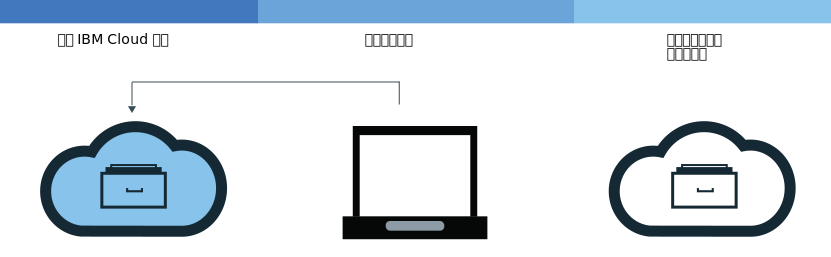
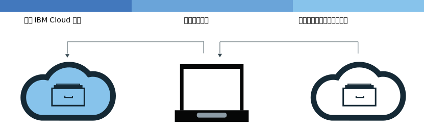

---

copyright:
  years: 2017, 2018
lastupdated: "2018-09-11"

---

{:new_window: target="_blank"}
{:shortdesc: .shortdesc}
{:screen: .screen}
{:pre: .pre}
{:table: .aria-labeledby="caption"}
{:codeblock: .codeblock}
{:tip: .tip}
{:download: .download}


# 將映像檔新增至名稱空間
{: #registry_images_}

藉由將映像檔新增至 {{site.data.keyword.registrylong}} 中的名稱空間，即可安全地儲存 Docker 映像檔，並將它與其他使用者共用。
{:shortdesc}

您要新增至名稱空間的每個映像檔都必須先存在於本端電腦上。您可以將映像檔從另一個儲存庫下載（取回）至本端電腦，或使用 Docker `build` 指令，以從 Dockerfile 建置自己的映像檔。若要將映像檔新增至名稱空間，您必須將本端映像檔上傳（推送）至 {{site.data.keyword.registrylong_notm}} 中的名稱空間。


請不要將個人資訊放在容器映像檔、名稱空間名稱、說明欄位（例如，在登錄記號中）或任何映像檔配置資料（例如，映像檔名稱或映像檔標籤）中。
{:tip}


## 從另一個登錄取回映像檔
{: #registry_images_pulling}

您可以從任何專用或公用登錄來源中取回（下載）映像檔，然後標記它，以供稍後在 {{site.data.keyword.registrylong_notm}} 中使用。
{:shortdesc}


**開始之前**

- [安裝 CLI](registry_setup_cli_namespace.html#registry_cli_install)，以使用名稱空間中的映像檔。
- [在 {{site.data.keyword.registrylong_notm}} 中設定自己的名稱空間](registry_setup_cli_namespace.html#registry_namespace_add)。
- [確定您可以在沒有 root 許可權的情況下執行 Docker 指令](https://docs.docker.com/engine/installation/linux/linux-postinstall)。如果您的 Docker 用戶端設定成需要 root 許可權，則必須使用 `sudo` 來執行 `ibmcloud login`、`ibmcloud cr login`、`docker pull` 及 `docker push` 指令。

  如果您變更許可權以在沒有 root 專用權的情況下執行 Docker 指令，則必須再次執行 `ibmcloud login` 指令。


下載映像檔，請參閱「開始使用」文件中的[取回映像檔](index.html#registry_images_pulling)。

如果您收到 "unauthorized: authentication required" 或 "denied: requested access to the resource is denied" 訊息，請執行 `ibmcloud cr login` 指令。
{:tip}

在您取回映像檔並針對名稱空間標記它之後，可以將映像檔從本端電腦上傳（推送）至名稱空間。

## 將 Docker 映像檔推送至名稱空間
{: #registry_images_pushing}

您可以將映像檔推送（上傳）至 {{site.data.keyword.registrylong_notm}} 中的名稱空間，以安全地儲存映像檔，並將它與其他使用者共用。
{:shortdesc}



**開始之前**

- [安裝 CLI](registry_setup_cli_namespace.html#registry_cli_install)，以使用名稱空間中的映像檔。
- [在 {{site.data.keyword.registrylong_notm}} 專用登錄中設定自己的名稱空間](registry_setup_cli_namespace.html#registry_namespace_add)。
- 在本端電腦上[取回](#registry_images_pulling)或[建置](#registry_images_creating)映像檔，並以您的名稱空間資訊標記映像檔。
- [確定您可以在沒有 root 許可權的情況下執行 Docker 指令](https://docs.docker.com/engine/installation/linux/linux-postinstall)。如果您的 Docker 用戶端設定成需要 root 許可權，則必須使用 `sudo` 來執行 `ibmcloud login`、`ibmcloud cr login`、`docker pull` 及 `docker push` 指令。

  如果您變更許可權以在沒有 root 專用權的情況下執行 Docker 指令，則必須再次執行 `ibmcloud login` 指令。


若要上傳（推送）映像檔，請完成下列步驟：

1. 登入 CLI。

   ```
  ibmcloud cr login
  ```
   {: pre}

   如果您從專用 {{site.data.keyword.registrylong_notm}} 取回映像檔，則必須登入。
  {:tip}

2. 若要檢視帳戶中可用的所有名稱空間，請執行 `ibmcloud cr namespace-list` 指令。
3. [將映像檔上傳至名稱空間。](index.html#registry_images_pushing)

   如果您收到 `unauthorized: authentication required` 或 `denied: requested access to the resource is denied` 訊息，請執行 `ibmcloud cr login` 指令。
  {:tip}


在將映像檔推送至專用登錄之後，您可以執行下列其中一項作業：

- [使用漏洞警告器管理安全](../va/va_index.html)，以尋找潛在安全問題及漏洞的相關資訊。
- [建立叢集以及使用此映像檔來部署容器](/docs/containers/container_index.html#container_index)至 {{site.data.keyword.containerlong_notm}} 中的叢集。


## 在登錄之間複製映像檔
{: #registry_images_copying}

您可以從某個地區的登錄取回映像檔，然後將它推送至另一個地區的登錄，即可與這兩個地區的使用者共用映像檔。
{:shortdesc}



**開始之前**

- [安裝 CLI](registry_setup_cli_namespace.html#registry_cli_install)，以使用名稱空間中的映像檔。
- [在 {{site.data.keyword.registrylong_notm}} 專用登錄中設定自己的名稱空間](registry_setup_cli_namespace.html#registry_namespace_add)。
- [確定您可以在沒有 root 許可權的情況下執行 Docker 指令](https://docs.docker.com/engine/installation/linux/linux-postinstall)。如果您的 Docker 用戶端設定成需要 root 許可權，則必須使用 `sudo` 來執行 `ibmcloud login`、`ibmcloud cr login`、`docker pull` 及 `docker push` 指令。

  如果您變更許可權以在沒有 root 專用權的情況下執行 Docker 指令，則必須再次執行 `ibmcloud login` 指令。


若要在兩個登錄之間複製映像檔，請完成下列步驟：

1. [從登錄取回映像檔](#registry_images_pulling)。
2. [將映像檔推送至另一個登錄](#registry_images_pushing)。請確定您針對目標新地區使用正確的網域名稱。

複製映像檔之後，您可以執行下列其中一項作業：

- [使用漏洞警告器管理映像檔安全](../va/va_index.html)，以尋找潛在安全問題及漏洞的相關資訊。
- [建立叢集以及使用此映像檔來部署容器](/docs/containers/container_index.html#container_index)至 {{site.data.keyword.containerlong_notm}} 中的叢集。


## 建置 Docker 映像檔，以與名稱空間搭配使用
{: #registry_images_creating}

您可以直接在 {{site.data.keyword.Bluemix_notm}} 建置 Docker 映像檔，或在本端電腦上建立自己的 Docker 映像檔，並將它上傳（推送）至 {{site.data.keyword.registrylong_notm}} 中的名稱空間。
{:shortdesc}

**開始之前**

- [安裝 CLI](registry_setup_cli_namespace.html#registry_cli_install)，以使用名稱空間中的映像檔。
- [在 {{site.data.keyword.registrylong_notm}} 專用登錄中設定自己的名稱空間](registry_setup_cli_namespace.html#registry_namespace_add)。
- [確定您可以在沒有 root 許可權的情況下執行 Docker 指令](https://docs.docker.com/engine/installation/linux/linux-postinstall)。如果您的 Docker 用戶端設定成需要 root 許可權，則必須使用 `sudo` 來執行 `ibmcloud login`、`ibmcloud cr login`、`docker pull` 及 `docker push` 指令。

  如果您變更許可權以在沒有 root 專用權的情況下執行 Docker 指令，則必須再次執行 `ibmcloud login` 指令。


Docker 映像檔是每個您建立的容器的基準。映像檔是從 Dockerfile 建立的，而 Dockerfile 是包含映像檔建置指示的檔案。Dockerfile 可能會在其指示中參照個別儲存的建置構件，例如應用程式、應用程式的配置，以及其相依關係。

如果您要充分運用 {{site.data.keyword.Bluemix_notm}} 運算資源與網際網路連線，或是您的工作站上未安裝 Docker，請直接在 {{site.data.keyword.Bluemix_notm}} 中建置映像檔。如果您需要在建置中存取資源，而這些資源位於防火牆之後的伺服器上，請在本端建置您的映像檔。

若要建置自己的 Docker 映像檔，請完成下列步驟：

1. 建立您要在其中儲存建置環境定義的本端目錄。建置環境定義包含您的 Dockerfile 及相關建置構件（例如應用程式碼）。在指令行視窗中，導覽至此目錄。
2. 建立 Dockerfile。
  1. 在本端目錄中建立 Dockerfile。

     ```
    touch Dockerfile
    ```
     {: pre}

  2. 使用文字編輯器來開啟 Dockerfile。您至少必須新增基礎映像檔，以根據它建置映像檔。請將 _&lt;source_image&gt;_ 及 _&lt;tag&gt;_ 取代為您要使用的映像檔儲存庫及標籤。如果您要使用另一個專用登錄中的映像檔，請定義此專用登錄中映像檔的完整路徑。

     ```
    FROM <source_image>:<tag>
    ```
     {: pre}

     **範例**
     若要建立以公用 {{site.data.keyword.IBM_notm}} {{site.data.keyword.appserver_short}} Liberty (ibmliberty) 映像檔為基礎之 Dockerfile 的範例，請使用下列程式碼：

     ```
    FROM registry.<region>.bluemix.net/ibmliberty:latest
    LABEL description="This is my test Dockerfile"
    EXPOSE 9080
    ```
     {: pre}

     此範例會將標籤新增至映像檔 meta 資料，並公開埠 9080。如需您可以使用的其他 Dockerfile 指示，請參閱 [Dockerfile 參考資料](https://docs.docker.com/engine/reference/builder/)。

3. 決定映像檔的名稱。映像檔名稱必須為下列格式：

   ```
   registry.<region>.bluemix.net/<my_namespace>/<repo_name>:<tag>
   ```
   {: pre}

   其中 _&lt;my_namespace&gt;_ 是您的名稱空間資訊、_&lt;repo_name&gt;_ 是儲存庫名稱，而 _&lt;tag&gt;_ 是您要用於映像檔的版本。若要尋找名稱空間，請執行 `ibmcloud cr namespace-list` 指令。

4. 記下包含 Dockerfile 的目錄路徑。如果您在下列步驟中執行指令，而工作目錄設為儲存建置環境定義之處，則可以將 _&lt;directory&gt;_ 取代為句號 (.)。
5. 選擇直接在 {{site.data.keyword.Bluemix_notm}} 中建置映像檔，或先在本端建置並測試映像檔，再將它推送至 {{site.data.keyword.Bluemix_notm}}。
  - 若要直接在 {{site.data.keyword.Bluemix_notm}} 中建置映像檔，請執行下列指令：

    ```
    ibmcloud cr build -t <image_name> <directory>
    ```
    {: pre}

    其中 _&lt;image_name&gt;_ 是您映像檔的名稱，而 _&lt;directory&gt;_ 是目錄的路徑。
   
   如需 `ibmcloud cr build` 指令的相關資訊，請參閱 [{{site.data.keyword.registrylong_notm}} CLI](registry_cli.html)。

  - 若要先在本端建置並測試映像檔，再將它推送至 {{site.data.keyword.Bluemix_notm}}，請完成下列步驟：
    1. 在本端電腦上從 Dockerfile 建置映像檔，並以映像檔名稱來標記它。

       ```
       docker build -t <image_name> <directory>
       ```
       {: pre}

       其中 _&lt;image_name&gt;_ 是您映像檔的名稱，而 _&lt;directory&gt;_ 是目錄的路徑。

    2. 選用項目：先在本端電腦上測試映像檔，再將它推送至名稱空間。

       ```
       docker run <image_name>
       ```
       {: pre}

       將 _&lt;image_name&gt;_ 取代為您的映像檔名稱。

    3. 在您建立映像檔並針對名稱空間標記它之後，[可以將映像檔推送至名稱空間專用登錄](#registry_images_pushing)。

若要使用「漏洞警告器」來檢查映像檔的安全，請參閱[使用漏洞警告器管理映像檔安全](../va/va_index.html)。


## 刪除專用 {{site.data.keyword.Bluemix_notm}} 儲存庫中的映像檔
{: #registry_images_remove}

您可以使用圖形使用者介面 (GUI) 或 CLI 刪除專用儲存庫中不想要的映像檔。
{:shortdesc}

如果您要刪除專用儲存庫及其相關聯映像檔，請參閱[刪除專用儲存庫及任何相關聯映像檔](#registry_repo_remove)。

無法刪除您專用 {{site.data.keyword.Bluemix_notm}} 儲存庫中的公用 {{site.data.keyword.IBM_notm}} 映像檔，且它們不會計入您的配額。

刪除映像檔無法復原。刪除現有部署正在使用的映像檔，可能會導致擴增及（或）重新排程失敗。
{:tip}


### 使用 CLI 刪除專用 {{site.data.keyword.Bluemix_notm}} 儲存庫中的映像檔
{: #registry_images_remove_cli}

您可以使用 CLI 刪除專用儲存庫中不想要的映像檔。
{:shortdesc}

刪除映像檔無法復原。刪除現有部署正在使用的映像檔，可能會導致擴增及（或）重新排程失敗。
{:tip}

若要使用 CLI 刪除映像檔，請完成下列步驟：

1.  執行 `ibmcloud login` 指令，以登入 {{site.data.keyword.Bluemix_notm}}。
2.  若要刪除映像檔，請執行下列指令：

    ```
    ibmcloud cr image-rm IMAGE
    ```
    {: pre}

    其中 _IMAGE_ 是您要移除之映像檔的名稱，格式為 `repository:tag`。

    如果映像檔名稱中未指定標籤，則依預設會刪除以 `latest` 標記的映像檔。您可以藉由在指令中列出每一個專用 {{site.data.keyword.Bluemix_notm}} 登錄路徑，並以空格隔開每一個路徑，來刪除多個映像檔。

    若要尋找映像檔的名稱，請執行 `ibmcloud cr image-list`。請以 `repository:tag` 格式，結合 Repository 及 Tag 直欄的內容，以建立映像檔名稱。
 {:tip}

3.  執行下列指令，驗證已刪除映像檔，並確認映像檔未顯示在清單中。

    ```
    ibmcloud cr image-list
    ```
    {: pre}


### 使用 GUI 刪除專用 {{site.data.keyword.Bluemix_notm}} 儲存庫中的映像檔
{: #registry_images_remove_gui}

您可以使用圖形使用者介面 (GUI) 刪除專用映像檔儲存庫中不想要的映像檔。
{:shortdesc}

刪除映像檔無法復原。刪除現有部署正在使用的映像檔，可能會導致擴增及（或）重新排程失敗。
{:tip}

若要使用 GUI 刪除映像檔，請完成下列步驟：

1.  使用您的 IBM ID 登入 {{site.data.keyword.Bluemix_notm}} 主控台 ([https://console.bluemix.net](https://console.bluemix.net))。
2.  如果您有多個 {{site.data.keyword.Bluemix_notm}} 帳戶，請從帳戶功能表中選取要使用的帳戶及地區。
3.  按一下**型錄**。
4.  選取**容器**種類，然後按一下 **Container Registry** 磚。
5.  按一下**專用儲存庫**。即會顯示您的專用儲存庫清單。
6.  按一下包含儲存庫的列，而儲存庫包含您要刪除的映像檔。
7.  在包含您要刪除之映像檔的列中，按一下**開啟及關閉選項清單**圖示，然後選取**刪除映像檔**。請確定您已選取正確的映像檔，因為此動作無法復原。按一下**刪除**。


## 刪除專用儲存庫及任何相關聯映像檔
{: #registry_repo_remove}

您可以使用圖形使用者介面 (GUI)，刪除不再需要的專用儲存庫及任何相關聯映像檔。
{:shortdesc}

當您刪除儲存庫時，會刪除該儲存庫中的所有映像檔。此動作無法復原。
{:tip}

開始之前，請備份您要保留的任何映像檔。

若要使用 GUI 刪除儲存庫，請完成下列步驟：

1.  使用您的 IBM ID 登入 {{site.data.keyword.Bluemix_notm}} 主控台 ([https://console.bluemix.net](https://console.bluemix.net))。
2.  如果您有多個 {{site.data.keyword.Bluemix_notm}} 帳戶，請從帳戶功能表中選取要使用的帳戶及地區。
3.  按一下**型錄**。
4.  選取**容器**種類，然後按一下 **Container Registry** 磚。
5.  按一下**專用儲存庫**。即會顯示您的專用儲存庫清單。
6.  在包含您要刪除之專用儲存庫的列中，按一下**開啟及關閉選項清單**圖示，然後選取**刪除儲存庫**。請確定您已選取正確的儲存庫，因為此動作無法復原。按一下**刪除**。

