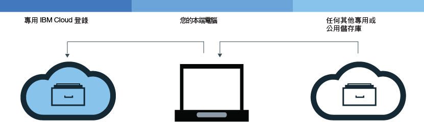
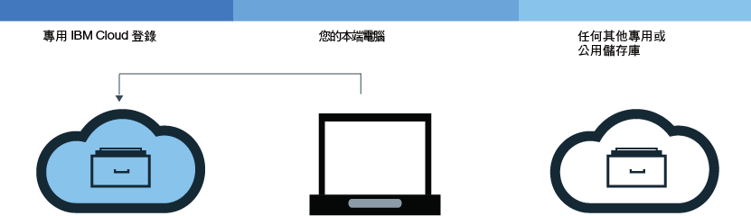
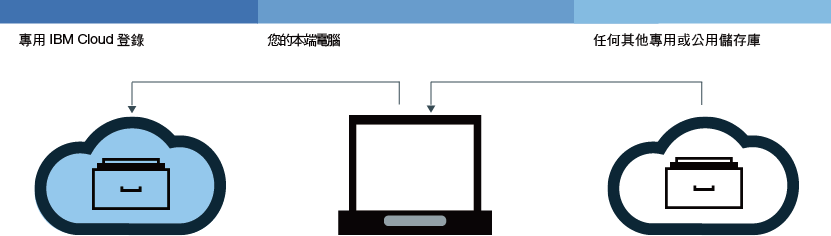

---

copyright:
  years: 2017
lastupdated: "2017-11-15"

---

{:new_window: target="_blank"}
{:shortdesc: .shortdesc}
{:screen: .screen}
{:pre: .pre}
{:table: .aria-labeledby="caption"}
{:codeblock: .codeblock}
{:tip: .tip} 
{:download: .download}


# 將映像檔新增至名稱空間
{: #registry_images_}

將映像檔新增至 {{site.data.keyword.registrylong}} 中的名稱空間，即可安全地儲存 Docker 映像檔，並將其與其他使用者共用。
{:shortdesc}

您要新增至名稱空間的每個映像檔都必須先存在於本端機器上。您可以將映像檔從另一個儲存庫下載（取回）至本端機器，或使用 Docker `build` 指令，以從 Dockerfile 建置自己的映像檔。若要將映像檔新增至名稱空間，您必須將本端映像檔上傳（推送）至 {{site.data.keyword.registrylong_notm}} 中的名稱空間。


## 從另一個登錄取回映像檔
{: #registry_images_pulling}

您可以從任何專用或公用登錄來源中取回（下載）映像檔，然後將它加上標籤，以供稍後在 {{site.data.keyword.registrylong_notm}} 中使用。
{:shortdesc}



開始之前：

- [安裝 CLI](registry_setup_cli_namespace.html#registry_cli_install)，以使用名稱空間中的映像檔。
- [在 {{site.data.keyword.registrylong_notm}} 中設定自己的名稱空間](registry_setup_cli_namespace.html#registry_namespace_add)。
- [確定您可以在沒有 root 許可權的情況下執行 Docker 指令](https://docs.docker.com/engine/installation/linux/linux-postinstall)。如果您的 Docker 用戶端設定成需要 root 許可權，則必須以 `sudo` 身分來執行 `bx login`、`bx cr login`、`docker pull` 及 `docker push` 指令。

  如果您變更許可權以在沒有 root 專用權的情況下執行 Docker 指令時，則必須再次執行 `bx login`。


下載映像檔，請參閱「開始使用」文件中的[取回映像檔](index.html#registry_images_pulling)。

  **提示：**如果您收到 "unauthorized: authentication required" 或 "denied: requested access to the resource is denied" 訊息，請執行 `bx cr login` 指令。


在您取回映像檔並針對名稱空間標記它之後，可以將映像檔從本端機器上傳（推送）至名稱空間。

## 將 Docker 映像檔推送至名稱空間
{: #registry_images_pushing}

您可以將映像檔推送（上傳）至 {{site.data.keyword.registrylong_notm}} 中的名稱空間，以安全地儲存映像檔，並將其與其他使用者共用。
{:shortdesc}



開始之前：

- [安裝 CLI](registry_setup_cli_namespace.html#registry_cli_install)，以使用名稱空間中的映像檔。
- [在 {{site.data.keyword.registrylong_notm}} 專用登錄中設定自己的名稱空間](registry_setup_cli_namespace.html#registry_namespace_add)。
- 在本端機器上[取回](#registry_images_pulling)或[建置](#registry_images_creating)映像檔，並將映像檔標上名稱空間資訊。
- [確定您可以在沒有 root 許可權的情況下執行 Docker 指令](https://docs.docker.com/engine/installation/linux/linux-postinstall)。如果您的 Docker 用戶端設定成需要 root 許可權，則必須以 `sudo` 身分來執行 `bx login`、`bx cr login`、`docker pull` 及 `docker push` 指令。

  如果您變更許可權以在沒有 root 專用權的情況下執行 Docker 指令時，則必須再次執行 `bx login`。


若要上傳（推送）映像檔，請遵循下列步驟。

1. 登入 CLI：

  ```
  bx cr login
  ```
  {: pre}

  **附註：**如果從您的專用 {{site.data.keyword.registrylong_notm}} 取回映像檔，您必須登入。

2. 若要檢視帳戶中可用的所有名稱空間，請執行 `bx cr namespace-list` 指令。
3. [將映像檔上傳至名稱空間。](index.html#registry_images_pushing)

  **提示：**如果您收到 "unauthorized: authentication required" 或 "denied: requested access to the resource is denied" 訊息，請執行 `bx cr login` 指令。


在您將映像檔推送至專用登錄之後，即可：

- [使用漏洞警告器管理安全](../va/va_index.html)，以尋找潛在安全問題及漏洞的相關資訊。
- [建立叢集以及使用此映像檔來部署容器](../../containers/container_index.html)至 {{site.data.keyword.containerlong_notm}} 中的叢集。

## 在登錄之間複製映像檔
{: #registry_images_copying}

您可以從一個地區的登錄取回映像檔，然後將它推送至另一個地區的登錄，以便您可以與兩個地區的使用者共用映像檔。
{:shortdesc}



開始之前：

- [安裝 CLI](registry_setup_cli_namespace.html#registry_cli_install)，以使用名稱空間中的映像檔。
- [在 {{site.data.keyword.registrylong_notm}} 專用登錄中設定自己的名稱空間](registry_setup_cli_namespace.html#registry_namespace_add)。
- [確定您可以在沒有 root 許可權的情況下執行 Docker 指令](https://docs.docker.com/engine/installation/linux/linux-postinstall)。如果您的 Docker 用戶端設定成需要 root 許可權，則必須以 `sudo` 身分來執行 `bx login`、`bx cr login`、`docker pull` 及 `docker push` 指令。

  如果您變更許可權以在沒有 root 專用權的情況下執行 Docker 指令時，則必須再次執行 `bx login`。


若要在兩個登錄之間複製映像檔，請遵循下列步驟。

1. [從登錄取回映像檔](#registry_images_pulling)。
2. [將映像檔推送至另一個登錄](#registry_images_pushing)。請確定您針對目標新地區使用正確的網域名稱。

在您複製映像檔之後，即可：

- [使用漏洞警告器管理映像檔安全](../va/va_index.html)，以尋找潛在安全問題及漏洞的相關資訊。
- [建立叢集以及使用此映像檔來部署容器](../../containers/container_index.html)至 {{site.data.keyword.containerlong_notm}} 中的叢集。

## 建置 Docker 映像檔以便搭配名稱空間使用
{: #registry_images_creating}

您可以直接在 {{site.data.keyword.Bluemix_notm}} 建置 Docker 映像檔，或在本端機器上建立自己的 Docker 映像檔，並將它上傳（推送）至 {{site.data.keyword.registrylong_notm}} 中的名稱空間。
{:shortdesc}

開始之前：

- [安裝 CLI](registry_setup_cli_namespace.html#registry_cli_install)，以使用名稱空間中的映像檔。
- [在 {{site.data.keyword.registrylong_notm}} 專用登錄中設定自己的名稱空間](registry_setup_cli_namespace.html#registry_namespace_add)。
- [確定您可以在沒有 root 許可權的情況下執行 Docker 指令](https://docs.docker.com/engine/installation/linux/linux-postinstall)。如果您的 Docker 用戶端設定成需要 root 許可權，則必須以 `sudo` 身分來執行 `bx login`、`bx cr login`、`docker pull` 及 `docker push` 指令。

  如果您變更許可權以在沒有 root 專用權的情況下執行 Docker 指令時，則必須再次執行 `bx login`。


Docker 映像檔是每個您建立的容器的基準。從 Dockerfile 建立映像檔，而 Dockerfile 是包含映像檔建置指示的檔案。Dockerfile 可能會在其指示中參照分開儲存的建置構件，例如應用程式、應用程式的配置，以及其相依關係。

若您想要利用 {{site.data.keyword.Bluemix_notm}} 運算資源與網際網路連線，或是您的工作站上未安裝 Docker，請直接在 {{site.data.keyword.Bluemix_notm}} 建置映像檔。若您需要在建置中存取資源，而該資源位於防火牆之後的伺服器上，請在本端建置映像檔。

若要建置自己的 Docker 映像檔，請完成下列步驟：

1. 建立您要儲存建置環境定義的本端目錄。建置環境定義包含您的 Dockerfile 及相關建置構件（例如應用程式碼）。在指令行視窗這導覽至此目錄。
2. 建立 Dockerfile。
  1. 在本端目錄中建立 Dockerfile。

    ```
    touch Dockerfile
    ```
    {: pre}

  2. 使用文字編輯器來開啟 Dockerfile。您至少必須新增從中建置映像檔的基礎映像檔。請將 _&lt;source_image&gt;_ 及 _&lt;tag&gt;_ 取代為您要使用的映像檔儲存庫及標籤。如果您要使用另一個專用登錄中的映像檔，請定義此專用登錄中映像檔的完整路徑。

    ```
    FROM <source_image>:<tag>
    ```
    {: pre}

    建立根據公用 {{site.data.keyword.IBM_notm}} {{site.data.keyword.appserver_short}} Liberty (ibmliberty) 映像檔之 Dockerfile 的範例：

    ```
    FROM registry.<region>.bluemix.net/ibmliberty:latest
    LABEL description="This is my test Dockerfile"
    EXPOSE 9080
    ```
    {: pre}

    此範例會將標籤新增至映像檔 meta 資料，並公開埠 9080。如需您可使用的 Dockerfile 指示，請參閱 [Dockerfile 參考資料](https://docs.docker.com/engine/reference/builder/)。

3. 決定映像檔的名稱。映像檔名稱必須為下列格式：

  ```
  registry.<region>.bluemix.net/<my_namespace>/<repo_name>:<tag>
  ```
  {: pre}

  其中 _&lt;my_namespace&gt;_ 是您的名稱空間資訊、_&lt;repo_name&gt;_ 是儲存庫名稱，而 _&lt;tag&gt;_ 是您要用於映像檔的版本。若要尋找名稱空間，請執行 `bx cr namespace-list` 指令。

4. 記下包含 Dockerfile 的目錄路徑。如果您在下列步驟中執行指令，而工作目錄設為儲存建置環境定義之處，則可以將 _&lt;directory&gt;_ 取代為句號 (.)。
5. 選擇直接在 {{site.data.keyword.Bluemix_notm}} 中建置映像檔，或先在本端建置及測試映像檔，然後再將它推送至 {{site.data.keyword.Bluemix_notm}}。
  - 若要直接在 {{site.data.keyword.Bluemix_notm}} 中建置映像檔，請執行下列指令：

    ```
    bx cr build -t <image_name> <directory>
    ```
    {: pre}

    其中 _&lt;image_name&gt;_ 是您映像檔的名稱，而 _&lt;directory&gt;_ 是目錄的路徑。

    如需 `bx cr build` 指令的相關資訊，請參閱 [{{site.data.keyword.registrylong_notm}} CLI](../../cli/plugins/registry/index.html#containerregcli)。

  - 若要先在本端建置及測試映像檔，然後再將它推送至 {{site.data.keyword.Bluemix_notm}}，請完成下列步驟：
    1. 在本端機器上從 Dockerfile 建置映像檔，並使用映像檔名稱將它加上標籤。

      ```
      docker build -t <image_name> <directory>
      ```
      {: pre}

      其中 _&lt;image_name&gt;_ 是您映像檔的名稱，而 _&lt;directory&gt;_ 是目錄的路徑。

    2. 選用項目：先測試本端機器上的映像檔，再將它推送至名稱空間。

      ```
      docker run <image_name>
      ```
      {: pre}

      請將 _&lt;image_name&gt;_ 取代為您的映像檔名稱。

    3. 在您建立映像檔並針對名稱空間標記它之後，[可以將映像檔推送至名稱空間專用登錄](#registry_images_pushing)。

若要使用「漏洞警告器」來檢查映像檔的安全，請參閱[使用漏洞警告器管理映像檔安全](../va/va_index.html)。

## 從專用 {{site.data.keyword.Bluemix_notm}} 映像檔登錄移除映像檔
{: #registry_images_remove}

您可以從專用映像檔登錄移除不想要的映像檔。
{:shortdesc}

開始之前，請移除任何正在使用映像檔的容器。

無法從您的專用 {{site.data.keyword.Bluemix_notm}} 登錄移除公用 {{site.data.keyword.IBM_notm}} 映像檔，也不會計入您的配額。

1. 執行 `bx login` 指令，以登入 {{site.data.keyword.Bluemix_notm}}。
2. 若要移除映像檔，請執行下列指令：

  ```
  bx cr image-rm IMAGE
  ```
  {: pre}

  其中 _IMAGE_ 是您要移除之映像檔的完整 {{site.data.keyword.Bluemix_notm}} 登錄路徑，格式為 `namespace/image:tag`。

  如果映像檔路徑中未指定標籤，則預設會刪除以 `latest` 標記的映像檔。您可以在指令中列出每個專用 {{site.data.keyword.Bluemix_notm}} 登錄路徑，並在每個路徑之間加上空格，刪除多個映像檔。

  **提示：**您可以執行 `bx cr namespace-list` 指令以擷取名稱空間值。

3. 執行下列指令，驗證已移除映像檔，並確認映像檔未出現在清單中。

  ```
  bx cr image-list
  ```
  {: pre}
