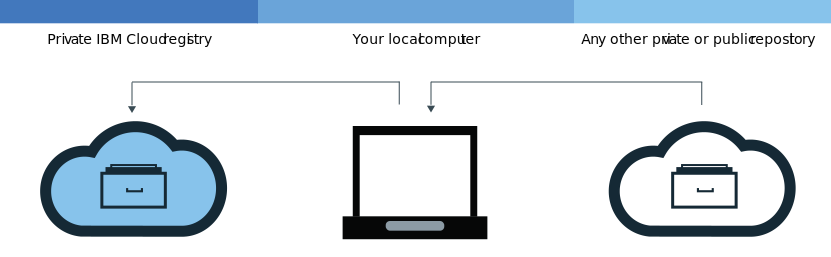

---

copyright:
  years: 2017, 2020
lastupdated: "2020-12-04"

keywords: Docker build command, delete images, add images, pull images, push images, copy images, delete private repositories, images, building images, list images, trash, recycle bin, restoring images,

subcollection: Registry


---

{:new_window: target="_blank"}
{:shortdesc: .shortdesc}
{:screen: .screen}
{:pre: .pre}
{:table: .aria-labeledby="caption"}
{:codeblock: .codeblock}
{:tip: .tip}
{:note: .note}
{:important: .important}
{:deprecated: .deprecated}
{:download: .download}
{:term: .term}
{:external: target="_blank" .external}


# Adding images to your namespace
{: #registry_images_}

You can securely store and share Docker images with other users by adding images to your namespace in {{site.data.keyword.registrylong}}.
{: shortdesc}

Every image that you want to add to your namespace must exist on your local computer first. You can either download (pull) an image from another repository to your local computer, or build your own image from a Dockerfile by using the Docker `build` command. To add an image to your namespace, you must upload (push) the local image to your namespace in {{site.data.keyword.registrylong_notm}}.

Do not put personal information in your container images, namespace names, description fields, or in any image configuration data (for example, image names or image labels).
{: important}

## Pulling images from another registry
{: #registry_images_pulling_reg}

You can pull (download) an image from any private or public registry source, and then tag it for later use in {{site.data.keyword.registrylong_notm}}.
{: shortdesc}

{: caption="Figure 1. Pulling images from another registry" caption-side="bottom"}

Before you begin, complete the following tasks:

- [Install the CLI](/docs/Registry?topic=Registry-registry_setup_cli_namespace#cli_namespace_registry_cli_install) to work with images in your namespace.
- [Set up your own namespace in {{site.data.keyword.registrylong_notm}}](/docs/Registry?topic=Registry-registry_setup_cli_namespace#registry_namespace_setup).
- [Make sure that you can run Docker commands without root permissions](https://docs.docker.com/install/linux/linux-postinstall/){: external}. If your Docker client is set up to require root permissions, you must run `ibmcloud login`, `ibmcloud cr login`, `docker pull`, and `docker push` commands with `sudo`.

  If you change your permissions to run Docker commands without root privileges, you must run the `ibmcloud login` command again.

1. Download the image, see [Pull an image](/docs/Registry?topic=Registry-getting-started#gs_registry_images_pulling) in the Getting Started documentation.

   If you get an `unauthorized: authentication required` or a `denied: requested access to the resource is denied` message, run the `ibmcloud cr login` command.
   {: tip}

After you pull an image and tag it for your namespace, you can upload (push) the image from your local computer to your namespace.

## Pushing Docker images to your namespace
{: #registry_images_pushing_namespace}

You can push (upload) an image to your namespace in {{site.data.keyword.registrylong_notm}} to store and share your image with other users.
{: shortdesc}

 an image from your local computer to your namespace in {{site.data.keyword.registrylong_notm}} to store and share your image with other users."){: caption="Figure 2. Pushing Docker images to your namespace." caption-side="bottom"}

Before you begin, complete the following tasks:

- [Install the CLI](/docs/Registry?topic=Registry-registry_setup_cli_namespace#cli_namespace_registry_cli_install) to work with images in your namespace.
- [Set up your own namespace in {{site.data.keyword.registrylong_notm}}](/docs/Registry?topic=Registry-registry_setup_cli_namespace#registry_namespace_setup).
- [Pull](#registry_images_pulling_reg) or [build](#registry_images_creating) an image on your local computer and tag the image with your namespace information.
- [Make sure that you can run Docker commands without root permissions](https://docs.docker.com/install/linux/linux-postinstall/){: external}. If your Docker client is set up to require root permissions, you must run `ibmcloud login`, `ibmcloud cr login`, `docker pull`, and `docker push` commands with `sudo`.

  If you change your permissions to run Docker commands without root privileges, you must run the `ibmcloud login` command again.

To upload (push) an image, complete the following steps:

1. Log in to the CLI.

   ```
   ibmcloud cr login
   ```
   {: pre}

   You must log in if you pull an image from your private {{site.data.keyword.registrylong_notm}}.
   {:tip}

2. To view all namespaces that are available in your account, run the `ibmcloud cr namespace-list` command.
3. [Upload the image to your namespace.](/docs/Registry?topic=Registry-getting-started#gs_registry_images_pushing)

   If you get an `unauthorized: authentication required` or a `denied: requested access to the resource is denied` message, run the `ibmcloud cr login` command.
   {:tip}

After you push your image to {{site.data.keyword.registrylong_notm}}, you can do one of the following tasks:

- [Manage security with Vulnerability Advisor](/docs/Registry?topic=va-va_index) to find information about potential security issues and vulnerabilities.
- [Create a cluster and use this image to deploy a container](/docs/containers?topic=containers-getting-started#getting-started) to the cluster in {{site.data.keyword.containerlong_notm}}.

## Copying images between registries
{: #registry_images_copying}

You can pull an image from a registry in one region and push it to a registry in another region so that you can share the image with users in both regions.
{:shortdesc}

{: caption="Figure 3. Copying images between registries." caption-side="bottom"}

Before you begin, complete the following tasks:

- [Install the CLI](/docs/Registry?topic=Registry-registry_setup_cli_namespace#cli_namespace_registry_cli_install) to work with images in your namespace.
- [Set up your own namespace in {{site.data.keyword.registrylong_notm}}](/docs/Registry?topic=Registry-registry_setup_cli_namespace#registry_namespace_setup).
- [Make sure that you can run Docker commands without root permissions](https://docs.docker.com/install/linux/linux-postinstall/){: external}. If your Docker client is set up to require root permissions, you must run `ibmcloud login`, `ibmcloud cr login`, `docker pull`, and `docker push` commands with `sudo`.

  If you change your permissions to run Docker commands without root privileges, you must run the `ibmcloud login` command again.

To copy an image between two registries, complete the following steps:

1. [Pull an image from a registry](#registry_images_pulling_reg).
2. [Push the image to another registry](#registry_images_pushing_namespace). Make sure that you use the correct domain name for the new region you're targeting.

After you copy your image, you can do one of the following tasks:

- [Managing image security with Vulnerability Advisor](/docs/Registry?topic=va-va_index) to find information about potential security issues and vulnerabilities.
- [Create a cluster and use this image to deploy a container](/docs/containers?topic=containers-getting-started#getting-started) to the cluster in {{site.data.keyword.containerlong_notm}}.

## Creating new images that refer to a source image
{: #registry_images_source}

Create a new image by using the [`ibmcloud cr image-tag`](/docs/Registry?topic=container-registry-cli-plugin-containerregcli#bx_cr_image_tag) command.
{: shortdesc}

In the region that you're logged into, create a new image in {{site.data.keyword.registrylong_notm}} that refers to an existing image in the same region. This action is supported for source images created by using Docker Engine version 1.12, or later, only.

New images that are created by using this mechanism do not retain signatures. If you require the new image to be signed, do not use this mechanism.
{: tip}

Before you begin, complete the following tasks:

- [Install the CLI](/docs/Registry?topic=Registry-registry_setup_cli_namespace#cli_namespace_registry_cli_install) to work with images in your namespace.
- Ensure that you have access to a private namespace in {{site.data.keyword.registrylong_notm}} that contains a source image to which you want to refer another image.

To create a new image from a source image, complete the following steps:

1. Log in to the CLI.

   ```
   ibmcloud cr login
   ```
   {: pre}

2. Run the following command to add the new reference, where `SOURCE_IMAGE` is the name of your source image and `TARGET_IMAGE` is the name of your target image. The source and target images must be in the same region. `SOURCE_IMAGE` must be in the format `repository:tag` or `repository@digest`and `TARGET_IMAGE` must be in the format `repository:tag`, for example, `us.icr.io/namespace/image:latest`

   ```
   ibmcloud cr image-tag [SOURCE_IMAGE] [TARGET_IMAGE]
   ```
   {: pre}

3. Verify that the new image was created by running the following command, and check that the image is shown in the list with the same image digest as the source image.

   ```
   ibmcloud cr image-list
   ```
   {: pre}

## Building Docker images to use them with your namespace
{: #registry_images_creating}

You can build a Docker image directly in {{site.data.keyword.cloud_notm}} or create your own Docker image on your local computer and upload (push) it to your namespace in {{site.data.keyword.registrylong_notm}}.
{: shortdesc}

Before you begin, complete the following tasks:

- [Install the CLI](/docs/Registry?topic=Registry-registry_setup_cli_namespace#cli_namespace_registry_cli_install) to work with images in your namespace.
- [Set up your own namespace in {{site.data.keyword.registrylong_notm}}](/docs/Registry?topic=Registry-registry_setup_cli_namespace#registry_namespace_setup).
- [Make sure that you can run Docker commands without root permissions](https://docs.docker.com/install/linux/linux-postinstall/){: external}. If your Docker client is set up to require root permissions, you must run `ibmcloud login`, `ibmcloud cr login`, `docker pull`, and `docker push` commands with `sudo`.

  If you change your permissions to run Docker commands without root privileges, you must run the `ibmcloud login` command again.

A Docker image is the basis for every container that you create. An image is created from a Dockerfile, which is a file that contains instructions to build the image. A Dockerfile might reference build artifacts in its instructions that are stored separately, such as an app, the app's configuration, and its dependencies.

If you want to take advantage of {{site.data.keyword.cloud_notm}} compute resources and internet connection or Docker is not installed on your workstation, build your image directly in {{site.data.keyword.cloud_notm}}. If you need to access resources in your build that are on servers that are behind your firewall, build your image locally.

The [`ibmcloud cr build`](/docs/Registry?topic=container-registry-cli-plugin-containerregcli#bx_cr_build) command is deprecated from 6 October 2020. You can use [Tekton pipelines](/docs/ContinuousDelivery?topic=ContinuousDelivery-pipeline_container_images#pipeline_tekton_images) instead. For more information, see [{{site.data.keyword.registrylong_notm}} is Deprecating Container Builds](https://www.ibm.com/cloud/blog/announcements/ibm-cloud-container-registry-deprecating-container-builds){: external}.
{: deprecated}

To build your own Docker image, complete the following steps:

1. Create a local directory where you want to store the build context. The build context contains your Dockerfile and related build artifacts, such as the app code. Navigate to this directory in a command line window.
2. Create a Dockerfile.
   1. Create a Dockerfile in your local directory.

      ```
      touch Dockerfile
      ```
      {: pre}

   2. Use a text editor to open the Dockerfile. At a minimum, you must add the base image to build your image from. Replace `<source_image>` and `<tag>` with the image repository and tag that you want to use. If you are using an image from another private registry, define the full path to the image in {{site.data.keyword.registrylong_notm}}.

      ```
      FROM <source_image>:<tag>
      ```
      {: pre}

      For example, to create a Dockerfile that is based on the public {{site.data.keyword.IBM_notm}} {{site.data.keyword.appserver_short}} Liberty (ibmliberty) image, use the following command:

      ```
      FROM <region>.icr.io/ibmliberty:latest
      LABEL description="This is my test Dockerfile"
      EXPOSE 9080
      ```
      {: pre}

      This example adds a label to the image metadata and exposes port 9080. For more Dockerfile instructions that you can use, see the [Dockerfile Reference](https://docs.docker.com/engine/reference/builder/){: external}.

3. Decide on a name for your image. The image name must be in the following format, where `<my_namespace>` is your namespace information, `<repo_name>` is the name of your repository, and `<tag>` is the version that you want to use for your image:

   ```
   <region>.icr.io/<my_namespace>/<repo_name>:<tag>
   ```
   {: pre}

   To find your namespace, run the `ibmcloud cr namespace-list` command
   {: tip}

4. Take note of the path to the directory that contains your Dockerfile. If you run the commands in the following steps while your working directory is set to where your build context is stored, you can replace `<directory>` with a period (.).
5. Choose to either build your image directly in {{site.data.keyword.cloud_notm}} or build and test your image locally before you push it to {{site.data.keyword.cloud_notm}}.
   - To build the image directly in {{site.data.keyword.cloud_notm}}, run the following command, where `<image_name>` is the name of your image and `<directory>` is the path to the directory. If you run the command when your working directory is set to where your build context is stored, you can replace `<directory>` with a period (.).

     ```
     ibmcloud cr build -t <image_name> <directory>
     ```
     {: pre}

     The [`ibmcloud cr build`](/docs/Registry?topic=container-registry-cli-plugin-containerregcli#bx_cr_build) command is deprecated from 6 October 2020. You can use [Tekton pipelines](/docs/ContinuousDelivery?topic=ContinuousDelivery-pipeline_container_images#pipeline_tekton_images) instead. For more information, see [{{site.data.keyword.registrylong_notm}} is Deprecating Container Builds](https://www.ibm.com/cloud/blog/announcements/ibm-cloud-container-registry-deprecating-container-builds){: external}.
     {: deprecated}

   - To build and test your image locally before you push it to {{site.data.keyword.cloud_notm}}, complete the following steps:
      1. Build the image from your Dockerfile on your local computer and tag it with your image name, where `<image_name>` is the name of your image and `<directory>` is the path to the directory.

         ```
         docker build -t <image_name> <directory>
         ```
         {: pre}

      2. Optional: Test your image on your local computer before you push it to your namespace.

         ```
         docker run <image_name>
         ```
         {: pre}

         Replace `<image_name>` with the name of your image.

      3. After you create your image and tag it for your namespace, [you can push your image to your namespace in {{site.data.keyword.registrylong_notm}}](#registry_images_pushing_namespace).

To use Vulnerability Advisor to check the security of your image, see [Managing image security with Vulnerability Advisor](/docs/Registry?topic=va-va_index).

## Pushing images to {{site.data.keyword.registrylong_notm}} by using an API key
{: #registry_api_key_push_image}

Create a service ID that uses an API key to push images to {{site.data.keyword.registrylong_notm}}.
{: shortdesc}

Complete the following steps:

1. Create a service ID, see [Creating and working with service IDs](/docs/account?topic=account-serviceids#serviceids).
2. Create a policy that gives the service ID permission to access the registry, for example, `Administrator` and `Manager` roles, see [Managing access for {{site.data.keyword.registryshort_notm}}](/docs/Registry?topic=Registry-iam).
3. Create an API key, see [Creating an API key for a service ID](/docs/account?topic=account-serviceidapikeys#create_service_key).
4. Use the API key to log in to registry so that you can push images to the registry, see [Automating access to {{site.data.keyword.registrylong_notm}}](/docs/Registry?topic=Registry-registry_access).
5. Push your images, see [Pushing Docker images to your namespace](#registry_images_pushing_namespace).

You can now use clusters to pull the images, see [Building containers from images](/docs/containers?topic=containers-images).

## Removing tags from images in your private {{site.data.keyword.cloud_notm}} repository
{: #registry_images_untag}

You can remove a tag, or tags, from an image and leave the underlying image and any other tags in place by using the [`ibmcloud cr image-untag`](/docs/Registry?topic=container-registry-cli-plugin-containerregcli#bx_cr_image_untag) command.
{: shortdesc}

Where multiple tags exist for the same image digest within a repository, to remove the underlying image and all its tags, see [Deleting images from your private {{site.data.keyword.cloud_notm}} repository](#registry_images_remove).
{: tip}

To remove a tag, or tags, by using the CLI, complete the following steps:

1. Log in to {{site.data.keyword.cloud_notm}} by running the `ibmcloud login` command.
2. To remove a tag, run the following command, where `IMAGE` is the name of the image that you want to remove, in the format `repository:tag`. If a tag is not specified in the image name, the command fails. You can delete the tags for multiple images by listing each private {{site.data.keyword.cloud_notm}} registry path in the command with a space between each path.

   ```
   ibmcloud cr image-untag IMAGE
   ```
   {: pre}

   To find the names of your images, run `ibmcloud cr image-list`. Combine the content of the **Repository** and **Tag** columns to create the image name in the format `repository:tag`.
   {: tip}

3. Verify that the tag was removed by running the following command, and check that the tag does not show in the list.

   ```
   ibmcloud cr image-list
   ```
   {: pre}

## Deleting images from your private {{site.data.keyword.cloud_notm}} repository
{: #registry_images_remove}

You can delete unwanted images from your private repository by using either the {{site.data.keyword.cloud_notm}} console or the CLI.
{: shortdesc}

If you want to delete a private repository and its associated images, see [Deleting a private repository and any associated images](#registry_repo_remove).

Deleting an image that is being used by an existing deployment might cause scale up, reschedule, or both, to fail.
{: important}

If you want to restore a deleted image, you can list the contents of the trash by running the [`ibmcloud cr trash-list`](/docs/Registry?topic=container-registry-cli-plugin-containerregcli#bx_cr_trash_list) command and restore a selected image by running the [`ibmcloud cr image-restore`](/docs/Registry?topic=container-registry-cli-plugin-containerregcli#bx_cr_image_restore) command.
{: tip}

Where multiple tags exist for the same image digest within a repository, the [`ibmcloud cr image-rm`](/docs/Registry?topic=container-registry-cli-plugin-containerregcli#bx_cr_image_rm) command removes the underlying image and all its tags. If the same image exists in a different repository or namespace, that copy of the image is not removed. If you want to remove a tag from an image and leave the underlying image and any other tags in place, see [Removing tags from images in your private {{site.data.keyword.cloud_notm}} repository](#registry_images_untag) command.
{: tip}

### Deleting images from your private {{site.data.keyword.cloud_notm}} repository by using the CLI
{: #registry_images_remove_cli}

You can delete unwanted images and all their tags from your private repository by using the CLI.
{: shortdesc}

Deleting an image that is being used by an existing deployment might cause scale up, reschedule, or both, to fail.
{: important}

If you want to restore a deleted image, you can list the contents of the trash by running the [`ibmcloud cr trash-list`](/docs/Registry?topic=container-registry-cli-plugin-containerregcli#bx_cr_trash_list) command and restore a selected image by running the [`ibmcloud cr image-restore`](/docs/Registry?topic=container-registry-cli-plugin-containerregcli#bx_cr_image_restore) command.
{: tip}

To delete an image by using the CLI, complete the following steps:

1. Log in to {{site.data.keyword.cloud_notm}} by running the `ibmcloud login` command.
2. To delete an image, run the following command, where `IMAGE` is the name of the image that you want to remove, in the format `repository@digest` or `repository:tag`. If a tag is not specified in the image name, the image tagged `latest` is deleted by default. You can delete multiple images by listing each private {{site.data.keyword.cloud_notm}} registry path in the command with a space between each path.

   ```
   ibmcloud cr image-rm IMAGE
   ```
   {: pre}

   To find the names of your images, run `ibmcloud cr image-list`. Combine the content of the **Repository** and **Tag** columns to create the image name in the format `repository:tag`. To identify your image by digest, run the `ibmcloud cr image-digests` command. Combine the content of the **Repository** column and the **Digest** column, for example, `repository@digest`.
   {: tip}

3. Verify that the image was deleted by running the following command, and check that the image does not show in the list.

   ```
   ibmcloud cr image-list
   ```
   {: pre}

### Deleting images from your private {{site.data.keyword.cloud_notm}} repository by using the GUI
{: #registry_images_remove_gui}

You can delete unwanted images and all their tags from your private image repository by using the {{site.data.keyword.cloud_notm}} console.
{:shortdesc}

Deleting an image that is being used by an existing deployment might cause scale up, reschedule, or both, to fail.
{: important}

If you want to restore a deleted image, you can list the contents of the trash by running the [`ibmcloud cr trash-list`](/docs/Registry?topic=container-registry-cli-plugin-containerregcli#bx_cr_trash_list) command and restore a selected image by running the [`ibmcloud cr image-restore`](/docs/Registry?topic=container-registry-cli-plugin-containerregcli#bx_cr_image_restore) command.
{: tip}

To delete an image by using the GUI, complete the following steps:

1. Log in to the {{site.data.keyword.cloud_notm}} console [https://cloud.ibm.com/login](https://cloud.ibm.com/login){: external} with your IBMid.
2. If you have multiple {{site.data.keyword.cloud_notm}} accounts, select the account and region that you want to use from the account menu.
3. Click **Catalog**.
4. Select the **Containers** category and click the **Container Registry** tile.
5. Click **Images**. A list of your images is displayed.
6. In the row that contains the image that you want to delete, select the check box.
7. Click **Delete Image**.

## Listing images in the trash
{: #registry_images_list_trash}

You can list deleted images that are in the trash and see when they expire.
{: shortdesc}

To find out which images are in the trash, you can use the [`ibmcloud cr trash-list`](/docs/Registry?topic=container-registry-cli-plugin-containerregcli#bx_cr_trash_list) command. Images are stored in the trash for 30 days.

To list the images in the trash, complete the following steps:

1. Log in to {{site.data.keyword.cloud_notm}} by running the `ibmcloud login` command.
2. List the images in the trash by running the following command:

   ```
   ibmcloud cr trash-list
   ```
   {: pre}

3. List only the images in the trash for the namespace that you're interested in by running the following command, where `<namespace>` is your namespace:

   ```
   ibmcloud cr trash-list --restrict <namespace>
   ```
   {: pre}

## Restoring images
{: #registry_images_restore}

You can restore images from the trash. Deleted images are stored in the trash for 30 days.
{: shortdesc}

You can restore an image from the trash by running the [`ibmcloud cr image-restore`](/docs/Registry?topic=container-registry-cli-plugin-containerregcli#bx_cr_image_restore) command. To find out which images are in the trash, run the [`ibmcloud cr trash-list`](/docs/Registry?topic=container-registry-cli-plugin-containerregcli#bx_cr_trash_list) command.

You can restore images by running the [`ibmcloud cr image-restore`](/docs/Registry?topic=container-registry-cli-plugin-containerregcli#bx_cr_image_restore) command. You can use the following options:

- `<repo>@<digest>`, which restores the digest and all of its tags in the repository that aren't already in the live repository, see [Restoring images by digest](#registry_images_restore_digest)
- `<repo>:<tag>`, which restores the tag, see [Restoring images by tag](#registry_images_restore_tag)

### Restoring images by digest
{: #registry_images_restore_digest}

When you restore an image by digest, the digest is copied from the trash into your live repository, and all of the digest's tags in the repository are restored. The digest continues to show in the trash because a copy is restored.
{: shortdesc}

To restore an image by digest from the trash, complete the following steps:

1. Log in to {{site.data.keyword.cloud_notm}} by running the `ibmcloud login` command.
2. List the images in the trash by running the following command:

   ```
   ibmcloud cr trash-list
   ```
   {: pre}

   A table is displayed that shows the items in the trash. The table shows the digest, the days until expiry, and the tags for that digest.

3. Note the digest for the image that you want to restore.
4. Run the following command to restore the image to your repository, where `<dns>` is the domain name, `<namespace>` is the namespace, `<repo>` is the repository, and `<digest>` is the digest of the image that you want to restore.

   ```
   ibmcloud cr image-restore <dns>/<namespace>/<repo>@<digest>
   ```
   {: pre}

   If some of the tags aren't restored, see [When I'm restoring an image from the trash by digest, why aren't some of the tags restored?](/docs/Registry?topic=Registry-troubleshoot-image-restore-digest).
   {: tip}

   In your live repository, you can pull the image by digest. If you run the [`ibmcloud cr image-digests`](/docs/Registry?topic=container-registry-cli-plugin-containerregcli#bx_cr_image_digests) command, the image shows in the output.
   {: tip}

### Restoring images by tag
{: #registry_images_restore_tag}

When you restore an image by tag, only that specific tag is moved out of the trash into your live repository.
{: shortdesc}

To restore an image by tag from the trash, complete the following steps:

1. Log in to {{site.data.keyword.cloud_notm}} by running the `ibmcloud login` command.
2. List the images in the trash by running the following command:

   ```
   ibmcloud cr trash-list
   ```
   {: pre}

   A table is displayed that shows the items in the trash. The table shows the digest, the days until expiry, and the tags for that digest.

3. For the image that you want to restore, make a note of the digest up to, but not including, the at sign (@), This part of the digest is `<dns>/<namespace>/<repo>`, where `<dns>` is the domain name, `<namespace>` is the namespace, and `<repo>`  is the repository.
4. For the image that you want to restore, make a note of the tag, `<tag>`.
5. Run the following command to restore the image to your repository, where `<dns>/<namespace>/<repo>` is the name of the image that you want to restore and `<tag>` is the tag.

   ```
   ibmcloud cr image-restore <dns>/<namespace>/<repo>:<tag>
   ```
   {: pre}

   In your live repository, you can pull the image by tag.

   If you run the `ibmcloud cr trash-list` command, the digest and any other tags show in the output but the tag is no longer displayed.
   {: tip}

## Deleting a private repository and any associated images
{: #registry_repo_remove}

You can delete private repositories that are no longer required, and any associated images, by using the {{site.data.keyword.cloud_notm}} console.
{: shortdesc}

When you delete a repository, all images in that repository are deleted. This action can't be undone.
{: important}

Before you begin, you must back up any images that you want to keep.
{: tip}

To delete a private repository by using the GUI, complete the following steps:

1. Log in to the {{site.data.keyword.cloud_notm}} console [https://cloud.ibm.com/login](https://cloud.ibm.com/login){: external} with your IBMid.
2. If you have multiple {{site.data.keyword.cloud_notm}} accounts, select the account and region that you want to use from the account menu.
3. Click **Catalog**.
4. Select the **Containers** category and click the **Container Registry** tile.
5. Click **Repositories**. A list of your private repositories is displayed.
6. In the row that contains the private repository that you want to delete, select the check box.

   Ensure that you've selected the correct repository because this action can't be undone.
   {: important}

7. Click **Delete Repository**.
